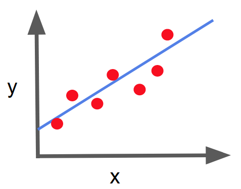
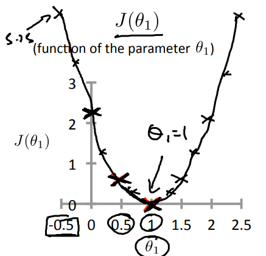

# Machine Learning
## 概要
人間が学習して成せる行動をコンピュータで実現する夢のある分野(人による)。

## 線形回帰
線形回帰は入力値に基づいて出力値を予測することができるモデルの一種である。ある値$x$(入力)があり、その$x$から予測したい値$y$(出力)があるとする。予め、いくつかの$x$とそれに対応する$y$があるとすると、下の図の赤点のような形に表すことができる。この時、赤点の位置を予測するような基準がほしいと考えた時、赤点の位置に基づいて青線を引く。この青線の位置を計算するのが線形回帰である。

### モデル表現(Model Representation)
モデル表現のために表記法から解説する。$x^{(i)}$は$i$番目の入力変数を示し、入力特徴(input feature)とも呼ばれる。$y^{(i)}$は予測しようとしている$i$番目の出力変数またはターゲット変数を示す。  これらをペアにした$(x^{(i)}, y^{(i)})$はtraining exampleと呼ばれ、training exampleが$m$個のまとめられている時、それをデータセット($(x^{(i)}, y^{(i)});i=1,\ldots,m$)と呼ぶ。ある機械学習モデルの訓練用データセットとなる時、その訓練用データセットを訓練セットと呼ぶ。入力値の空間を$X$、出力値の空間を$Y$とする。空間は集合であり$x\in X$と表すことができる。よく$x\in\mathbb{R}$と表されたりする。  
教師あり学習について考えるとする。教師あり学習とは、$x$に対応する$y$を含むデータセットがある時、そのデータセットのデータを用いて、用いたデータとは別の$z$が与えられたときにそれに対応する$y$を予想するものである。ある$x$が与えられた時、$y$を予測するような関数$h$を考えるとする。この$h$は仮説と呼ばれ、上の図の青線に当たるものである。上の図の場合、$h=\theta_ 0+\theta_ 1x$と表すことができる。線形回帰では、$y$を予測できるような$h$を作成するために、適切な$\theta$の値を探す。

### 目的関数(コスト関数、Objective function、cost function)
仮説の精度は目的関数を用いて計測できる。簡単に言えば、$|予測値-正解値|$といういわば誤差を測ることで予測の精度を測ることができる。尚、正解値を英語ではground truthという。基本的に誤差の評価は$(予測値-正解値)^2$で行われ、2乗する理由はいちいちマイナスかどうか確認して修正する絶対値よりも楽だからである(多分)。誤差は0に近ければ近いほど正解に近いということである。  
$h(x)=\theta_ 0+\theta_ 1x$である時、目的関数$J$は以下の様になる。

$$
J(\theta_ 0,\theta_ 1)=\frac{1}{2m}\sum_ {i=1}^m(\hat{y}_ i-y_ i)^2=\frac{1}{2m}\sum_ {i=1}^m(h_ \theta(x_ i)-y_ i)^2
$$

$\frac{1}{m}$ではなく$\frac{1}{2m}$である理由はAndrew Ng先生(機械学習界の凄い人)曰くそっちのほうが計算が楽であるからとのこと。説明のために$\theta_ 0$を0、トレーニングセットを((1,1),(2,2),(3,3))にすると、$h_ \theta(x)$と$J(\theta_ 1)$ ($\theta_ 0$は0になったため引数から省略)は以下のようになる。

$$
h_ \theta(x)=\theta_ 1x
$$

$$
J(\theta_ 0,\theta_ 1)=\frac{1}{2m}\sum_ {i=1}^m(h_ \theta(x_ i)-y_ i)^2=\frac{1}{6}\sum_ {i=1}^3(\theta_ 1x_ i-y_ i)^2
$$

となる。ここで、$\theta_ 1$の値を-0.5から-0.25, 0,...とずらした値をグラフに書いてみる。するとすぐ下の図[1]の黒い曲線の様になる。下図より、最も$J(\theta_ 1)$が最小であるのは$\theta_ 1=1$のときである。このことより、仮説の精度が最も良くなるのは$\theta_ 1=1$であることがわかる。

今夏は説明のために$\theta_ 0$を固定したが、これも自由に設定できる様にすると下図\[1\](今回の説明のために作られたものでないことに注意、あくまでこういう表現ができるということ)のように成る。下図の左は3次元、右は等高線で表されている。このような表記になってもやることは一つであり、$J(\theta_ 0,\theta_ 1)$が最も低くなるなような$\theta$の値を探すことである。  
次に、最適な$\theta$を自動で探すための手法を説明する。

### 勾配降下(Gradient descent)
目的関数を最小化するための方法として、最急降下法がある。最急降下法は$J(\theta_ 0,\theta_ 1,\ldots,\theta_ n)$の最小化を行うことができる。今回は説明するためにシンプルに$J(\theta_ 0,\theta_ 1)$を扱うことにする。  
下図[1]で最急降下法を説明すると、ある適当な場所(例えば図中の星印)から、できるだけ早く下るための最善の一歩を考える。一歩踏み出した後、また早く下るための最善の一歩を考える。そしてまた一歩踏み出す...、ということを区理解して最下部まで行く(最小化する)のである。
最急降下法アルゴリズムの定義は以下のようになっている。

$$
\rm{repeat\ until\ convergence}\{\ \theta_ j := \theta_ j-\alpha\frac{\partial}{\partial\theta_ j}J(\theta_ 0, \theta_ 1)(for\ j=0\ and\ j=1)\ \}
$$

## 目的関数の最適化

## ノルム

## 技術用語

## Reference
1. [Machine Learning | Coursera. Stanford. (アクセス:2019/04/08)](https://www.coursera.org/learn/machine-learning/)

## key-words
Math, Optimization