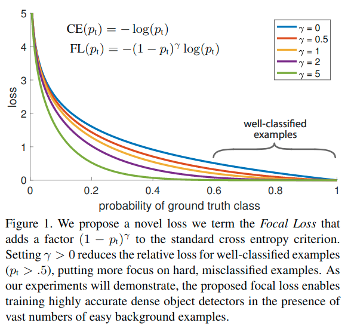

# Focal Loss for Dense Object Detection 

元の論文の公開ページ : [arxiv.org](https://arxiv.org/abs/1708.02002)  
提案モデルの実装 : [facebookの実装](https://github.com/facebookresearch/fvcore/blob/fb679749e3ba2714ac66680c9207c96a7e8e06d1/fvcore/nn/focal_loss.py)※  
※Detectron -> Detectron2 -> fvcoreで探した

Note: 記事の見方や注意点については、[こちら](/)をご覧ください。  
Note: 引用中の[*]は論文内の文献番号である。該当する論文は、論文関連リンクの各リストの末尾に基づいて調べられる。

## どんなもの?
##### dense detectorsの訓練中に発生する、前景と背景クラスの不均衡の問題に対処する損失を提案した。
- YOLOを始めとするone-stage detectors[(具体的にはdense detectors)]は、R-CNNのようなtwo-stage detectorsに精度の面で負けているが、この原因が訓練中の前景と背景クラスの不均衡によるものであると主張した。
  - [dense detectorsとあるが、YOLOなどのone-stage detectorsを中心とした話を展開している。]
  - [調べた限りだと、dense detectorsはYOLOなどで採用されている1セルごとにいくつかの境界線を生成する方法指すみたい。]
  - [今(2020年)では、dense detectors ≒ one-stage detectorsみたいな形式にはならないかも。(最近の2D検出器には疎いためわからん)]
- [この不均衡により、hard exampleとeasy exampleの問題が起こる。]
  - [hard exampleとeasy exampleの問題は、Bootstrapping (Hard negative miningとも)で取り扱われている。]
- R-CNNをもととした検出器はtwo-stage detectorの構造を持っており、これが不均衡に対処している。
  - proposal stage (e.g., Selective Sarch, RPN)によってオブジェクトの候補位置(cadidate object locations, サンプル)を少数(e.g., 1-2K)に抑え、背景を写したものをほとんど取り除いてくれる。その次のsecond classification stageでは、sampling heuristicsに基づいて前景と背景のバランスを保つ。
- これとは対象的に、one-stage detectorでは最大100k個の膨大なサンプルを処理する必要があり、これらのサンプルには分類が容易な背景のサンプル(easily classified background examples)が多く含まれている。
  - [このeasily classified background examplesはeasy exampleを指し、これの割合が大きいと学習効率が悪くなる。]
  - [また、この不均衡に対する他の方法は1章より、]
    - "While similar sampling heuristics may also be applied, they are inefficient as the training procedure is still dominated by easily classified background examples."
    - "This inefficiency is a classic problem in object detection that is typically addressed via techniques such as bootstrapping [33, 29] or hard example mining [37, 8, 31]."
- 著者らは、このクラス不均衡により効率的に対処するための損失であるFocal lossを提案した。
  - 1章より、"The loss function is a dynamically scaled cross entropy loss, where the scaling factor decays to zero as confidence in the correct class increases, see Figure 1. Intuitively, this scaling factor can automatically down-weight the contribution of easy examples during training and rapidly focus the model on hard examples."
  - [fig1は提案手法の詳細にて]
- また、この損失の効果を示すためのネットワークとしてRetinaNetを設計した。
- **"Finally, we note that the exact form of the focal loss is not crucial, and we show other instantiations can achieve similar results."**

##### Note
1. [Fast R-CNNとその派生ではbootstrapを使っていないことをOHEM[2]の論文の時点で言っている。]
   1. [2]より: "It may seem odd then that the current state-of-the-art object detectors, embodied by Fast R-CNN [14] and its descendants [24], do not use bootstrapping."
2. [Hard examples miningとHard negative miningの名称については、OHEM[2]の論文で述べられている。述べた内容は以下の通り。]
   1. "We use the term hard example mining, rather than hard negative mining, because our method is applied in a multi-class setting to all classes, not just a “negative” class."

## 先行研究と比べてどこがすごいの? or 関連事項
##### 省略

## 技術や手法のキモはどこ? or 提案手法の詳細
### 手法の概要
- Focal lossは、前景と背景クラス間に極端な不均衡(e.g. 1:1000)が存在するone-stage detectorsの訓練を想定した設計となっている。
- 提案されるFocal lossは、(binary) cross entropy(以下CE)損失を拡張した形となっている。
- 下はCEの定義について。Focal lossの定義は工夫にて。

#### CE損失の定義とexamplesに関して
##### CEの定義を行う。
- CEを以下のように定義する。
- $$
  \mathrm{CE}(p, y)=\left\{\begin{array}{ll}
  -\log (p) & \text { if } y=1 \\
  -\log (1-p) & \text { otherwise }
  \end{array}\right. \tag{1}
  $$
  - $y \in\{\pm 1\}$はground-truthクラス
  - $p \in[0,1]$は、モデルが$y=1$である可能性を推定した値。
- 表記を楽にするために、$p_t$を定義(式(2))する。
- $$
  p_{\mathrm{t}}=\left\{\begin{array}{ll}
  p & \text { if } y=1 \\
  1-p & \text { otherwise }
  \end{array}\right. \tag{2}
  $$
- よって、$\mathrm{CE}(p, y)=\mathrm{CE}\left(p_{\mathrm{t}}\right)=-\log \left(p_{\mathrm{t}}\right)$とする。

##### 大量のeasy examplesによって、数の少ないクラスの学習が進みづらくなる。
- CEで学習した場合、図1の青曲線のような流れとなる。
- この図が示す損失で重要なのは、簡単に分類できる例$\left(p_{t} \gg .5\right)$が明らかに大きな損失を持つということ。
- easy examplesが大量にある場合、これらの損失が他の比較的レアなクラスを圧倒してしまう。
- 

#### クラスの不均衡に対するCEの拡張
##### クラスの不均衡に対する一般的なCE損失の拡張手法として$\alpha$-balanced CE損失を定義する。
- クラスの不均衡に対する一般的なCE損失の拡張手法は、重み付け係数$alpha$を導入したCE損失である。
  - クラスラベル1に対して、$\alpha \in[0,1]$
  - クラスラベル-1に対して、$1-\alpha$
- 実際には、クラスの頻度の逆数もしくはクロスバリデーションに基づいたハイパーパラメーター値がセットされる。
- $alpha_t$をバランスとして定義したとき、この重み付けされたCE損失である$\alpha$-balanced CE損失は式(3)のようになる。
- $$
  \mathrm{CE}\left(p_{\mathrm{t}}\right)=-\alpha_{\mathrm{t}} \log \left(p_{\mathrm{t}}\right) \tag{3}
  $$
- この損失はCEのシンプルな拡張ではあり、提案するfocal lossの実験用のベースラインとして扱う。

### 工夫
#### Focal Loss
##### easy examplesの比重を下げ、hard negativesの損失を重視する損失関数Focal Lossを提案する。
- 実験が示すとおり、dense detectorsの訓練中に遭遇する極端なクラスの不均衡は、CE損失による学習を鈍らせる。
  - 簡単に分類されたnegativesは損失の大半を占め、勾配もその損失に独占される。
- $\aleph$はpositive/negative examplesに対して比重を簡単にかけられるが、easy/hard examplesに対してかけるのは難しい。
- 代わりに、easy examplesの比重を下げ、hard negativesの損失を重視する損失関数を提案する。
- この損失はCE損失に対して$(1-p_t)^\gamma$(modulating factor)を追加したものであり、式(4)のように定義される。
  - $\gamma \geq 0$はfocusing parameter
- $$
  \mathrm{FL}\left(p_{\mathrm{t}}\right)=-\left(1-p_{\mathrm{t}}\right)^{\gamma} \log \left(p_{\mathrm{t}}\right) \tag{4}
  $$
- $\gamma \in [0,5]$のいくつかの値で試したfocal lossの結果は図1の通り。
- **このFocal lossには2つの特性がある。**
  - **examplesを誤って分類したときに$p_t$は小さくなり、modulating factorは1に近くなるので通常のCE損失に近くなる。examplesが適切に分類した場合、$p_t \to 1$となるためmodulating factorは0になる。**
  - **focusing parameter $\gamma$はeasy examplesの重みを下げるようにレートを調節する。**
    - $\gamma=0$のとき、FLはCEと同じになる。
    - **$\gamma$が増加したとき、modulating factorの効果も増加する。最も効果があるのは$\gamma=2$であることが実験でわかった。**
- 直感的には、modulating factorがeasy examplesからの損失の割合を減らし、代わりに小さかった損失の割合を増やす。
  - "For instance, with $\gamma = 2$, an example classified with $p_t = 0.9$ would have $100\times$ lower loss compared with CE and with $p_t \approx 0.968$ it would have $1000\times$ lower loss."
  - "This in turn increases the importance of correcting misclassified examples (whose loss is scaled down by at most $4\times$ for $pt \geq .5$ and $\gamma = 2$)."

##### 更に、Focal Lossに$\alpha$を付けた損失を定義する。
- $\alpha$-balanced CE損失であった$\aleph$をFocal lossに取り付ける。これを式(5)に示す。
- $$
  \mathrm{FL}\left(p_{\mathrm{t}}\right)=-\alpha_{\mathrm{t}}\left(1-p_{\mathrm{t}}\right)^{\gamma} \log \left(p_{\mathrm{t}}\right) \tag{5}
  $$
- この方法は通常のFocal lossよりも僅かに精度が良かったため、実験で使用する。
- **Finally, we note that the implementation of the loss layer combines the sigmoid operation for computing p with the loss com-putation, resulting in greater numerical stability.**

##### 学習の安定性を上げるために学習初期に工夫を入れた。
- 2値分類モデルは五分五分の確率で$y=-1$もしくは1の出力を行うように初期化される。
- このような初期化の場合、クラスの不均衡により、学習の初期にレアでないクラスが損失の割合を多く占めて不安定な状況を起こす。
- それに対応するため、著者らは学習はじめにレアクラス(前景)に対して、モデルによって推定された$p$の値に関する'prior'の概念を導入する。
  - To counter this, we introduce the concept of a ‘prior’ for the value of p estimated by the model for the rare class (foreground) at the start of training.
- priorを$\pi$によって示し、レアクラスのexamplesに対するモデルの推定値$p$は低くするようにする(例：0.01)。
  - [$\pi$は4.1章にて使われる]
- **これにより、クラスのバランスが悪い場合のFocal lossとCEのどちらでも訓練の安定性が増すことがわかった。**
- [正直わかってないので修正必要]

#### Class Imbalance and Two-stage Detectors
##### Two-stage detectorsに対してクラス不均衡のための
- Two stage detectorsは$\alpha$-balancingなしのCE損失もしくは提案された損失で学習がよくなされている。
- この代案として、クラスの不均衡に対処する2つのメカニズムを導入する。
  - "a two-stage cascade"
  - "biased minibatch sampling"
- "The first cascade stage is an object proposal mechanism [35, 24, 28] that reduces the nearly infinite set of possible object locations down to one or two thousand."
- "Importantly, the selected proposals are not random, but are likely to correspond to true object locations, which removes the vast majority of easy negatives."
- "When training the sec-ond stage, biased sampling is typically used to construct minibatches that contain, for instance, a 1:3 ratio of posi-tive to negative examples."
- "This ratio is like an implicit $\aleph$-balancing factor that is implemented via sampling."
- "Our proposed focal loss is designed to address these mechanisms in a one-stage detection system directly via the loss function."

#### RetinaNet Detector
##### 省略

## どうやって有効だと検証した?
##### 省略

## 議論はある?
##### 省略

## 次に読むべき論文は?
##### なし

## 論文関連リンク
##### あり
1. [A. Shrivastava, A. Gupta, and R. Girshick. Training region-based object detectors with online hard example mining. In CVPR, 2016.](https://arxiv.org/abs/1604.03540)[31]

## 会議, 論文誌, etc.
##### ICCV 2017

## 著者
##### Tsung-Yi Lin, Priya Goyal, Ross Girshick, Kaiming He, Piotr Dollár

## 投稿日付(yyyy/MM/dd)
##### 2017/08/07

## コメント
##### なし

## key-words
##### Paper, CV, RGB_Image, Detection, 省略

## status
##### 省略

## read
##### I, A, M

## Citation
##### 未記入
