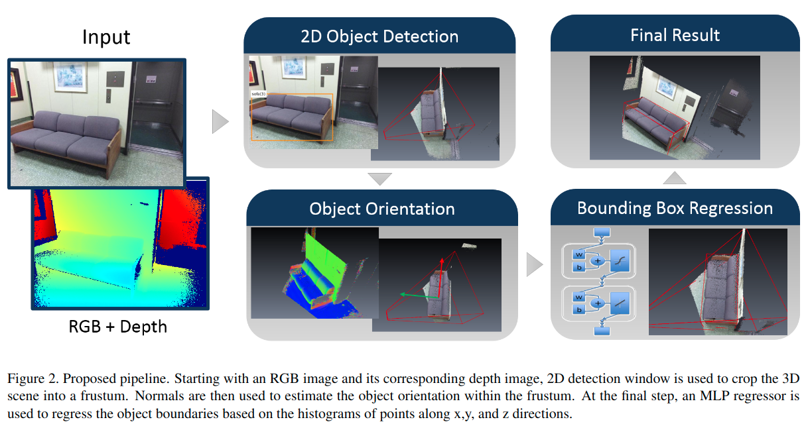

# 2D-Driven 3D Object Detection in RGB-D Images

元の論文の公開ページ : [ivul.kaust.edu.sa](https://ivul.kaust.edu.sa/Documents/Publications/2017/2D-Driven%203D%20Object%20Detection%20in%20RGB-D%20Images.pdf)  
Github Issues :   

## どんなもの?
RGB-D画像を用いてオブジェクトの3Dバウンディングボックスを推定する手法を提案した。
- 2D情報を使用して3D内の探索範囲を減らす方法を取っている。
- 3Dの情報はオブジェクトの周囲へバウンディングボックスを敷くために使用される。
- オブジェクトの向きも推定する。
- 最終ステップでは、シーン内のオブジェクトクラスの関係性を用いて検出の結果を改善する。
- [検出も早い。]

## 先行研究と比べてどこがすごいの? or 関連事項
省略

## 技術や手法のキモはどこ? or 提案手法の詳細
提案手法のパイプラインは図2の通り。[概要図としてわかりやすい。]

## どうやって有効だと検証した?

## 議論はある?

## 次に読むべき論文は?
- なし

## 論文関連リンク
1. [なし]()[1]

## 会議, 論文誌, etc.
ICCV 2017

## 著者
Jean Lahoud, Bernard Ghanem

## 投稿日付(yyyy/MM/dd)
2017/10/22

## コメント
なし

## key-words
CV, Paper, RGB_Image, Depth_Image, Detection

## status
導入

## read
A

## Citation
{
    @INPROCEEDINGS{8237757,
    author={J. {Lahoud} and B. {Ghanem}},
    booktitle={2017 IEEE International Conference on Computer Vision (ICCV)},
    title={2D-Driven 3D Object Detection in RGB-D Images},
    year={2017},
    volume={},
    number={},
    pages={4632-4640},
    keywords={image colour analysis;learning (artificial intelligence);multilayer perceptrons;object detection;search problems;SUN RGB-D dataset;2D-driven 3D object detection;2D object detection techniques;3D information;multilayer perceptron;search space;3D bounding boxes;RGB-D images;sparse 3D domain;object class relations;object locations;score bounding boxes;Three-dimensional displays;Two dimensional displays;Object detection;Solid modeling;Computational modeling;Detectors;Search problems},
    doi={10.1109/ICCV.2017.495},
    ISSN={2380-7504},
    month={Oct},}
}