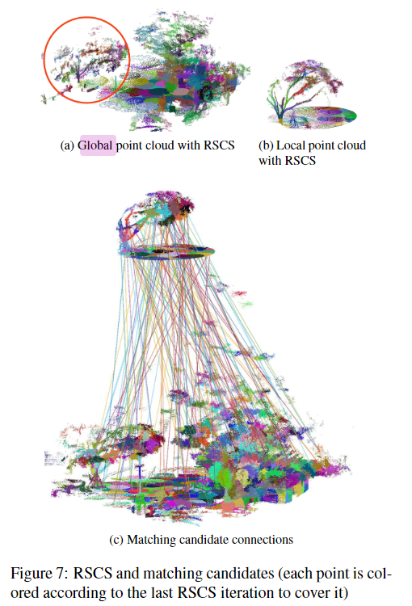

# 3D Point Cloud Registration for Localization using a Deep Neural Network Auto-Encoder

元の論文の公開ページ : [CVFのページ](http://openaccess.thecvf.com/content_cvpr_2017/papers/Elbaz_3D_Point_Cloud_CVPR_2017_paper.pdf)  
Github Issues : [#48](https://github.com/Obarads/obarads.github.io/issues/48)

## どんなもの?
RegistrationタスクをこなすアルゴリズムであるLORAXを提案した。

## 先行研究と比べてどこがすごいの?
省略

## 技術や手法のキモはどこ? or 提案手法の詳細
### アルゴリズム
LORAX(LOcalization by Registration using a deep Auto-encoder reduced Cover Set、X=CS?)アルゴリズムによってRegistrationタスクを行う。このアルゴリズムでは、large outdoor areaを描写する点群をglobal点群、global点群内に一部含まれる点群をlocal点群とする(点群の関係は図7を参照したほうがいい)。global点群の点の数は最大一億であり、local点群はglobal点群よりも2~3桁少ない。アルゴリズムの概要は以下の通り。

1. 新しいRandom Sphere Cover Setアルゴリズムを使用し点群をsuper-points(SP)に分割する。
2. 各SPに対する正規化されたローカル座標系の選択(要はSP内の座標系の定義)。
3. SPデータを2Dデプスマップへ投影する。(Depth Map Projection)
4. 突出の検出とsuper-pointsのフィルタリング。(Saliency Detection and Filtration)
5. DNN AutoEncoderを使って次元縮小する。
6. 対応する記述子間の候補の一致を見つける。(Selecting Candidates for Matching)
7. 局所探索を使った大まかなRegistrationを行う。(Coarse Registration by Localized Search)
8. 反復的に最短点の微調整を行う。

### Random Sphere Cover Set (RSCS)
RSCSのアルゴリズムは以下の通り。

1. ランダムにSPに属していない点$P$を選択する。
2. $P$を中心として半径$R_ {sphere}$内にある点の集合を新しいSPとして定義する。

適切な$R_ {sphere}$の値はアルゴリズムの最終段階中に一致した数$m$とlocal点群を包括する球の体積$V_ {local}$等の値から近似式で求める。尚、堅牢性向上のためglobal点群で1回、local点群で複数回、RSCSが施される。

### Depth Map Projection
図3を見ての通り。SPをz軸方向から写し取った画像を用意し、必要な部分だけ切り取り、点群のノイズや点密度を均一にするためにmax filterとmean filterを使って図3(c)の状態のSPを作り出す。尚、切り取り後の画像サイズは$d_ {im2}^2=32\times 32$とする。

### Saliency Detection and Filtration
役に立たないSPを排除するため3つの測定を行う。

#### Density Test
$N_ d$点に満たないSPをはじく。また、$K$個の近隣SPよりも比較的少ない点を含むSPもはじく。

#### Geometric Quality Test
高さ(z軸)に差がないSPをはじく。

#### Saliency Test
global点群から得たSPのデプスマップを$d_ {im2}^2$個のデプスベクトルに変形する。デプスベクトルのセットにPCAを施し、最初の三つの固有ベクトルを使うだけで正確に再構築できるSP(local点群とglobal点群のもの)はデータセットでよく見られる幾何学特徴であるため、排除する(最初ってなに?)。これにより、点群の異なる領域にある類似のSP間での一致の可能性が減少する。

### Selecting Candidates for Matching
SPをDAEで抽出した特徴(SP auto-encoder based Feature、SAF)ベクトルのユークリッド距離を使い、各local点群中のSPから近いK個(K近傍)のglobal点群中のSPをセットとする。ただし、i番目の近傍に関連する距離よりi+1番目の近傍に関連する距離がはるかに遠い場合、i+1からKまでの候補は除外する。

### Coarse Registration by Localized Search
点群間の対応関係を探すが、一致する箇所を最低$m=3$(堅牢性の考慮により$m=6$)探さなければならない。しかし、そのままだと検索規模が大きすぎる。そのため、各反復で、$V_ {local}$を超えない範囲の球の中に含まれるすべてのglobal点群に対するm個の候補ペアのみを考慮する。  
RANSACを使い、反復的に6つの候補ペアを選択し、変換を計算、そしてglobal点群中の近傍とlocal点群内の変換点間の物理的な平均距離を計測することで一致度をチェックする。coarse registration stepの結果として最良のscoring transformationのみを選択する代わりに、local点群が重ならない5つの裁量の変換$(T_ 1, \ldots, T_ 5)$を記録する。次の微調整ステップがそれぞれに適応され、最終的に、最良のscoring fine registrationが得られたものが選択される。

## どうやって有効だと検証した?
省略

## 議論はある?
なし

## 次に読むべき論文は?
- なし

## 論文関連リンク
1. [Gil Elbaz. 3D Point Cloud Registration for Localization using a Deep Auto-encoder Neural Network. (著者の説明動画, アクセス:2019/04/10)](https://www.youtube.com/watch?v=iAScGjMvyHA)
2. [gilbaz, gilbaz/LORAX: CVPR Paper - "3D Point Cloud Registration for Localization using a Deep Neural Network Auto-Encoder" - Partial Implementation Code. (著者らの実装, アクセス:2019/04/10)](https://github.com/gilbaz/LORAX)

## 会議
CVPR 2017

## 著者
Gil Elbaz, Tamar Avraham, Anath Fischer. 

## 投稿日付(yyyy/MM/dd)
2017/07/21

## コメント
なし

## key-words
Registration, Point_Cloud, AutoEncoder, CV, Paper

## status
修正