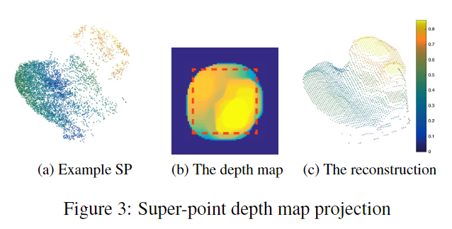

# 3D Point Cloud Registration for Localization using a Deep Neural Network Auto-Encoder

元の論文の公開ページ : [CVFのページ](http://openaccess.thecvf.com/content_cvpr_2017/papers/Elbaz_3D_Point_Cloud_CVPR_2017_paper.pdf)

## どんなもの?

## 先行研究と比べてどこがすごいの?

## 技術や手法のキモはどこ? or 提案手法の詳細
### **アルゴリズム**
LORAX(LOcalization by Registration using a deep Auto-encoder reduced Cover Set、X=CS?)アルゴリズムによってRegistrationタスクを行う。アルゴリズムの概要は以下の通り。

1. 新しいRandom Sphere Cover Setアルゴリズムを使用し点群をsuper-points(SP)に分割する。
2. 各SPに対する正規化されたローカル座標系の選択(要はSP内の座標系の定義)。
3. SPデータを2Dデプスマップへ投影する。(Depth Map Projection)
4. 突出の検出とsuper-pointsのフィルタリング。(Saliency Detection and Filtration)
5. DNN AutoEncoderを使って次元縮小する。
6. 対応する記述子間の候補の一致を見つける。
7. 局所探索を使った大まかなRegistrationを行う。
8. 反復的に最短点の微調整を行う。

### **Random Sphere Cover Set (RSCS)**
RSCSのアルゴリズムは以下の通り。

1. ランダムにSPに属していない点$P$を選択する。
2. $P$を中心として半径$R_ {sphere}$内にある点の集合を新しいSPとして定義する。

適切な$R_ {sphere}$の値はアルゴリズムの最終段階中に一致した数$m$と局所的な点群を包括する球の体積$V_ {local}$等の値から近似式で求める。

### **Depth Map Projection**
図3を見ての通り。SPをz軸方向から写し取った画像を用意し、必要な部分だけ切り取り、点群のノイズや点密度を均一にするためにmax filterとmean filterを使って図3(c)の状態のSPを作り出す。

### **Saliency Detection and Filtration**
役に立たないSPを排除するため3つの測定を行う。

- **Density Test**  
  $N_ d$点に満たないSPをはじく。また、$K$個の近隣SPよりも比較的少ない点を含むSPもはじく。
- **Geometric Quality Test**  
  高さ(z軸)に差がないSPをはじく。
- **Saliency Test**  
  あまり特徴のない

## どうやって有効だと検証した?

## 議論はある?

## 次に読むべき論文は?
-
-

### 論文関連リンク
1.
2.

### 会議
CVPR 2017

### 著者
Gil Elbaz, Tamar Avraham, Anath Fischer. 

### 投稿日付(yyyy/MM/dd)
2017/07/21

## コメント
PointNetの様な点群を直接消費するモデルがちょうど発表されたころであるため、

## key-words
Registration, Point_Cloud