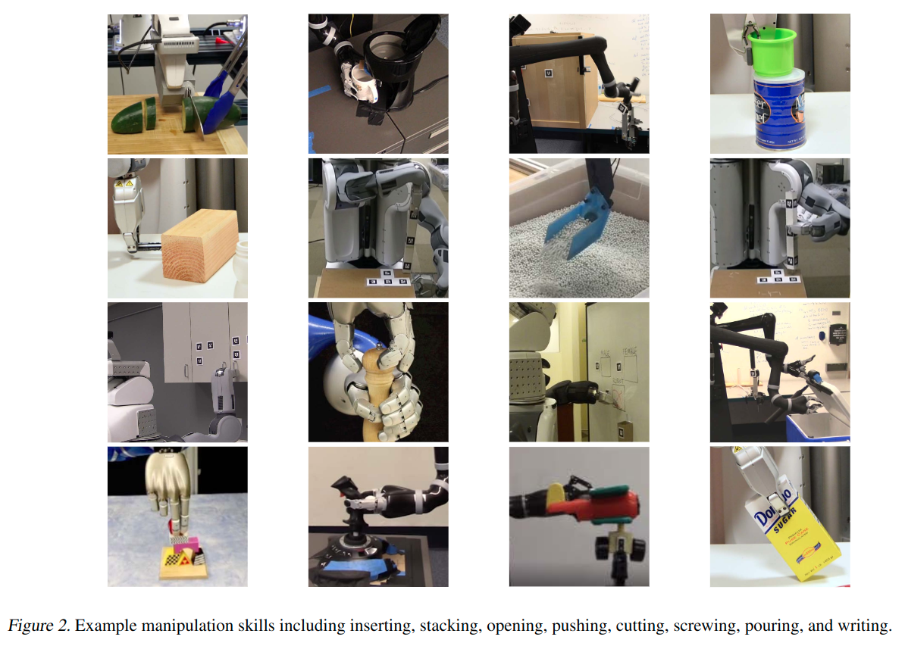

# A Review of Robot Learning for Manipulation: Challenges, Representations, and Algorithms

元の論文の公開ページ : [arxiv.org](https://arxiv.org/abs/1907.03146)  
提案モデルの実装 : [なし]()  
Github Issues :   

Note: 記事の見方や注意点については、[こちら](/)をご覧ください。
Note: 本記事は全翻訳に近いです。

## どんなもの?
##### ロボットマニュピレーションのために機械学習を使う研究について調査した。
- このサーベイでは、ロボットマニュピレーションの学習問題を形式化し、残りの研究課題を明確にする。

## 先行研究と比べてどこがすごいの? or 関連事項
##### 省略

## 技術や手法のキモはどこ? or 提案手法の詳細
- Note: 全翻訳ではありません。

### 1. 導入
##### ロボットマニュピレーションの意義について説明する。
- ロボットマニュピレーションはロボット工学の可能性を得るための中心的存在である。
  - ここのロボットの定義はアクチュエーターを持ち、それを使用してworldに変化をもたらすことができることである。
  - [worldは現実世界とか現実の環境とかそういうニュアンス?]
- 環境を操作できる[(環境に介入できる)]ロボットは、病院、高齢者もしくは幼児の見守り、工場、宇宙、レストランなどのサービス産業および家庭に配備でき、とんでもないポテンシャルを持つ。
- 多種多様な状況や、食品の準備のような特定の状況にもある広範かつ非体系的な環境の変動は、ロボットが経験したことのない環境に対処できる必要があることを示している。
- 研究者はどうやってそのような環境でロボットが操作の仕方を学習していくかという問(研究)に注目している。
- この研究は以下のような多くの目的に及ぶ。
  - 人のデモンストレーションから個々の操作を学習する、
  - 高度なプランニングに対して適切な操作タスクの抽象的説明の学習、
  - オブジェクトとの相互作用によるオブジェクトの機能の発見。
- その一例として、著者らの研究を図2に示す。

##### 本論文の目的について説明する。
- この論文の目的は以下の２つである。
  - 既存の研究を単体の一貫したフレームワークへ統合し、ロボットマニュピレーション学習問題の形式化を行う。
  - マニュピレーションのためのロボットの学習を行う研究の一部を説明する。
- こうすることで、これらの手法が適応されているマニュピレーション学習の問題の多様性を示すと同時に、残っている研究課題を特定できる。

##### 本論文は1章~8章で構成される。
- 本論文の構成は以下の通りになる。
  - 2

## どうやって有効だと検証した?
##### 省略

## 議論はある?
##### 省略

## 次に読むべき論文は?
##### なし

## 論文関連リンク
##### なし
1. [なし]()[1]

## 会議, 論文誌, etc.
##### なし

## 著者
##### Oliver Kroemer, Scott Niekum, George Konidaris

## 投稿日付(yyyy/MM/dd)
##### 2019/07/06

## コメント
##### なし

## key-words
##### Survey, Robot, 未完

## status
##### 未完

## read
##### なし

## Citation
##### 未記入
