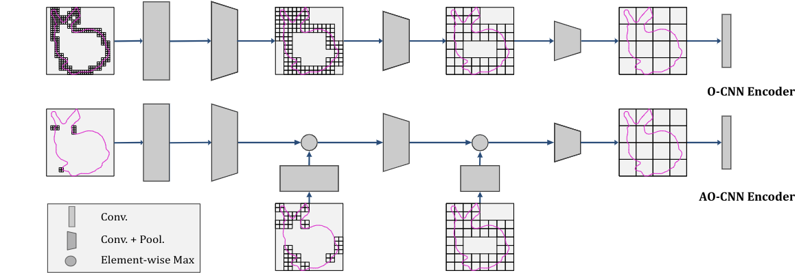
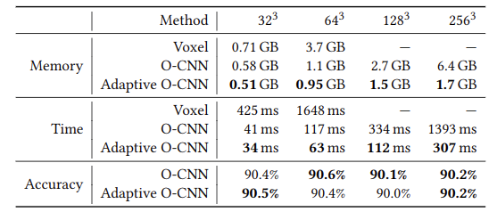

# Adaptive O-CNN: A Patch-based Deep Representation of 3D Shapes

元の論文の公開ページ : [arxiv](https://arxiv.org/abs/1809.07917)  
提案モデルの実装 : [microsoft/O-CNN](https://github.com/microsoft/O-CNN)  
Github Issues : [#5](https://github.com/Obarads/obarads.github.io/issues/5)

Note: 記事の見方や注意点については、[こちら](/)をご覧ください。

## どんなもの?
効率的に3D形状のエンコードとデコードを行うモデルであるAdaptive Octree-based CNN(以下AO-CNN)を提案した。
- エンコーダーではoctreeで分割したoctant(octantはoctreeによって細分化された領域。ある1つの領域を細分化すると8つの同形状のoctreeができる。)の法線と変位を入力として扱い、各レベル(octantのサイズ)で3D畳み込みを行う。
- デコーダーは各レベルのoctantの形状や細分状態を推定し、最良の法線と変位を算出する。

## 先行研究と比べてどこがすごいの? or 関連事項
3Dの生成モデルのベースには以下のものがある。
- **Voxel**  
2D画像を3Dへ拡張したボクセル表現を扱うもの。当然、2Dからの順当な拡張なので既存のフレームワークも適合しやすいが、メモリと計算コストが高いのと、高解像度なものを生成することが困難。
- **Multi-view**  
Multi-view imagesから生成を行うもの。適切な視点を選ぶ、オクルージョンへの対策、異なる視点の一貫性を試行すること(?)など、問題がいくつかある。
- **Point Cloud**  
PointNetをはじめとするPoint Cloud(以下点群)の解析方法が増えたが、点群の出力(表現)は点の数に依存し尚且つ点から表面を抽出するのに追加の処理が必要となる。
- **Polygonal mesh**  
表面パッチやメッシュはtemplate meshを変形するニューラルネットワークによって推定できたり2Dから3Dへマッピングできたりする。しかしながら、事前に定義されたmesh topology(?)とtemplate meshの均一なテッセレーションは不規則かつ複雑な形状を生成する場合、品質が保証できなくなる。
- **Octree**  
疎なボクセル表現の代表格であるoctreeは計算効率とメモリ効率に優れており、高解像度を生成するのに適している。通常、生成は境界、空きや占有を元に推定し行われる。

提案手法のAO-CNNは名の通りoctreeをベースにしている。octant内にあるオブジェクトの面が平面に近似しているかどうか算出し、もし近似していなければその部分を更に細分化し、またその細分化されたoctant内の平面の近似を取るという再帰処理を行う。もし近似していれば細分化は行わず、終了する。この処理を行うことで、通常のoctreeの様に面に細かく沿うまで細分化する必要がなくなる。図1は2Dでの簡単な説明。左は従来のquadtree(octreeの2D版)、中央は提案手法で使うadaptive quadtree(adaptive octreeの2D版)である。左は面に沿う部分をまんべんなく細分化しているが、中央は平面に近似していればそこで細分化を止めている。よって計算コストとメモリの使用量を削減している。右はoctant内の情報に沿って線を直線(3Dでは平面)で表したもの。右の図で線と線が繋がっていないものがあり、これはoctreeでも同じことが起こり得るが、修復することが可能である。詳しくは論文関連リンクの2~5の論文を参照。

先行研究でも確率変数やoctree構造の補助と共にスパース性や適切な畳込みの定義、プーリング演算子を調査しているが、AO-CNNは既存の研究と比べて精度もスパース性も向上している。

## 技術や手法のキモはどこ? or 提案手法の詳細
### Adaptive octree
octantをO、表面をS、O内にある表面(局所表面)をSOとして、SO=0ではない時にSOに対して最小近似誤差を持つ尤もな平面Pは以下の目的関数となる。

ここでn∈R\*\*3は平面の単位法線ベクトルであり、平面方程式はP:n\*x+d=0,x∈R\*\*3である。法線方向と形状の法線を一致させるためnとSOの平均法線との間の角度が90度未満かどうかチェックする。もし、そうでない場合はnとdに-1を掛ける。  
POをOによって制限されたPとすると局所領域の形状近似値δOはPOとSO間のハウスドルフ距離で定義される。定義式は以下の通り。

ここでoctreeに次の修正を入れる:最大深度レベルではないOは、もしSO≠0かつδOが所定の閾値δ^より多い場合はそれを再分割する。  
実際にはδ^=√3/2*hと設定する。hはoctreeの中で最も細かい軸のエッジ長である。

### 3D Encoder
下図の上がO-CNN(ただのoctree-based CNN)で下がAO-CNN。最大深度は5であり、Conv.演算子はReLUとBatch Normalizationを含む。基本的な構造は同じだがAO-CNNはO-CNNと違い、細かいoctantだけでなく他のレベルのoctantも入力として使われる。入力するタイミングは図の通り段階的に行われる。この時、局所平面がn\*x+d=0かつx∈R\*\*3であるlレベルのOについて、4チャンネルの入力信号(n,d☆)を使う。このときd☆=d-n\*cであり、cはOの中心を表す。d☆はlレベルのサイズにによって範囲をつけられ、相対変数となる(?)。なお、空のoctantの入力信号は(0,0,0,0)である。  
段階的に処理されていくごとに、粗いレベルになる。実装では最も粗いレベルは2に設定している。

### 3D Decoder
  下の図がAO-CNNのデコーダーである。デコーダーではoctant内の形状の近似状態を推定する。推定する状態の種類はempty、surface-well-approximatedと surface-poorly-approximatedの3つである。

#### 近似状態
- **surface-poorly-approximated**  
この状態であるoctantは更に細分化され、含まれている特徴も細分化されたものへdeconvolution演算子を介して渡される。

- **surface-well-approximated**  
この状態であるoctantはそこで細分化をやめ、octantのレベルもそこで止まる。

- **empty**  
これに関しては説明なし。多分無視される。

#### 予測モジュール
FC+BN+ReLU+FCからなり、予測モジュールの出力は局所近似ステータスとパラメータ(n,d☆)である。局所近似ステータスはoctreeの細分化やdeconvolution演算子で必要とされる。

#### 損失関数
損失はstructure lossとpatch lossの2つを含む。デコーダーの損失はこの2つの損失を足し合わせたものとなる。
- **structure loss**  
  予測された構造と実際の構造の相違を測る。octantのステータスは3種類あるため、3クラス分類として扱い、クロスエントロピー損失を使ってstructure lossを定義する。ここで、Hlはレベルlのoctreeのクロスエントロピーを示し、structure lossは以下のように示される。  

  

  ここで、nlは予測されたoctreeのlレベルでのoctreeの数であり、lmaxは最大深度、wlはそれぞれのレベルで定義された重みを指す。l=2であるのは、エンコーダーと同様の理由で設計したoctreeの最も荒いレベルが2であるからである。実装ではwlを1に設定している。

- **patch loss**
  それぞれのレベルのすべてのoctantの平面パラメータと実際の値の2乗距離誤差を測る。定義式は以下の通り。

  

  ここでniとd☆iは予測されたパラメーターであり、n上線iとd☆上線iは一致させるべき実際の値を指し、n'lは予測されたoctreeのlレベルで分割されたoctantの数を指す。λには0.2をセットする。この論文ではoctreeのレベルが4を超えるときにoctreeを適応するため、ｌは4から始まる。この下の図はデコーダーである。

  

## どうやって有効だと検証した?
ModelNet40を使った分類タスクにおけるメモリ使用量と時間、精度を比較している。比較した表は以下の通り。目標通り、高効率なモデルを作成できている。

分類タスクの精度も他のモデルについていけるほどのパフォーマンスを持つ。以下の表の通り。

AutoEncoderを使った生成精度も測っており、概ね良好である。評価にはChamfer distanceを使っている。以下の表の通り。

## 議論はある?
実装における一つの制限として、AO-CNNのoctree内の隣接するパッチがシームレスでは無いこと。パッチ間の隙間を減らすために有用な手法を用意する必要がある。もう一つは、AO-CNNでは曲線(車のホイールなど)の特徴をあまり近似させられないこと。将来的には曲線パッチを用いることのできるものがでるだろう。

## 次に読むべき論文は?
なし

## 論文関連リンク
1. [公式の論文内容の紹介](https://wang-ps.github.io/AO-CNN.html)
1. Simon Fuhrmann and Michael Goesele. 2014. Floating scale surface reconstruction. ACM Trans. Graph. (SIGGRAPH) 33, 4 (2014), 46:1–46:11.
1. Michael Kazhdan and Hugues Hoppe. 2013. Screened Poisson surface reconstruction. ACM Trans. Graph. 32, 3 (2013), 29:1–29:13. 
1. Marco Attene, Marcel Campen, and Leif Kobbelt. 2013. Polygon mesh repairing: An application perspective.ACM Comput. Surv.45, 2 (2013), 15:1–15:33. 
1. Tao Ju. 2004. Robust repair of polygonal models. ACM Trans. Graph. (SIGGRAPH) 23, 3 (2004), 888–895. 

## 参考リンク
##### なし

## 会議
##### SIGGRAPH Asia 2018

## 著者/所属機関
##### PENG-SHUAI WANG, CHUN-YU SUN, YANG LIU, XIN TONG

## 投稿日付(yyyy/MM/dd)
##### 2018/09/21

## コメント
##### なし

## key-words
##### Classification, Voxel, CV, Paper, 導入, Implemented

## status
##### 導入

## read
##### A, I, R, M, E, C

## Citation
##### github.comより引用
[リンク](https://github.com/microsoft/O-CNN)  
@article {Wang-2018-AOCNN,
    title     = {{Adaptive O-CNN: A Patch-based Deep Representation of 3D Shapes}},
    author    = {Wang, Peng-Shuai and Sun, Chun-Yu and Liu, Yang and Tong, Xin},
    journal   = {ACM Transactions on Graphics (SIGGRAPH Asia)},
    volume    = {37},
    number    = {6},
    year      = {2018},
}