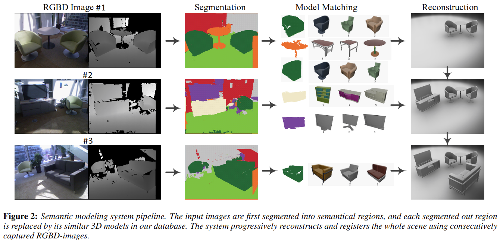

# An Interactive Approach to Semantic Modeling of Indoor Scenes with an RGBD Camera

元の論文の公開ページ : [kunzhou.net](http://kunzhou.net/2012/SIGGRAPHASIA12-IndoorSceneModeling.pdf)  
Github Issues : [#131](https://github.com/Obarads/obarads.github.io/issues/131)

## どんなもの?
室内空間のシーンを3Dモデル化するだけでなく、シーン内に存在するオブジェクトに対してクラスラベルを付与する対話型アプローチを提案した。本アプローチでは、RGB-Dデータを入力として受け取る。RGB-Dデータは(オブジェクトカテゴリごとの)セグメンテーションが施され、そのセグメンテーションを元に3Dモデルと特徴マッチングを行い、一致したオブジェクトを再構築するための空間に設置する。また、セグメンテーションが十分でない場合のために、セグメンテーション結果を改善するためのstroke-base対話インターフェイスがユーザーに提供されている。さらに、一枚の画像からシーン全体が見えない場合は、シーンの一部を写している他の画像を用意することで再構築を手助けするように設計されている。アルゴリズムのプロセス概要図は図2の通り。

## 先行研究と比べてどこがすごいの?

## 技術や手法のキモはどこ? or 提案手法の詳細

## どうやって有効だと検証した?

## 議論はある?

## 次に読むべき論文は?
- なし

## 論文関連リンク
1. なし

## 会議
SIGGRAPH ASIA 2012

## 著者
Tianjia Shao, Weiwei Xu, Kun Zhou, Jingdong Wang, Dongping Li, and Baining Guo

## 投稿日付(yyyy/MM/dd)
2012/11/01

## コメント
なし

## key-words
RGB_Image, Depth_Image, Reconstruction, Labeling

## status
導入

## read
A, I

## Citation
