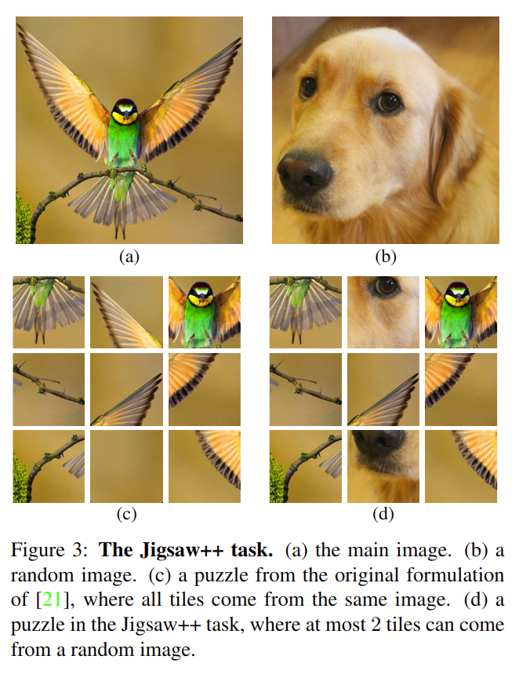

# Boosting Self-Supervised Learning via Knowledge Transfer

元の論文の公開ページ : [arxiv](https://arxiv.org/abs/1805.00385)
Github Issues : [#49](https://github.com/Obarads/obarads.github.io/issues/49)

## どんなもの?
省略

## 先行研究と比べてどこがすごいの?
省略

## 技術や手法のキモはどこ? or 提案手法の詳細
提案する手法は図2の様に4つのステップに分けられる。また、新たなpretextであるJigsaw++を提案した。訓練全体の流れは以下の通りである。

- **(a) Self-Supervised Learning Pre-Training**: pretext taskを使ってモデルを訓練する。
- **(b) Clustring**: 各画像をモデルに入力し、その中間表現をクラスタリングする。各クラスタごとにcluster centerを用意する。
- **(c) Extracting Pesudo-Labels**: 各特徴ベクトルに最も近いcluster centerを割り振る。これが擬似ラベルとなる。
- **(d) Cluster Classification**: ターゲットのアーキテクチャに換装し、擬似ラベルと擬似ラベルを生成するのに使われたデータセットを使って分類する。

#### The Jigsaw++ Pretext Task
Jigsawタスク[1]では1つの画像を分割してタスクをこなす形式であったが、Jigsaw++タスクは1つの画像の分割パネルの中に別の画像の分割パネル(occludingタイル)を最大2個混ぜる。混ぜたものは図3の様になる。

モデルはoccludingタイルの検出と、occludingタイルが無いときよりも情報量が少ない状態でJigsawタスクをこなす必要があるため、より難易度が上がる。タスクに曖昧さを加えないためにJigsawのときと同じく最小ハミング距離を使ってタイルの配置が似ないようにする。他にも各画像タイルに対して独立にmean and std normalization(平均と標準化?)を適応し、ネットワークの70%(の時間?)はグレイスケール画像によって訓練される。これらは低レベルな統計値による解決を防ぐための手法である。

## どうやって有効だと検証した?
省略

## 議論はある?
省略

## 次に読むべき論文は?
- Deep Clustring for Unsupervised Learning of Visual Features

## 論文関連リンク
1. [M. Noroozi and P. Favaro. Unsupervised learning of visual representations by solving jigsaw puzzles. In ECCV, 2016.](https://arxiv.org/abs/1603.09246)
2. [鈴⽊智之. Self-supervised Learningによる特徴表現学習. (アクセス日時 2019/04/22)](http://hirokatsukataoka.net/temp/cvpaper.challenge/SSL_0929_final.pdf)

## 会議
CVPR 2018

## 著者
Mehdi Noroozi, Ananth Vinjimoor, Paolo Favaro, Hamed Pirsiavash.

## 投稿日付(yyyy/MM/dd)
2018/03/01

## コメント
なし

## key-words
RGB_Image, Classification, Self-Supervised_Learning, CV, Paper

## status
省略