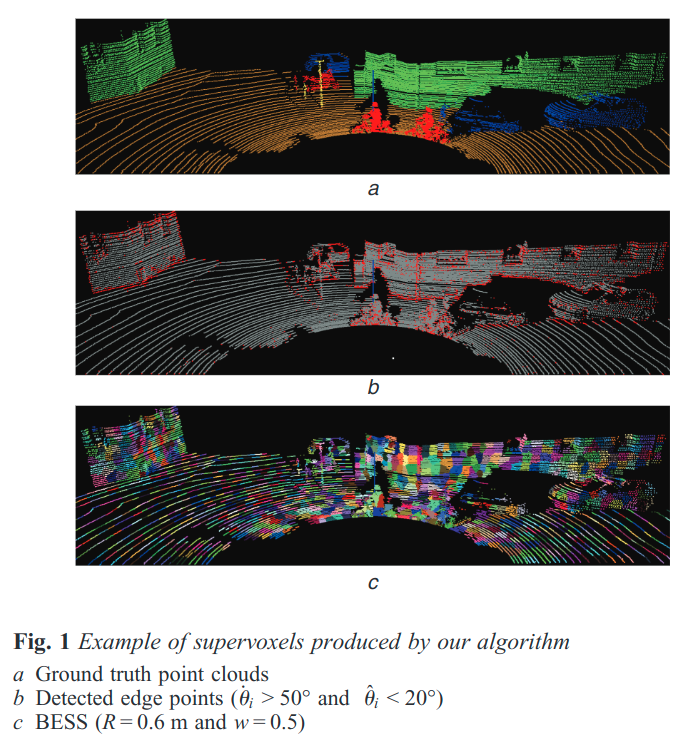

# Boundary-enhanced supervoxel segmentation for sparse outdoor LiDAR data

元の論文の公開ページ : [pdfs.semanticscholar.org](https://pdfs.semanticscholar.org/2732/6ae43ec7a6a31ecd257171b8a338053946cd.pdf)  
Github Issues : 

## どんなもの?
Velodyne LiDARの屋外スパースデータ用のsupervoxel手法を提案した。
- 屋外などの広い空間でVelodyne LiDARを使うとスパースな点群を取得する。このような点群に対してボクセル化を行うと、複数のオブジェクトが同じボクセルに重複する可能性が出る。
- このような問題を解決するため、Velodyne LiDARの屋外スパースデータ用の柔軟な形状を持つスーパーボクセル手法を提案する。この目的を達成するために以下の2つのアルゴリズムを開発した。
    - オブジェクトの境界形状を維持しつつ、空間的&幾何学的特性を含む、boundary-enhanced supervoxel segmentation (BESS)というスーパーボクセル手法。
    - スパース点群に対して効果的に動く境界検出手法。

スーパーボクセル手法の効果に関しては図1の通りである。
- aはground truthの点群
- bは検出したedge points
- cはBESSの結果

## 先行研究と比べてどこがすごいの?

## 技術や手法のキモはどこ? or 提案手法の詳細

## どうやって有効だと検証した?

## 議論はある?

## 次に読むべき論文は?
- なし

## 論文関連リンク
1. なし

## 会議, 論文誌, etc.
Electronics Letters (Volume: 50 , Issue: 25 , 12 4 2014)

## 著者
Soohwan Song, Honggu Lee and Sungho Jo

## 投稿日付(yyyy/MM/dd)
2014/12/08

## コメント
なし

## key-words
Supervoxel, CV, Paper, Point_Cloud, 修正

## status
修正

## read
A, I

## Citation
@ARTICLE{6975789,
author={S. {Song} and H. {Lee} and S. {Jo}},
journal={Electronics Letters},
title={Boundary-enhanced supervoxel segmentation for sparse outdoor LiDAR data},
year={2014},
volume={50},
number={25},
pages={1917-1919},
keywords={image segmentation;optical radar;radar imaging;boundary-enhanced supervoxel segmentation;sparse outdoor LiDAR data;voxelisation methods;geometric information;BESS;light detection and ranging;supervoxels;geometric properties;spatial properties},
doi={10.1049/el.2014.3249},
ISSN={0013-5194},
month={},}