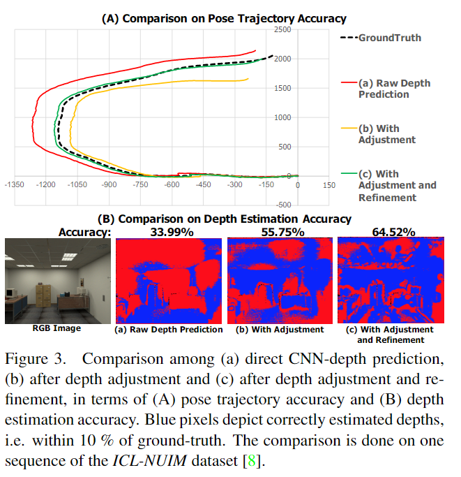

# CNN-SLAM: Real-time dense monocular SLAM with learned depth prediction

元の論文の公開ページ : [arxiv](https://arxiv.org/abs/1704.03489)  
Github Issues : [#50](https://github.com/Obarads/obarads.github.io/issues/50)

## どんなもの?
省略

## 先行研究と比べてどこがすごいの?
省略

## 技術や手法のキモはどこ? or 提案手法の詳細
提案手法のパイプラインは図2に示す通り。高フレームレートを維持するために、キーフレーム上でのみCNNを介してデプスマップを予測するように提案している。さらに、訓練データとテストデータの内容の違いがあることを踏まえ、ピクセル単位のデプス予測の信頼度を測定する不確実性マップを作成する。

### Camera Pose Estimation
カメラポーズ推定は[1]を参考にしている。各フレーム$t$において、最新のカメラポーズ$T_ t^{k_ i}=[R_ t, t_ t]\in\mathbb{SE}(3)$を予測する。この$T_ t^{k_ i}$はフレーム$t$と直近キーフレーム$k_ i$間の変換であり、$R_ t\in\mathbb{SO}(3)$は$3\times 3$の回転行列、$t_ t\in\mathbb{R}^3$は3D変換ベクトルである。最新の輝度画像$\mathcal{I}_ t$と直近のキーフレーム$k_ i$の輝度画像$\mathcal{I}_ {k_ i}$間の輝度誤差を最小化するような変換を求める。$T_ t^{k_ i}$は目的関数の式(1)に基づく重みづけされたGauss-Newton最適化を使って求められる。

$$
E(T_ t^{k_ i})=\sum_ {\tilde{u}\in\Omega}\rho\Biggl(\frac{r(\tilde{u},T_ t^{k_ i})}{\sigma(r(\tilde{u},T_ t^{k_ i}))}\Biggl) \tag{1}
$$

ここで、$\rho$はHuberノルム、$\sigma$は[1]の残差不確実性を測る関数である。ここで、$r$は式(2)の様に定義される輝度誤差である。

$$
r(\tilde{u},T_ t^{k_ i}) = \mathcal{I}_ {k_ i}(\tilde{u}) - \mathcal{I}_ t(\pi(KT_ t^{k_ i}\tilde{\mathcal{V}_ {k_ i} }(\tilde{u}))) \tag{2}
$$

デプスマップが密である&効率を考慮して、高い色勾配領域内にある画素の一部$\tilde{u}\subset u\in\Omega$のみに残光誤差の計算を制限する。また、$\pi$は3D点を2D画像座標へマッピングする透視投影関数であり、式(3)の様に表される。

$$
\pi([xyz]^T)=(x/z,y/z)^T \tag{3}
$$

このとき、$\mathcal{V}_ {k_ i}(u)$はキーマップのデプスマップから計算された頂点マップの3D要素であり、式(4)の様に表される。

$$
\mathcal{V}_ {k_ i}(u)=K^{-1}\dot{u}\mathcal{D}_ {k_ i}(u) \tag{4}
$$

このとき、$K$はカメラの内部行列である。  
$T_ t^{k_ i}$が得られたのち、世界座標系中の最新のカメラポーズは$T_ t=T_ t^{k_ i}T_ {k_ i}$として計算される。

### CNN-based Depth Prediction and Semantic Segmentation
新しいキーフレームが作られたとき、CNNを介してデプスマップが推定される。ImageNetで訓練されたモデルの値を初期値として使う。

### Key-frame Creation and Pose Graph Optimization
事前訓練時と推定時のSLAMの内部パラメーターに違いがある場合、3D再構築時のスケールが不正確になる。これを改善するために、現在のカメラの焦点距離$\mathcal{f}_ {cur}$とトレーニング時に使われたセンサーの焦点距離$\mathcal{f}_ {tr}$の間の比率を用いて、CNNを介したデプス回帰を調節する。比率は式(5)に示す通りである。

$$
\mathcal{D}_ {k_ i}(u) = \frac{\mathcal{f}_ {cur}}{f_ {tr} }\tilde{\mathcal{D} }_ {k_ i}(u) \tag{5}
$$

ここで、$\tilde{D}_ {k_ i}$は最新のキーフレーム画像$\mathcal{I}_ i$からCNNによって直接回帰されたデプスマップである。  
図3にこの調節の有用性を示す。調節したときのものを表す緑線がもっともGround truthに近い。

追加で、デプスマップ$\mathcal{D}_ {k_ i}$を不確実性マップ $\mathcal{U}_ {k_ i}$に関連付ける。  
まずは不確実性マップを初期化する。著者らは現在のデプスマップと直近のキーフレーム上の各シーンポイントとの間の差に基づいて信頼値を計算し、不確実性マップを初期化することを提案した。具体的には、不確実性マップ $\mathcal{U}_ {k_ i}$は最新のキーフレーム$k_ i$のデプスマップと直近のキーフレーム$k_ j$のデプスマップの間にある要素ごとの平方差として定義される。定義は$k_ i$から$k_ j$への変換$T_ {k_ j}^{k_ i}$に従って式(6)の様になる。

$$
\mathcal{U}_ {k_ i}(u)=(\mathcal{D}_ {k_ i}(u)-\mathcal{D}_ {k_ j}(v))^2 \tag{6}
$$

ここで$v = \pi(KT_ {k_ j}^{k_ i}\mathcal{V}_ {k_ i}(u))$である。  
さらに、新しく初期化された各キーフレームの精度をさらに向上させるために、デプスマップと不確実性マップを融合する。具体的には、最初に直近のキーフレーム$k_ j$から伝播された不確実性マップを式(7)の様に定義する。

$$
\tilde{\mathcal{U} }_ {k_ j}(v)=\frac{D_ {k_ j}(v)}{D_ {k_ i}(v)} \mathcal{U}_ {k_ j}(v)+\sigma_ p^2 \tag{7}
$$

ここで、$\sigma_ p^2$は伝播された不確実性を増加させるために使われるホワイトノイズである。次に、2つのデプスマップと不確実性マップを式(8)と(9)の加重スキームに従って融合する。

$$
\mathcal{D}_ {k_ i}(u)=\frac{\tilde{\mathcal{U}_ {k_ j} }(v)\cdot\mathcal{D}_ {k_ i}(u)+\mathcal{U}_ {k_ i}(u)\cdot\mathcal{D}_ {k_ j}(v) }{ \mathcal{U}_ {k_ i}(u) + \tilde{\mathcal{U}_ {k_ j}(v)} } \tag{8}
$$

$$
\mathcal{U}_ {k_ i}(u) = \frac{\tilde{\mathcal{U} }_ {k_ j}(v) \cdot \mathcal{U}_ {k_ i}(u) }{\mathcal{U}_ {k_ i}(u)+\tilde{\mathcal{U}}_ {k_ j} (v) } \tag{9}
$$

最後に、各キーフレームのポーズグラフも更新される。

### Frame-wise Depth Refinement
この段階の目的は、新たな各フレームで推定されたデプスマップに基づいて、現在アクティブなキーフレームのデプスマップを継続的に改良することである。この目標を達成するため、著者らはエピポーラ線に沿った5ピクセルマッチングに基づいて、現在のフレーム$t$の各ピクセルにおいて不確実性マップ$\mathcal{U}_ t$とデプスマップ$\mathcal{D}_ t$を計算することによって、[3]のsemi-denseスキーム中で記述されているsmall baseline stereo matching strategyを使う。この２つのマップは推定されたカメラポーズ$T_ i^{k_ i}$に基づくキーフレーム$k_ i$と位置合わせされる。
推定されたデプスマップと不確実性マップは式(10)と(11)に従って直近のキーフレーム$k_ i$のものと直接融合される。

$$
\mathcal{D}_ {k_ i}(u)=\frac{\mathcal{U}_ t(u)\cdot \mathcal{D}_ {k_ i}(u)+ \mathcal{U}_ {k_ i}(u)\cdot \mathcal{D}_ t(u)}{\mathcal{U}_ {k_ i}(u)+\mathcal{U}_ t(u)} \tag{10}
$$

$$
\mathcal{D}_ {k_ i}(u)=\frac{\mathcal{U}_ t(u)\cdot \mathcal{U}_ {k_ i}(u)}{\mathcal{U}_ {k_ i}(u)+\mathcal{U}_ t(u)} \tag{11}
$$

重要なことに、提案されたCNNベースの予測のおかげでキーフレームを密なデプスマップに関連付けられ、高勾配領域に沿ってデプス値だけを洗練する[5]の手法とは対象的にキーフレームの全ての要素が改良される。低テクスチャ領域内の観測されているデプスは高い不確実性($\mathcal{U}_ t$内の高い値)を持つ傾向があるので、この提案アプローチは自然に改良されたデプスマップを引き起こすだろう(文章一部省略)。一方で、不確実な深度観測の影響を受けずに、ますます低テクスチャ化された領域内の要素はCNNからの予測深度値を徐々に保持する。  
図3は提案されたデプスマップ改良プロセスの有効性を示している。

### Global Model and Semantic Label Fusion
省略

## どうやって有効だと検証した?
省略

## 議論はある?
省略

## 次に読むべき論文は?
- DeepVO?

## 論文関連リンク
1. [J. Engel, T. Schps, and D. Cremers. LSD-SLAM: Large-Scale Direct Monocular SLAM. InEuropean Conference on Computer Vision (ECCV), 2014.](https://vision.in.tum.de/research/vslam/lsdslam)
2. [長谷川邦洋. 第41回関東CV勉強会 CNN-SLAM. 2017. (アクセス:2019/03/31)](https://www.slideshare.net/KunihiroHasegawa/41cv-cnnslam)
3. [J. Engel, J. Sturm, and D. Cremers. Semi-dense visual odom-etry for a monocular camera. InIEEE International Confer-ence on Computer Vision (ICCV), December 2013.](https://jsturm.de/publications/data/engel2013iccv.pdf)

## 会議
CVPR2017

## 著者
Keisuke Tateno, Federico Tombari, Iro Laina, Nassir Navab.

## 投稿日付(yyyy/MM/dd)
2017/04/11

## コメント
なし

## key-words
RGB_Image, SLAM, CV, Paper

## status
修正