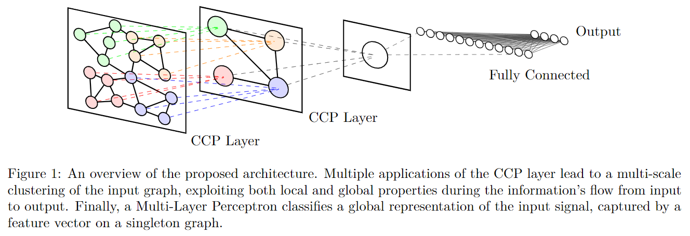

# Classifying Signals on Irregular Domains via Convolutional Cluster Pooling

元の論文の公開ページ : [arxiv](https://arxiv.org/abs/1902.04850)  
Github Issues : [#119](https://github.com/Obarads/obarads.github.io/issues/119)

## どんなもの?
Convolutional Cluster Pooling layerの導入をした。これは入力グラフ上の局所接続領域を異なる解像度で強調するためにマルチスケールクラスタリングを活用する。

## 先行研究と比べてどこがすごいの?

## 技術や手法のキモはどこ? or 提案手法の詳細
提案するConvolutional Cluster Pool-ing (CCP)層を使ったアーキテクチャは図1の通り。この層は以下の処理を行う。

1. 入力グラフをクラスタリング演算を実行する。
2. 1で得られた結果をもとに各クラスタに対して固定数の固定ノードを選択し、クラスタ内のcentrality-based rankでノードをソートする。

### Hierarchical Graph Clustering

## どうやって有効だと検証した?

## 議論はある?

## 次に読むべき論文は?
- なし

## 論文関連リンク
1. なし

## 会議
International Conference on Artificial Intelligence and Statistics (AISTATS) 2019

## 著者
Angelo Porrello, Davide Abati, Simone Calderara, and Rita Cucchiara

## 投稿日付(yyyy/MM/dd)
2019/02/13

## コメント
なし

## key-words
RGB_Image, Classification, CV, Paper

## status
導入

## read
A, I

## Citation
