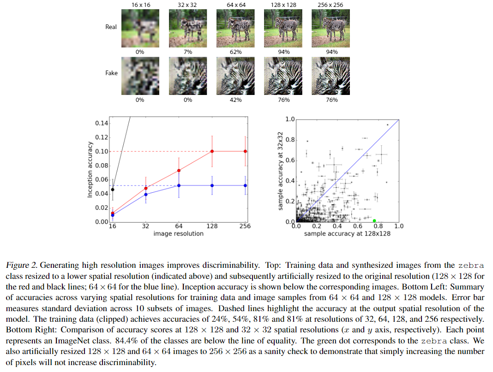
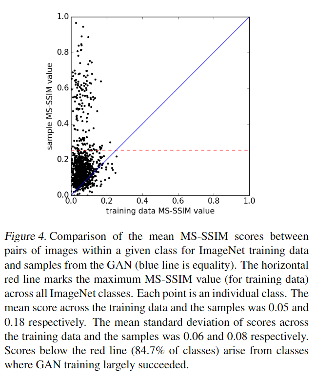
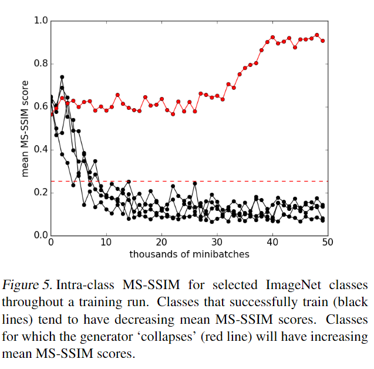

# Conditional Image Synthesis with Auxiliary Classifier GANs

元の論文の公開ページ : [arxiv](https://arxiv.org/abs/1610.09585)
Github Issues : [#37](https://github.com/Obarads/obarads.github.io/issues/37)

## どんなもの?
クラス条件付きモデルであり、クラスと画像を出力とする生成器を持つAC-GANを提案した。また、評価方法を提案したりGANの崩壊の観測についても実験している。

## 先行研究と比べてどこがすごいの?
クラス条件付きモデルでありながら、クラスラベルを再構築(生成した画像とともにラベルを生成)する補助のデコーダーを持つ。著者らが提案した二つの評価方法により、生成される画像の解像度と分類精度の関係について実験している。また、GANの崩壊の観測についても実験している。

## 技術や手法のキモはどこ? or 提案手法の詳細
ACGANはノイズ$z$とそれに対応するクラスラベル$c\sim p_ c$を入力とする生成器$G(c,z)$を持つ。弁別器$D(X)$は生成された画像$X_ {fake}=G(c,z)$もしくは実際の画像を入力として、ソース上の確率分布$P(S|X)$(リアルか合成か)とクラスラベル上の確率分布$P(C|X)$を出力する。
目的関数はソースとの対数尤度$L_ S$とクラスとの対数尤度$L_ C$によって構成されており、$D$は$L_ S+L_ C$を最大化、$G$は$L_ C-L_ S$を最大化するように学習される。(損失関数ではなく尤度で表現しているため勘違い注意) $L_ S$と$L_ C$の定義は式(2)と式(3)となる。($G$が$L_ C-L_ S$となるのは、$X_ {fake}$が与えられるとき$S=real$だと認識されるとき、$L_ S$の値が減少するため)

$$
L_ S=E[\log P(S=real \ | \ X_ {real})]+E[\log P(S=fake \ | \ X_ {fake})] \tag{2}
$$

$$
L_ C=E[\log P(C=c \ | \ X_ {real})]+E[\log P(C=c \ | \ X_ {fake})] \tag{3}
$$

## どうやって有効だと検証した?
### Generating High Resolution Images Improves Discriminability
高解像度画像を生成するといっても、ただ単に低解像度画像を高解像へ拡大し、低解像度画像をぼかしたような画像を生成しても意味がない。合成画像モデル(画像生成モデル)の目的は、低解像度画像よりも識別(分類)可能な高解像度画像を生成することである。  
高解像度かつぼけていない画像を生成することが識別性能向上に寄与することを証明するために、生成された画像もしくは実際の画像を予め学習されたInception network[1]に入力し、そのネットワークが正しいラベルを割り当てる割合を記録する。はじめに$128\times 128$の画像を生成もしくは用意し、それを人為的に拡大もしくは縮小(双線形補間)する。その後、それらの画像を元のサイズ($128 \times 128$)に戻す。結果は図2の上にある通り。画像がぼけているものは認識できていない。また画像を拡大したものを使ったとしてもクラス分類の精度は変わらなかった。結果として、縮小すると識別性能が著しく低下することが分かった。  

また、$128 \times 128$の解像度以外にも$64 \times 64$の解像度で生成を行った。結果は図2の左下のグラフの通り(赤が$129\times 128$、青が$64 \times 64$の生成解像度、$64\times 64$の生成画像から拡大縮小した後に戻すサイズは$64\times 64$)。なんと、$64 \times 64$サイズに縮小されたのちに拡大された$128 \times 128$の画像は$64 \times 64$の生成画像の時よりも精度が上であることが分かった。

### Measuring the Diversity of Generated Images
崩壊を起こしたGANはワンパターンな生成しかできなくなる。生成を行うのであれば多様な生成を行えるに越したことはないが、先ほど説明したInception networkを使った評価方法ではその評価を行うことができない。そこで、multiscale structural similarity(MS-SSIM、[2]など)を使って評価する。MS-SSIMの値は0~1までの値をとり、高いMS-SSIM値はある画像と別の画像が知覚的により類似しているということである。  
画像の多様性を判定するために、同クラス内の画像を100対ほどランダムに選択し、その画像間のMS-SSIM値を記録する。より高い多様性を有するクラスの平均MS-SSIM値はより低くなる(図3左)。多様性が低いものは平均MS-SSIMが低くなる(図3右)。

図4にImageNetの訓練データとGANの生成データの比較図を示す。黒点はそれぞれのクラス、赤破線(0.25)は訓練データの最大MS-SSIM値、青線は等値を示す。訓練データと生成データの全体平均MS-SSIM値はそれぞれ0.05と0.18、平均偏差は0.06と0.08であった。赤線より下のMS-SSIM値は、学習がほとんど成功しているクラスによって成り立っている。

GAN訓練中にMS-SSIMを使って生成器が崩壊しているかどうかを識別する。正常なものは黒色のグラフになるが、崩壊したクラスは赤色のグラフのようになる。

MS-SSIM測定には使用に2つのポイントがあり、これらに注意を払う必要がある(詳細省略)。

### その他
#### Generated Images are both Diverse and Discriminable
提案した上記2つの測定方法の相互作用について調べる。ここで、モード崩壊を起こしたGANは低品質な画像を生成する可能性が高い問うことが分かる。これは、モード崩壊を起こしたGANは多様な表現を犠牲にして高い品質を保つはずであるという仮説と対照的である。

#### Comparison to Previous Results
Inception scoreを用いて、SOTAな手法と比較を行う。

#### Searching for Signatures of Overfitting
過剰適合についての調査。

#### Measuring the Effect of Class Splits on Image Sample Quality
AC-GANを分割して学習させる。

#### Samples from all 1000 ImageNet Classes
ImageNetのクラスを使った10個のサンプルの生成。

## 議論はある?
この解像度に関する測定を画像以外でも調べてみるべきである。

## 次に読むべき論文は?
- [Phillip Isola, Jun-Yan Zhu, Tinghui Zhou, Alexei A. Efros. Image-to-Image Translation with Conditional Adversarial Networks. 2016.](https://arxiv.org/abs/1611.07004)

## 論文関連リンク
1. [Szegedy, Christian, Vanhoucke, Vincent, Ioffe, Sergey, Shlens, Jonathon, and Wojna, Zbigniew. Rethinking the inception architecture for computer vision. CoRR, abs/1512.00567, 2015.](http://arxiv.org/abs/1512.00567)
2. Wang, Zhou, Simoncelli, Eero P, and Bovik, Alan C. Multi-scale structural similarity for image quality assessment. In Signals, Systems and Computers, 2004. Conference Record of the Thirty-Seventh Asilomar Conference on, volume 2, pp. 1398–1402. Ieee, 2004b.

## 会議
ICML 2017

## 著者
Augustus Odena, Christopher Olah, Jonathon Shlens.

## 投稿日付(yyyy/MM/dd)
2016/10/30

## コメント
なし

## key-words
RGB_Image, GAN, CV, Paper

## status
更新済