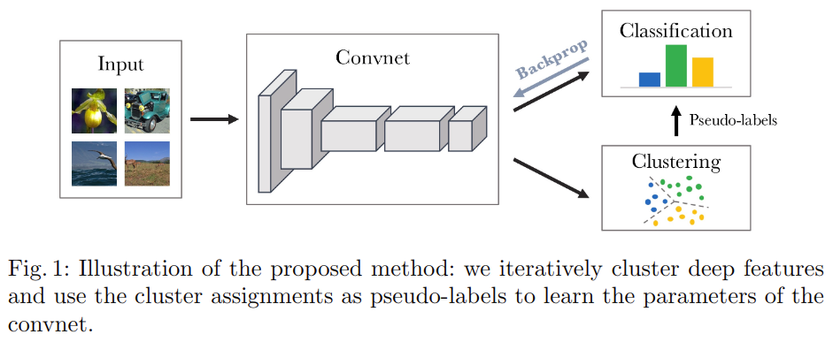

# Deep Clustring for Unsupervised Learning of Visual Features

元の論文の公開ページ : https://arxiv.org/abs/1807.05520

## どんなもの?
省略

## 先行研究と比べてどこがすごいの?
省略

## 技術や手法のキモはどこ? or 提案手法の詳細
$\theta$のパラメーターを持つconvnet mapping $f_ \theta$は、学習させなければ良い特徴を生成することができない。しかし、$\theta$の値がランダムでも$f_ \theta$は何らかの画像上に存在している特徴を捉えており、$\theta$がランダム値であるAlexNetでもImageNetで12%の精度を持っている\[2\](本当にランダムであるなら0.1%の精度しか持たないはずである[4])。  
この研究のアイデアは、このconvnetの識別能力を使うことにある。著者らはconvnetの出力をクラスタリングし、その分割した出力それぞれに擬似ラベルを割り当てて使う(図1)。

クラスタリングアルゴリズムは$k$-meansであり、これを用いて特徴$f_ \theta(x_ n)$を分割し各画像の疑似ラベルを取得する。明確には、式(2)の問題を解くことで$d\times k$の重心行列$C$と各画像$n$のクラスタ割当$y_ n$を同時に学習していく。

$$
\min _{C \in \mathbb{R}^{d \times k} } \frac{1}{N} \sum_{n=1}^{N} \min _{y_{n} \in\{0,1\}^{k} }\left\|f_{\theta}\left(x_{n}\right)-C y_{n}\right\|_{2}^{2} \quad \text { such that } \quad y_{n}^{\top} 1_{k}=1 \tag{2}
$$

この問題を解くことで最適割当の$(y_ n^\*)_ n \leq N$と重心行列$C^\*$が得られ、この割当のみ擬似ラベルとして使われる($C^\*$は使わない)。  
提案手法であるDeepClusterは式(2)を使って疑似ラベルを生成し、疑似ラベルを使ってconvnetの$\theta$を更新していく動作を繰り返す。ただしこの交互手順は自明な解を発生させやすいため、以下のような対策を立てる。

### Avoiding trivial solutions
以下は[1]を参考にしている。完全な文を見るのであれば[1]をおすすめする。

#### Empty clusters
識別モデルはクラス間の決定境界を学習する。この時、最適な決定境界は全ての入力を1つのクラスタに割り振ることである。この問題は空のクラスタを防ぐためのメカニズムを備えていないために起こり、convnetと同様に線形モデルでも発生する。これに対応するため、クラスタが空になる場合にランダムに空でないクラスタを選択し、それらの重心に僅かにランダムな摂動を与え、それを空のクラスタの新しい重心とする。その後、空でないクラスタに属する点を2つのクラスタに再び割り当てる。

#### Trivial parametrization
少数のクラスタに大部分の画像が割り振られている場合、パラメータ$theta$はそれらの間を排他的に識別するだろう。1つのクラスタを除く全てのクラスタがシングルトン(??)となるような非常に極端なシナリオである時、入力に関係なくconvnetは同じ予測を出力するtrivial parametrizationを引き起こす。この問題は画像のクラスが非常に偏っている教師有り学習でも起こる。この問題を回避するため、クラスまたは疑似ラベル上の一様分布に基づいて画像をサンプリングすることである。

## どうやって有効だと検証した?
省略

## 議論はある?
省略

## 次に読むべき論文は?
- Unsupervised Learning of Visual Representations by Solving Jigsaw Puzzles
- Representation Learning with Contrastive Predictive Coding
- ConvNets and ImageNet Beyond Accuracy: Understanding Mistakes and Uncovering Biases

## 論文関連リンク
1. [TAKAMI TORAO. 論文翻訳: Deep Clustering for Unsupervised Learning of Visual Features. (アクセス日時 2019/04/24)](https://hazm.at/mox/machine-learning/computer-vision/clustering/deepcluster/index.html)
2. [Yuki Ishikawa. DeepCluster 論文の紹介. (アクセス日時 2019/04/24)](https://speakerdeck.com/hoto17296/deepcluster-lun-wen-falseshao-jie?slide=15)
3. [鈴⽊智之. Self-supervised Learningによる特徴表現学習. (アクセス日時 2019/04/24)](http://hirokatsukataoka.net/temp/cvpaper.challenge/SSL_0929_final.pdf)
4. [Noroozi, M., Favaro, P.: Unsupervised learning of visual representations by solving jigsaw puzzles. In: ECCV. (2016)](https://arxiv.org/abs/1603.09246)

## 会議
ECCV 2018

## 著者/所属機関
Mathilde Caron, Piotr Bojanowski, Armand Joulin, and Matthijs Douze

## 投稿日付(yyyy/MM/dd)
2018/07/15

## コメント
なし

## key-words
2D_Image, Self-supervised

## status
省略