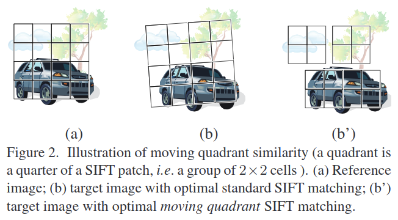

# DeepFlow: Large displacement optical flow with deep matching

元の論文の公開ページ : [cvl.its.u-tokyo](http://www.cvl.iis.u-tokyo.ac.jp/class2016/2016w/papers/3.inpainting/Weinzaepfel_DeepFlow_Large_Displacement_2013_ICCV_paper.pdf)  
Github Issues : [#73](https://github.com/Obarads/obarads.github.io/issues/73)

## どんなもの?
マッチングアルゴリズムと変分アプローチを用いて大変位するオプティカルフローに対処する手法、DeepFlowを提案した。貢献は以下の通り。

- **密な対応関係マッチング** : 著者らは密なサンプリングを行うことで変形可能なパッチを持つ単体特徴一致から密な対応関係を復元する記述子マッチングアルゴリズムを導入する。
- **Self-smoothed matching** : マッチングアルゴリズムは制限された一組の実現可能な非剛体ワーピング(歪み)を用いて実行される。一組の実現可能な非剛体ワーピングは非剛体記述子の計算上効率的な比較を可能にした後、円滑で密な対応関係を生成する。
- **大変位オプティカルフロー** : 著者らの変位オプティカルフローであるDeepFlowは大変位に対するロバスト性において、BroxとMalik'sのアプローチ[1]を超える結果を出す。実験はMiddleburyデータセットとMPI-Sintelデータセットで行われた。

## 先行研究と比べてどこがすごいの?
変分手法を用いたオプティカルフロー推定はSOTAな結果を残してきた。その中で[1]の手法は、大変位を処理するために記述子マッチングを変分アプローチに組み込んだ。しかし、この手法は局所記述子が顕著な部分でのみ信頼性を持ちなおかつ局所的な柔軟性に欠けるという問題がある。マッチング部品を追加しようにも、その場合は変位が小さい部分で性能の低下が起こる可能性があるため、エネルギーの定式化は難しい。他の手法では、計算コストを増大させてパフォーマンスを向上させている。  
著者らは、大変位オプティカルフローに対するdeep convolutional matchingを使用した計算効率の良い手法を提案する。

記述子マッチングは最初に記述子から画像の特徴量を抽出し、それらの特徴量に対して最近傍を行うことで対応する箇所を見つけることができる。しかし、これらの記述子は柔軟性のない(正方形の)局所フレームが使われる。また、最近傍法を用いた手法は弱から中程度のテクスチャ(顕著さのこと?)の正しい対応関係を見つけることができない。  
著者らは、非剛体フレーム内の記述子抽出および全画像領域で密なマッチングを行うことで性能が上がることを示す。  
非剛体ワーピングに関しては他の論文からアイデアを発している[2,3,4]。

[5]は著者らのパイプラインと類似しているが、矛盾する動きを持つオブジェクトに属する対応関係(異なる焦点面等)を併合する方法を欠いている。[6]に対して、著者らの提案手法はnon-prametricかつmodel-freeである。[7]の手法に関しては、トップダウン形式で動くもののdeep matching自体はボトムアップで動く(?)。また、これらの方法はloopy belief伝播を用いた不正確な推論を必要とする(??)。

## 技術や手法のキモはどこ? or 提案手法の詳細
### Deep Matching
このマッチングアルゴリズムは多段階アーキテクチャ(deep convolutional nets)に基づく。

#### Insights on the approach
ここではマッチングの方針について説明する。最初に定義について述べる。SIFT記述子は$4\times 4$の空間的なセルを持つ勾配方向のヒストグラムであり、128次元の実数ベクトル$H\in\mathbb{R}^{128}$を生成する。ここで、図2(b')に示すようにSIFTパッチを4つのquadrants(ここでは分割領域と呼ぶ)と呼ばれるものに分割する。これは次の様に示すことができる : $H=[H^1 \ H^2 \ H^3 \ H^4], \ H^S\in\mathbb{R}^{32}$

著者らはソース記述子をターゲット記述子に一致することを目指す。この両演算子は固定された$4\times 4$のグリッドを維持するというわけではなく、ターゲット記述子$H'$の4つの分割領域の域を最適化することを提案する : sim$(H,Q(p))=\sum^4_ {s=1}\max_ {p_ s}H_ S^TQ(p_ S)$、ここで$Q(p)\in\mathbb{R}^{32}$は位置$p$上で抽出された単体分割領域の記述子である。  
4つの分割領域がそれぞれ独立して動くと仮定した場合、適切な場所で類似性が効率的に推定され、粗い非剛体マッチングが得られる。「粗い」とあるが、これを再帰的に行えばより細かな非剛体マッチングを行うことができる。

#### Deep matching as 2D warping
より目的を明確にするため、**1Dのワーピングの場合**について説明する(2Dへの拡張は簡単である、[3,4]参照)。２つの1D記述子の列をそれぞれリファレンス(上記のソース記述子と同じ)$\mathbf{P}=\{\mathbf{P}_ {i}\}_ {i=0}^{L-1}$とターゲット$\mathbf{P}^{\prime} = \{\mathbf{P}_ {i}^{\prime}\}_ {i=0}^{L-1}$と呼ぶとする。最適なワーピングは式(1)のような要素間の類似性の合計を最大化する関数$w^{*} :\{0 \ldots L-1\} \rightarrow\{0 \ldots L-1\}$によって定義される。

$$
S\left(w^{*}\right)=\max _{w \in W} S(w)=\max _{w \in W} \sum_{i} \operatorname{sim}\left(\mathbf{P}(i), \mathbf{P}^{\prime}(w(i))\right) \tag{1}
$$

ここで、$w(i)$は$\mathbf{P}^{\prime}$中の要素$i$の位置を返す。式(1)の類似性測定は非負のコサイン類似度を使う。　　
実現可能なワーピングの集合$W$は最適なワーピング$w^*$を見つけることが計算上効率的であり、ワーピングが中程度の変形に対して耐性がある様に再帰的に定義される。

**Efficient computation of response maps** : 定義として、中心$\delta$とするサイズ$N \leqslant L$の$\mathbf{P}$の部分列(1D記述子について話していることに注意)を$\mathbf{P}[\delta, N]=\{\mathbf{P}(i)\}_ {i=\delta-\frac{N}{2}}^{\delta+\frac{N}{2}-1}$とする。$\mathbf{P}[\delta, N]$から$\mathbf{P}^{\prime}[T, N]$へのサブワーピングは$w_ {N, \delta \rightarrow T}$として表記される。

ここで、(1D記述子のはず...)Deep matchingの重要なアイデアは左半分と右半分の変位をそれぞれ仮定することである。任意のシーケンス$P[\delta,N]$の$\mathbf{P}[\delta-\frac{N}{4}, \frac{N}{2}]$と$\mathbf{P} [\delta+\frac{N}{4}, \frac{N}{2}]$は両方とも$P[\delta,N]$の変位と$N$の比例的に独立かつ制限されたものとする。図3に示すとおりである。

## どうやって有効だと検証した?

## 議論はある?

## 次に読むべき論文は?
- 3. [S. Uchida and H. Sakoe. A monotonic and continuous two-dimensional warping based on dynamic programming. In ICPR, 1998.](https://pdfs.semanticscholar.org/36dd/e6fa87576b393fd6769b3ba1c173dc610908.pdf)

## 論文関連リンク
1. [T. Brox and J. Malik. Large displacement optical flow: de-scriptor matching in variational motion estimation.IEEE Trans. PAMI, 2011.](http://www.ee.oulu.fi/research/imag/courses/Kokkinos/brox-malik-pami-2010.pdf)
2. [Y. LeCun, L. Bottou, Y. Bengio, and P. Haffner. Gradient-based learning applied to document recognition.Proceed-ings of the IEEE, 1998.](http://vision.stanford.edu/cs598_spring07/papers/Lecun98.pdf)
3. [S. Uchida and H. Sakoe. A monotonic and continuous two-dimensional warping based on dynamic programming. In ICPR, 1998.](https://pdfs.semanticscholar.org/36dd/e6fa87576b393fd6769b3ba1c173dc610908.pdf)
4. [D. Keysers, T. Deselaers, C. Gollan, and H. Ney. Deformation models for image recognition.IEEE Trans. PAMI, 2007.](http://www.keysers.net/daniel/files/Keysers--Deformation-Models--TPAMI2007.pdf)
5. [A. Ecker and S. Ullman. A hierarchical non-parametric method for capturing non-rigid deformations.Image and Vi-sion Computing, 2009.](http://citeseerx.ist.psu.edu/viewdoc/download?doi=10.1.1.330.7285&rep=rep1&type=pdf)
6. [M. Werlberger, W. Trobin, T. Pock, A. Wedel, D. Cremers, and H. Bischof. Anisotropic Huber-L1 optical flow. In BMVC, 2009.](http://www.bmva.org/bmvc/2009/Papers/Paper260/Paper260.pdf)
7. [J. Kim, C. Liu, F. Sha, and K. Grauman. Deformable spatial pyramid matching for fast dense correspondences. InCVPR, 2013.](https://people.csail.mit.edu/celiu/pdfs/CVPR13-DSPM.pdf)

## 会議
ICCV 2013

## 著者
Philippe Weinzaepfel, Jerome Revaud, Zaid Harchaoui, Cordelia Schmid.

## 投稿日付(yyyy/MM/dd)
2014/03/03

## コメント
なし

## key-words
RGB_Image, Flow_Estimation

## status
未完

## read
A, I, R

## Citation
