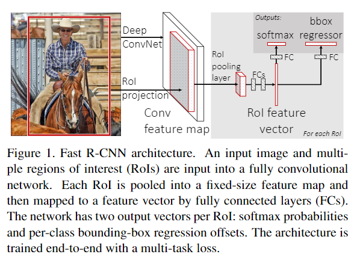
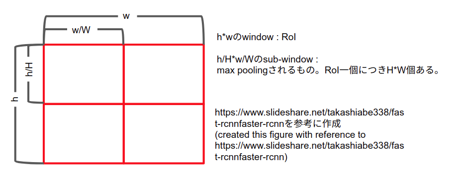

# Fast R-CNN

## どんなもの?
深層畳み込みネットワークを使ったオブジェクト検出用のフレームワークであるFast R-CNNを提案した。

## 先行研究と比べてどこがすごいの?
簡単に言えば、より正確に、より早く動作するようになった。

R-CNN(論文関連リンクの1、先に見るべき)では以下の点が問題となっている。

1. 多数の段階に分かれた訓練
2. 訓練の時間と容量を必要とする訓練
3. オブジェクト検知が遅い。

R-CNNが遅い理由としてそれぞれのオブジェクト提案のためにConvNetのforward処理を計算共有なしで行っている。SSPnetsはその点を解決している。しかし、多段階訓練や空間ピラミッドプーリングを処置する畳み込み層の更新不可など問題点を抱えている。対して、Fast R-CNNは以下の優位性がある。

1. より正確な検知能力(mAP)を持つ
2. マルチタスク損失により訓練が1段階のみになった
3. 全てのネットワーク層を更新可能
4. 要求される容量の低減

## 技術や手法のキモはどこ?
Fast R-CNNのモデルは図1の通り。Fast R-CNNは入力として全ての画像と物体提案のセットを取る。ネットワークは畳み込みと畳み込み特徴マップを生成するためのmax pooling層が組み込まれており、これらですべての画像を処理する。次に、それぞれのオブジェクト提案のためにregion of interest(RoI)プーリング層が特徴マップから固定長の特徴ベクトルを抽出する。この各特徴ベクトルは二つのFCレイヤに渡される: Kクラス+背景クラスの確率を算出するsoftmaxと各Kオブジェクトクラスに対する実際の値を出力する。各4つの値のセットはKクラスのうちの一つに対して洗練されたbounding boxの位置を符号化する。

### **The RoI pooling layer**
RoI pooling layerはmax poolingを使って任意の有効なRoI内の特徴を小さな特徴マップに変換する。RoIは４つのタプルである(r,c,h,w)で定義される。左上からの位置(r,c)と、高さと幅(h,w)からなる。RoI max poolingはh\*wのRoIをH\*Wの碁盤目上に区切ったおおよそh/H\*w/Wサイズのsub-windowをmax poolingする。RoIとsub-windowの関係は以下の通り。

###  **Multi-task lose**
Fast R-CNNのネットワークは2つの出力層を持ち、一つはRoIごとにK+1カテゴリ分類確率p=(p0,...,pK)を出力する。二つ目はbounding box回帰のオフセットtk=(tkx,tky,tkw,tkh)をKクラスごとに出力する(kはクラスのインデックス)。ここで、tkはオブジェクト提案に対するスケール不変の並進とlog空間の高さ/幅を特定する。それぞれのRoIのトレーニングはground-truthのクラスuとground-truthのbounding box回帰目標vでラベル付けされる。bounding box回帰と分類を同時に訓練するためにラベル付けされたRoIでmulti-task lossを式(1)に示す。

ここで、Lcls(p,u)=-log puでありクラスの誤差を示す。また、アイバーソンの記法で表されている関数\[u>=1\]はu>=1のとき1を返し、その他は0を返す。なお、背景クラスはu=0に割り当てられる。背景のRoIにbounding boxという概念は無いため、この場合Llocは無視される。v=(vx,vy,vw,vh)、tu=(tux,tuy,tuw,tuh)でbounding box回帰の誤差は式(2)の様になる。

このrubust L1損失はR-CNNやSPPnetで使われているL2損失より外れ値に強い。回帰対象がunboundedである場合、L2損失を用いた訓練は勾配爆発を防ぐために細かい学習率の調整が必要となる。

## どうやって有効だと検証した?

## 議論はある?

## 次に読むべき論文は?
- [S. Ren, K. He, R. Girshick, and J. Sun. Faster r-cnn: Towards real-time object detection with region proposal networks. In Advances in Neural Information Processing Sys-tems 28, pages 91–99. 2015.](https://arxiv.org/abs/1506.01497)

### 論文関連リンク
1. [R. Girshick, J. Donahue, T. Darrell, and J. Malik. Rich feature hierarchies for accurate object detection and semantic segmentation. InCVPR, 2014.](https://arxiv.org/abs/1311.2524)
2. [K. He, X. Zhang, S. Ren, and J. Sun. Spatial pyramid pooling in deep convolutional networks for visual recognition. In ECCV, 2014.](https://arxiv.org/abs/1406.4729)
3. [論文紹介 Fast R-CNN&Faster R-CNN](https://www.slideshare.net/takashiabe338/fast-rcnnfaster-rcnn)
4. [最新のRegion CNN(R-CNN)を用いた物体検出入門 ~物体検出とは? R-CNN, Fast R-CNN, Faster R-CNN, Mask R-CNN~ - Qiita](https://qiita.com/arutema47/items/8ff629a1516f7fd485f9)
5. [最新の物体検出手法Mask R-CNNのRoI AlignとFast(er) R-CNNのRoI Poolingの違いを正しく理解する - Qiita](https://qiita.com/yu4u/items/5cbe9db166a5d72f9eb8)
6. [4 Mask RCNN Arc.(Part3) - How RoI Pooling, RoI Warping & RoI Align Work](https://www.youtube.com/watch?v=XGi-Mz3do2s)

### 会議
ICCV 2015

### 著者
Ross Girshick

### 投稿日付(yyyy/MM/dd)
2015/04/30

## コメント
