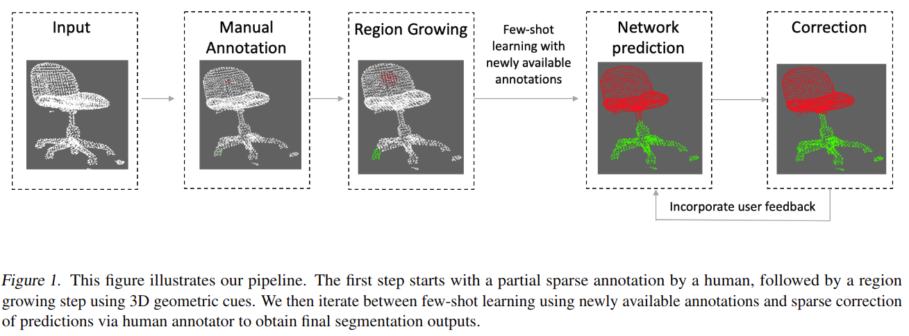

# Few-Shot Point Cloud Region Annotation with Human in the Loop

元の論文の公開ページ : [arxiv](https://arxiv.org/abs/1906.04409)  
Github Issues : [#130](https://github.com/Obarads/obarads.github.io/issues/130)

## どんなもの?
点ごとのアノテーションを持つ大規模点群データセットを作成するための点群アノテーションフレームワークを提案する。本フレームワークではhuman-in-loop学習を採用している。著者らの提案するフレームワークの概要図は図1の通り。本手法は人による部分的でまばらな注釈(Manual Annotation)を用いて始まり、次に3Dの幾何学的なキュー(手がかり)を用いてregio growing stepを行う。その後は、以下の手順は繰り返す。

1. 新たに利用できるアノテーションを使用してModelのfine-turningを行う。
2. アノテーションされた点群の予測を行う。
3. 人による予測の修正を行う。

[※ fine-turningで使用できるアノテーションはかなり少ないため、Few-shot Learningの扱いとなる。]

## 先行研究と比べてどこがすごいの?

## 技術や手法のキモはどこ? or 提案手法の詳細

## どうやって有効だと検証した?

## 議論はある?

## 次に読むべき論文は?
- なし

## 論文関連リンク
1. なし

## 会議
2019 ICML Workshop on Human in the Loop Learning (HILL 2019)

## 著者
Siddhant Jain, Sowmya Munukutla, and David Held

## 投稿日付(yyyy/MM/dd)
2019/06/11

## コメント
なし

## key-words
Point_Cloud, Few-Shot_Learning, Labeling, CV, Paper, 修正

## status
修正

## read
A, I

## Citation
