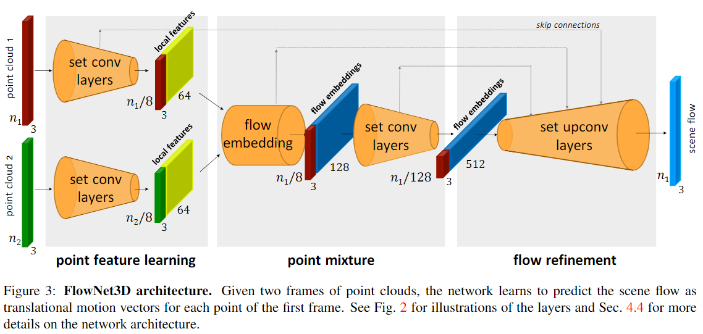
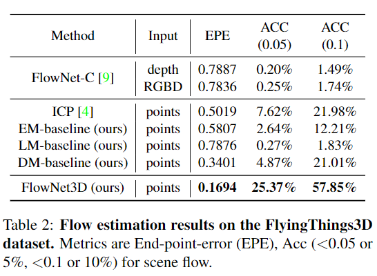
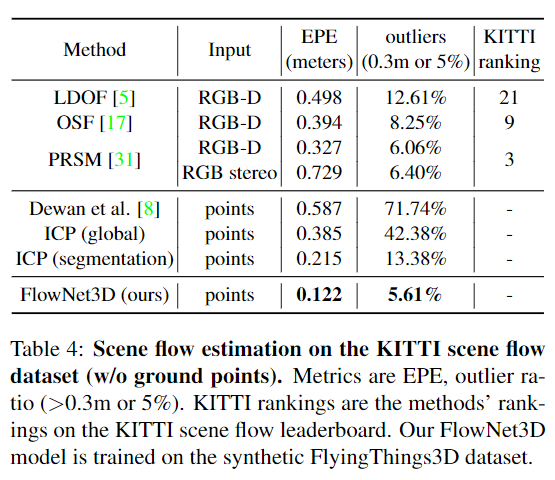
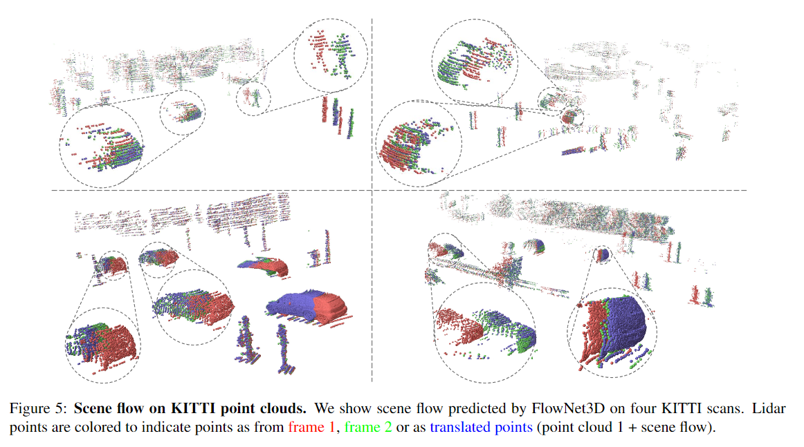

# FlowNet3D: Learning Scene Flow in 3D Point Clouds

元の論文の公開ページ : https://arxiv.org/abs/1806.01411

## どんなもの?
二つの点群からシーンフロー(場面の移り変わり)を得るFlowNet3Dを提案した。

## 先行研究と比べてどこがすごいの?
既存のRGBやRGB-D画像を使ったものと違い、この提案手法は点群のみを使ってシーンフローを解析する。また、深い特徴学習を行いながらも、semantic supervisionに頼らずシーンフローの問題を解く。FlyingThings3D datasetとKITTI scene flow datasetで大幅な性能向上を確認した。

## 技術や手法のキモはどこ? or 提案手法の詳細
### Problem Definition
この提案モデルではフレーム単位で断続的に得た点群$\mathcal{P}=\{x_i|i=1,\ldots,n_1\}$と$\mathcal{Q}=\{y_j|j=1,\ldots,n_2\}$(点の数は必ずしも$n_1=n_2$ではない、含まれる値はシンプルにXYZ座標のみとする)から最初のフレームの全ての点のシーンフローを推定する。

また、物理的に点が$x_i$から$x_i'$に移動し$\mathcal{P、Q}$が与えられたとき、はじめのシーンフロー$\mathcal{D}=\{d_ i|i=1,\ldots,n_1\}$を得ることが目的である。($y_j$ではなく$x_i'$である理由は多分$y_j$の候補をいくつかまとめているため、Point Mixture with Flow Embedding Layerの項この辺のことを述べている)

### 構造
著者らが提案した点群のシーンフロー推定ネットワークはend-to-endであり、図3の様にpoint feature learning、point mixture、flow refinementの3つから構成されている。

### Hierarchical Point Cloud Feature Learning
set conv layerは階層的な特徴を学習するPointNet++[1]の構造に従う。図2の左の様に、入力としてXYZ座標$x_i \in \mathbb{R}^3$と特徴$f_i\in \mathbb{R}^c(i=1,\ldots,n)$を$p_i=\{x_i,f_i\}$として含む$n$個の点を受け取り、出力として$n'$個の点を持つ一部の点群を出す。出力に含まれる点は$p'_j=\{x'_j,f'_j\}$であり、XYZ座標$x'_j$と更新された点特徴$f'_j\in \mathbb{R}^{c'}(j=1,\ldots,n')$を含む。

具体的には、PointNet++でもあるように、層は$x'_j$を中心としてそこから半径$r$内で最も遠い入力点をサンプリングする。サンプリングした結果、$n'$個の局所領域が完成し、これと式(1)を用いて局所特徴を抽出する。

$$
f'_j=\underset{\{i||x_i-x'_j||\leq r\} }{\rm MAX} {\{h(f_i,x_i-x'_j)\} } \tag{1}
$$

ここで、$h:\mathbb{R}^{c+3}\to\mathbb{R}^{c'}$は連結された$f_i$と$x_i-x'_j$を入力とする非線形関数(MLP)であり、$\rm MAX$はelement-wise max poolingである。

### Point Mixture with Flow Embedding Layer
この層では、はじめのフレーム内の各点に対するフロー埋め込み$\{e_ i\}_ {i=1}^{n_ 1} (e_i\in\mathbb{R}^{c'})$を学習する。XYZ座標$x_ i,y_ j\in\mathbb{R}^c$と特徴ベクトル$f_ i,g_ j\in\mathbb{R}^c$があるとき、このflow embedding層は$t$フレーム中に含まれる点群$\{p_ i=(x_ i,f_ i)\}_ {i=1}^{n_ 1}$と$t+1$フレーム中に含まれる点群$\{q_ j=(y_ j,g_ j)\}_ {j=1}^{n_ 2}$を入力として受け取る。この層の最終的な出力ははじめのフレームの点の元の座標$x_i$を含むので$\{o_ i=(x_ i,e_ i)\}_ {i=1}^{n_1}$となる。

点のシーンフローにおいて、$t$フレームにあった点がオクルージョンや視点移動によって$t+1$フレーム後にはなくなっている可能性がある。そこではじめのフレームに含まれる点$p_i$に近い、二番目のフレームに含まれる点$q_ j$を見つける(図2中央の青い点)。もし、$p_ i$に対応する$q ^* =\{y ^* ,g ^* \}$があるのであれば$p_i$のフローは$y^*-x_i$となるが、そんなことはめったにないので代わりに$q_j$'sの近傍からflow vote(フロー候補?)を集約する。式は式(2)の通り。

$$
e_i=\underset{\{j||y_j-x_i||\leq r\} }{\rm MAX} {\{h(f_i,g_j,y_j-x_i)\} } \tag{2}
$$

ここで、$h$はset conv layerと同類の非線形関数、$\rm MAX$はelement-wise max poolingである。$h$では、すべての潜在的フローベクトル$d_{ij}=y_j-x_i$を集約するための重みを学習することを期待する。

また、この式の代案として、特徴距離$dist(f_i,g_j)$を計算するというものがある。特徴距離は$h$に与えられる($f_i$と$g_j$が直接与えられる)。

### Flow Refinement with Set Upconv Layer
このモジュールでは入力された点とその特徴から、アップサンプリングしながら元のすべての点に対するフローの予測を行う。入力はソース点$\{p_ i=\{x_ i,f_ i\}i=1,\ldots,n\}$と目標の点座標の集合$\{x'_ j|j=1,\ldots,n\}$である。各目標点$x'_ j$に対し、層は近傍のソース点を集約することで各目標点の特徴$f'_ j\in\mathbb{R}^{c'}$(この場合、伝播されたフロー埋め込み)を出力する。このset upconvは式(1)で定義されているset conv層を直接利用することもできるが、ここでは別の方法をとる。set conv層の様に最も遠い$x'_ j$を見つける代わりに、目標点$\{x_ j'\}^{n'}_{j=1}$によって指定された場所の特徴を計算する。尚、アップサンプリングであるため、$n'>n$である。

点特徴をアップサンプリングする方法の比較用代案として、3D補完($f'_ i=\sum_ {i| \ ||x_ i-x'_ j||\leq r} w(x_ i,x'_ j)f_ i$、$w$はPointNet++の正規化されたinverse-distance weight関数)を使う。

### Network Architecture
FlowNet3Dは4つのset conv層、一つのflow embedding層、4つのset upconv層と最後に$\mathbb{R}^3$の予測されたシーンフローを出力する線形フロー回帰層からなる。

### Training and Inference wtih FlowNet3D
教師つき訓練データとして、FlyingThings3D[2]を利用する。
#### Training loss with cycle-consistency regularization
シーンフローの訓練のため、smooth $L_ 1$損失(huber loss)とcycle-consistency正則化を利用する。$t$フレームの点群$\mathcal{P}=\{x_ i\}^{n_ 1}_ {i=1}$と$t+1$フレームの点群$\mathcal{Q}=\{y_ j\}^{n_ 2}_ {j=1}$が与えられたとき、ネットワークは$\mathcal{D}=F(\mathcal{P,Q};\Theta)=\{d_ i\}^{n_ 1}_ {i=1}$としてシーンフローを予測する($F$はパラメータ$\Theta$のFlowNet3D)。ground truthシーンフロー$\mathcal{D^* }=\{d_ i ^* \}^{n_ 1}_ {i=1}$があるとき、損失関数は式(3)の様に定義される。

$$
L(\mathcal{P,Q,D^* },\Theta)=\frac{1}{n_ 1}\sum_ {i=1}^{n_ 1}\{||d_ i-d_ i^* ||+\lambda||d_ i'+d_ i||\} \tag{3}
$$

このとき、$||d'_ i+d_i||$はcycle-consistency項であり、シフトされた点群$\mathcal{P}'=\{x_ i+d_ i\}_ {i=1}^{n_1}$から元の点群$\mathcal{P}$へのbackward flow$\{d_ i'\}^{n_ 1}_ {i=1}=F(\mathcal{P',P};\Theta)$がreverse of forward flow(?)に近くなるように強制する。

#### Inference with random re-sampling
ダウンサンプリングを導入したことによって回帰問題の予測結果にノイズが混じる。ノイズを減らすため、複数の推測実行に対して点群をランダムにリサンプリングし、各点に対して予測されたフローベクトルの平均をとることである(?)。

## どうやって有効だと検証した?
### Evaluation and Design Validation on FlyingTh-ings3D
FlyingThings3Dを使い、3D end point error(EPE)とflow estimation accuracy(ACC)を計測手法として使う。結果は表2の通り。

### Generalization to Real Lidar Scans in KITTI
合成データセット(多分FlyingThings3D)で学習させたFlowNet3DでKITTIデータセットの評価を行う。結果は表4と図5、表5の通り。

### その他
いろいろある。

## 議論はある?
なし

## 次に読むべき論文は?
- なし

## 論文関連リンク
1. [C. R. Qi, L. Yi, H. Su, and L. J. Guibas. Pointnet++: Deep hierarchical feature learning on point sets in a metric space. arXiv preprint arXiv:1706.02413, 2017.](https://arxiv.org/abs/1706.02413)
2. [N. Mayer, E.Ilg, P. Husser, P. Fischer, D. Cremers, A. Doso-vitskiy, and T. Brox. A large dataset to train convolutional networks for disparity, optical flow, and scene flow estima-tion. InCVPR, 2016.](https://arxiv.org/pdf/1512.02134.pdf)

## 会議
CVPR2019

## 著者
Xingyu Liu, Charles R. Qi and Leonidas J. Guibas.

## 投稿日付(yyyy/MM/dd)
2018/07/04

## コメント
無し

## key-words
Point_Cloud

## status
更新済