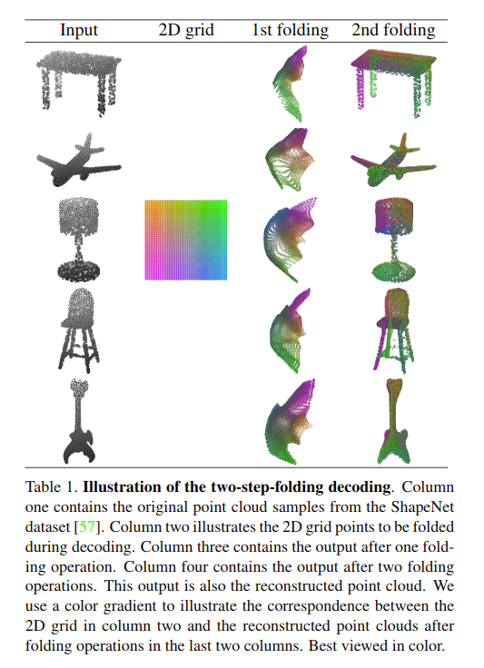

# FoldingNet: Point Cloud Auto-encoder via Deep Grid Deformation

元の論文の公開ページ : https://arxiv.org/abs/1712.07262

## どんなもの?
点群をEncoderで符号化した後に、紙の様な2Dの点群と先程の符号化したものを用いて入力と同じものに復元するFoldingNetと呼ばれるAutoEncoderを提案した(じゃんけんで言えは紙で石を包む感じ)。

## 先行研究と比べてどこがすごいの?
点群はオブジェクトの表面形状をかたどった表現であるため、表1の様に軸に沿った2Dの点群で3Dの形状を覆うようにして表現可能であるというアイデアを元にした提案である。このアイデアを用いることで復元中の動作が解釈しやすくなった。また、論文関連リンクの1(当時の著者が知る限り、点群用AutoEncoderに関する論文がこれしかなかった)の3つの全結合層のデコーダーよりもパラメーターのサイズが小さくなった。Encoderも最近隣グラフとmax-poolingによって局所形状を会得できるようにしている(グラフはあくまでAutoEncoderとしての話)。

## 技術や手法のキモはどこ? or 提案手法の詳細
### **構成**  
提案するFoldingNetは図1の通り。損失には(拡張された)Chamfer distanceを使用する。入力点群が$S$、再構成点群が$\widehat{S}$である時、(拡張された)Chamfer distanceは式(1)になる。

$$
d_{CH}(S,\widehat S)=\max\{\frac{1}{|S|}\sum_{ {\bf x} 
\in S}\min_{{\bf \widehat x}\in \widehat S} {\bf|| x-\widehat x||_ 2} 
,\frac{1}{|\widehat S|}\sum_{{\bf \widehat x} 
\in \widehat S}\min_{ {\bf x}\in S} {\bf|| \widehat x-x||_2}\} \tag{1}
$$

### **Graph-based Encoder Architecture**  
graph-based encoderは論文関連リンクの2に従って設計したものである。

## どうやって有効だと検証した?

## 議論はある?

## 次に読むべき論文は?
- 

### 論文関連リンク
1. [P. Achlioptas, O. Diamanti, I. Mitliagkas, and L. Guibas. Learning Representations and Generative Models for 3D Point Clouds. arXiv preprint arXiv:1707.02392, 2017.](https://arxiv.org/abs/1707.02392)
2. [Y. Shen, C. Feng, Y. Yang, and D. Tian. Mining point cloud local structures by kernel correlation and graph pooling.Pro-ceedings of the IEEE Conference on Computer Vision and Pattern Recognition, 2018.](https://www.merl.com/publications/docs/TR2018-041.pdf)

### 会議
CVPR 2018

### 著者
Yaoqing Yang, Chen Feng, Yiru Shen and Dong Tian.

### 投稿日付(yyyy/MM/dd)
2017/12/19

## コメント
なし

## key-words
PointCloud,AutoEncoder