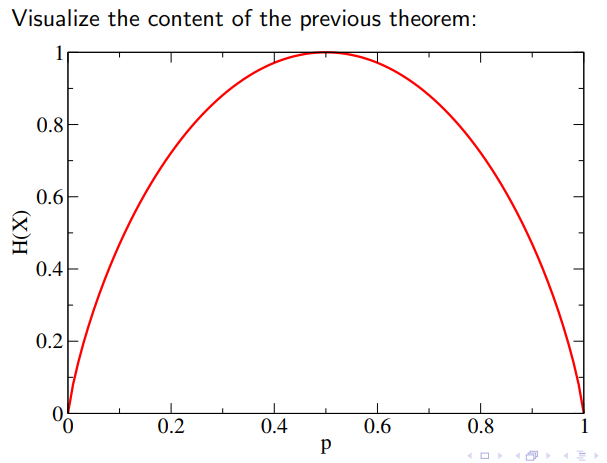

# Formal Modeling in Cognitive Science Lecture 25: Entropy, Joint Entropy, Conditional Entropy

元の記事の公開ページ : [Frank Keller. Formal Modeling in Cognitive Science Lecture 25: Entropy, Joint Entropy, Conditional Entropy. (アクセス:2019/05/01)](http://www.inf.ed.ac.uk/teaching/courses/fmcs1/slides/lecture25.pdf)
Github Issues :   

## どんなもの?
Entropy.

## 内容の詳細は?
以下は意訳である。  
### Entropy
$X$が離散確率変数であり$f(x)$が$x$における確率分布の値である時、$X$のエントロピーは以下の式で表される。

$$
H(X)=-\sum_{x \in X} f(x) \log _{2} f(x)
$$

- エントロピーはビットで計測される。
- 直感的には、確率変数の情報量(もしくは不確実性、不確実性はそれがどれくらい起こりにくいかである)を測る。
- 確率変数の結果を伝えるメッセージの長さとしても解釈できる。
- $H(X)\geq 0$と定義される。

#### 例
例としてフェアな8面ダイスを振った結果を記録するとする。この場合のエントロピーはどのようになるか?  
この確率分布は$f(x)=\frac{1}{8}$ for ${x=1,\cdots,8}$となる。そのため、エントロピーは以下のようになる。

$$
H(x)=-\sum_{x=1}^{8} f(x) \log f(x)=-\sum_{x=1}^{8} \frac{1}{8} \log \frac{1}{8} =-\log \frac{1}{8}=\log 8=3 \rm{bits}
$$

これはダイスの振りの結果を送るために必要とされるメッセージの平均の長さが3bitsであることを意味する。つまり2進数に変換すると以下のようになる。

|1  |2  |3  |4  |5  |6  |7  |8  |
|---|---|---|---|---|---|---|---|
|001|010|011|100|101|110|111|000|

#### 定理
もし$X$が$f(0)=p$と$f(1)=1-p$の分布を持つ二値確率変数である場合、以下の特性がある。

- $p=0 or 1$のとき、$H(X)=0$
- 最大$H(X)$は$p=\frac{1}{2}$

直感的には、$H(X)=0$(エントロピーが0)の場合、それには情報量(もしくは不確実性)が含まれていないため結果が変化しないことを意味する。  
エントロピーが最大になるのは両方の結果が等しい($p=\frac{1}{2}$)ときであり、この時不確実性が最大になる。図に表すと以下のようになる。図は[1]の9ページ目から引用したものである。

### Joint Entropy
以下は[1]の意訳である。  
もし$X$と$Y$が離散確率変数、$f(x,y)$が$(x,y)$における結合確率分布の値であるとき、$X$と$Y$の結合エントロピー(Joint Entropy)は下の式の様になる。

$$
H(X, Y)=-\sum_{x \in X} \sum_{y \in Y} f(x, y) \log f(x, y)
$$

結合エントロピーは、2つの離散確率変数の値を明確にするために必要とされる平均的な情報量を示す。

### Conditional Entropy
以下は[1]の意訳である。  
もし$X$と$Y$が離散確率変数であり、$f(x,y)$と$f(y|x)$が結合確率分布と条件付き確率分布であるとき、$X$で与えられる$Y$の条件付きエントロピー(conditional entropy)は以下のようになる。

$$
H(Y | X)=-\sum_{x \in X} \sum_{y \in Y} f(x, y) \log f(y | x)
$$

条件付きエントロピーが相手方が$X$を知っているとして、$Y$を伝えるために平均でどれだけの追加情報が必要であるかを示す。

#### 例
ここで、母音と子音が同じ音節内で一緒に発生する可能性があるとする。

|$f(x,y)$|p|t|k|$f(y)$|
|-|-|-|-|-|
|a|1/16|3/8|1/16|1/2|
|i|1/16|3/16|0|1/4|
|u|0|3/16|1/16|1/4|
|$f(x)$| 1/8 |3/4|1/8||

条件付き確率を計算すると以下のようになる。

$$
f(a | p)=\frac{f(a, p)}{f(p)}=\frac{\frac{1}{16}}{\frac{1}{8}}=\frac{1}{2}
$$
$$
f(a | t)=\frac{f(a, t)}{f(t)}=\frac{\frac{3}{8}}{\frac{3}{4}}=\frac{1}{2}
$$

子音が与えられた時の母音の条件付きエントロピーは以下のように計算される。

$$
H(V | C)=-\sum_{x \in C} \sum_{y \in V} f(x, y) \log f(y | x)\\
\begin{aligned}=&-(f(a, p) \log f(a | p)+f(a, t) \log f(a | t)+f(a, k) \log f(a | k)+\\ 
& f(i, p) \log f(i | p)+f(i, t) \log f(i | t)+f(i, k) \log f(i | k)+\\ 
& f(u, p) \log f(u | p)+f(u, t) \log f(u | t)+f(u, k) \log f(u | k) ) \end{aligned}\\
=\frac{11}{8} = 1.375 bits
$$

#### 定理
確率分布に対して次のように定義できる。

$$
f(y|x)=\frac{f(x,y)}{g(x)}
$$

エントロピーについても同様の定理になる。

もし$X$と$Y$が結合エントロピー$H(X,Y)$を持つ離散確率変数であり、$X$の周辺エントロピーが$H(X)$である時以下の関係が成り立つ。

$$
H(Y | X)=H(X, Y)-H(X)
$$

エントロピーとしての減算ではなく除算が対数で定義されている。

### Cross Entropy
[3]より引用する。  
2つの確率分布$P$と$Q$に対して以下の式を交差エントロピー(cross entropy)という。２つの確率分布の関係性を測るのに役に立つ。

$$
\mathrm{H}(p, q)=-\sum_{x} p(x) \log q(x)
$$

## 投稿日付(yyyy/MM/dd)

## key-words
CV, Other

## 参考文献
1. [Frank Keller. Formal Modeling in Cognitive Science Lecture 25: Entropy, Joint Entropy, Conditional Entropy. (アクセス:2019/05/01)](http://www.inf.ed.ac.uk/teaching/courses/fmcs1/slides/lecture25.pdf)
2. [情報量 - Wikipedia. (アクセス:2019/05/01)](https://ja.wikipedia.org/wiki/%E6%83%85%E5%A0%B1%E9%87%8F)
3. [交差エントロピーの例と微分の計算 - 具体例で学ぶ数学. (アクセス:2019/05/02)](https://mathwords.net/kousaentropy)