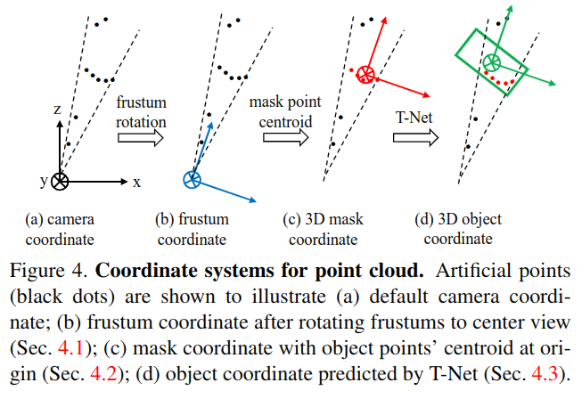

# Frustum PointNets for 3D Object Detection from RGB-D Data

元の論文の公開ページ : https://arxiv.org/abs/1711.08488  
Github Issues : 

## どんなもの?
RGB-Dデータを使用した3D検知モデル、Frustum PointNetを提案した。領域提案はRGBデータをもとに行われる。貢献は以下の通り。

- **新規RGB-D検知モデル** : 著者らは、RGB-Dデータを使った新しい3D検知フレームワークであるFrustum PointNetを提案した。
- **SOTA** : 著者らの提案手法は標準的な3Dオブジェクト検知ベンチマークでSOTAを達成した。
- **多様な実験** : 本提案モデルの特徴および設計の妥当性を示すため、様々な実験を行う。

## 先行研究と比べてどこがすごいの?

## 技術や手法のキモはどこ? or 提案手法の詳細
2D画像で検知した範囲から3D錐台状に点群を切り抜き、そこからオブジェクトの検出を行う。各オブジェクトはクラスとアモーダル3Dバウンディングボックスを持つ。アモーダルボックスはオブジェクトの一部が欠けていてもバウンディングする。このボックスはサイズ$h,w,l$、中央座標$c_ x,c_ y, c_ z$、方向$\theta,\phi,\psi$の値によって表現される。ただし、実装では鳥瞰図から見た方向$\theta$のみを扱う。

提案手法の概要図は図2の通り。

### Frustum Proposal
本提案手法ではRGB-Dカメラなどから得たRGB-Dデータを使用するが、今のRGB-Dカメラの深度データの解像度は低い。また、検知に関しては2D分野の方が成熟しているため、本提案ではRGB情報を含む画像を用いて提案領域を生成する。2D提案領域生成後、以下の手順を踏む。著者らは以下の手順をfrustum proposal generationと呼ぶ。

1. カメラの射影行列を用いて、2Dバウンディングボックスをオブジェクトのための錐台3D探索空間(多分、どの点がオブジェクトか判明してないため「探索」とつけている)へ拡張することができる。この錐台3D探索空間内のすべての点をfrustum point cloud(フラスタム点群)と呼ぶことにする(図4(a))。
2. 錐台の向きは2Dバウンディングボックスの位置ごとに異なり、その影響にフラスタム点群の位置に大きな変動が生まれる(図4(a))。そこで、錐台の中心軸を錐台方向へ回転させることで点を正規化させる(図4(b))。

### 3D Instance Segmentation
2DCNNを使って深度マップから3Dオブジェクトの位置(3Dバウンディングボックス)を直接回帰する方法があるが、図3に示すように、この方法はoccluding objectsとbackground clutterの問題に対処する必要があるため簡単ではない。

物理的な空間では、オブジェクトは距離的に分離されている傾向があるため、著者らは2D深度マップを使用する手法に代わって距離情報を元に処理を行う3D点群を用いた手法を採用する。Mask-RCNNと同様に、錐台内の点群にPointNetベースのネットワークを使用して3Dインスタンスセグメンテーションを行う。これを使うことにより、ローカル座標系における3Dバウンディングボックスの中心を予測できる(図4(c))。

#### 3D Instance Segmentation PointNet
このネットワークは錐台内の点群を取り、各点の確率スコアを予測する。このスコアは、その点が対象オブジェクトに属する可能性を示す。

## どうやって有効だと検証した?

## 議論はある?

## 次に読むべき論文は?
- なし

## 論文関連リンク
1. なし

## 会議
CVPR 2018

## 著者
Charles R. Qi, Wei Liu, Chenxia Wu, Hao Su, Leonidas J. Guibas.

## 投稿日付(yyyy/MM/dd)
2017/11/22

## コメント
なし

## key-words
Point_Cloud, Detection, 2D_Image

## status
未完

## read
A, I, M