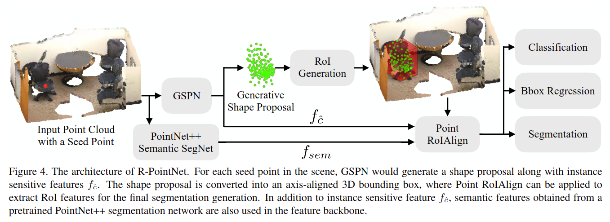
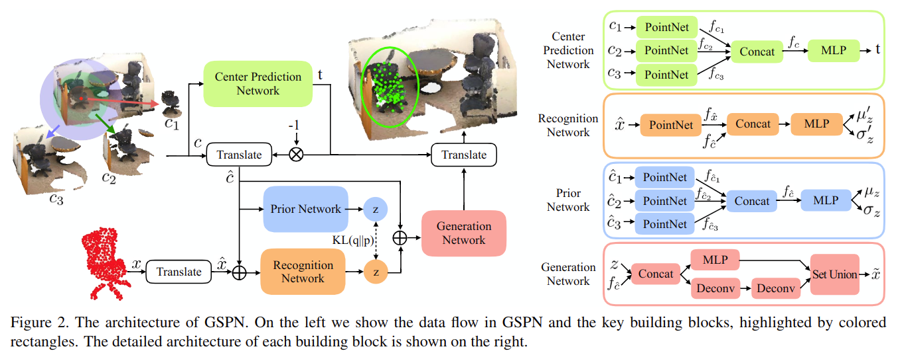
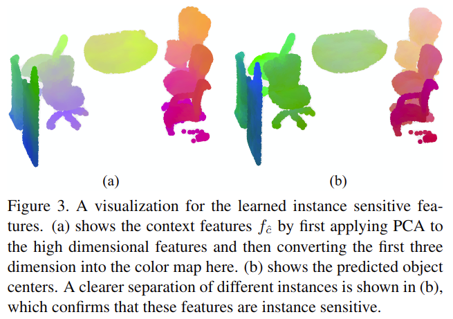

# GSPN: Generative Shape Proposal Network for 3D Instance Segmentation in Point Cloud

元の論文の公開ページ : [arxiv](https://arxiv.org/abs/1812.03320)
Github Issues : [#80](https://github.com/Obarads/obarads.github.io/issues/80)

## どんなもの?

## 先行研究と比べてどこがすごいの?
バウンドボックスによるオブジェクト検知はシンプルであるがあまり幾何学的形状の理解を必要としない(オブジェクトの境界に沿った分割を行わないため)。そのため、オブジェクト提案の領域が重複する箇所が発生する場合がある。また、オブジェクト提案はobjectness(物体っぽさ)をあまり考慮していない(Fast R-CNNなどが例)。これとは対照的にこの研究では幾何学的理解をより重視する手法を提案した。

## 技術や手法のキモはどこ? or 提案手法の詳細
### 概要 & R-PointNet
GSPNを使った点群セグメンテーション&オブジェクト検出アーキテクチャは図4の様にとおりである。このアーキテクチャをR-PointNetと呼ぶ。本提案はGenerative Shape Proposal Network (GSPN)と呼ばれる、objectnessを考慮した3Dオブジェクト提案を行う機構がミソとなる。

図4に沿ってR-PointNetの説明を行う。R-PointNetはMask R-CNNを参考に作成されている。シーン中の各シード点(左の赤点)に対し、GPSNはシード点を含んでいるオブジェクトの形状提案とinstance sensitive features $f_ {\hat{c} }$を生成する。形状提案は3Dバウンディングボックスへ変換され、最終的なセグメンテーションの生成を行うためにRoIとしてPoint RoIAlignが適応され、RoIの特徴が抽出される。$f_ {\hat{c} }$やPointNet++のセマンティックネットワークが生成する$f_ {sem}$をsemantic featuresとしてPoint RoIAlignで扱う。

### Generative Shape Proposal Network (GSPN)
GSPNはオブジェクト提案の手順をオブジェクト生成として扱う。

GSPNのアーキテクチャは図2に示すとおりである。GPSNは4つのネットワークから構成される。入力はシーン点群$P$とシード点$s$である。出力はシード点とその周辺にある点群に基づき生成されるオブジェクト点群(オブジェクト提案)である。

GSPNはある点群(あとで説明するコンテキスト)が与えられたとき、その点群に基づき現実のオブジェクトの分布$p_ \theta(x|c)$からサンプリングを行いオブジェクトの生成を行う。このとき、$p_ \theta(x|c)$を現実のオブジェクトの潜在表現$z$を持つ$\int_ {z} p_ {\theta}(x | z, c) p_ {\theta}(z | c) d z$として近似するとき、条件付きprior分布$p_ \theta(z|c)$からサンプル$z$を得ることで提案を生成し、生成分布$p_ {\theta}(x | z, c)$を介してオブジェクト提案$\tilde{x}$を計算する。$p_ \theta{z|c}$と$\theta{x|z,c}$は、式(1)の訓練データの条件付き対数尤度$\log p_ {\theta}(x|c)$の変動下界を最大化することで学習される。

$$
L=\mathbb{E}_{q_{\phi}(z | x, c)}\left[\log p_{\theta}(x | z, c)\right]-\operatorname{KL}\left(q_{\phi}(z | x, c) \| p_{\theta}(z | c)\right) \tag{1}
$$

ここで、$q_ {\phi}(z | x, c)$は提案分布であり、真のposterior$p_ {\theta}(z | x, c)$に近似する。

GPSNにおいて、$p_ \theta(z|c)$はprior network、$p_ \theta(x|z,c)$はgeneration network、$q_ {\phi}(z | x, c)$はRecognition networkが担当する。

[※　図2は一部不適切だと思う。下の部品を見ていけばわかる。]

#### 入力
$c$はシード点$s$を中心として$P$から切り取られた点群である。$c$は$K$個の異なる切り取り半径をもとに球状の範囲を持って生成される。$K=3$であるとき、異なるスケールの点群(論文ではコンテキスト)$c_ {k \in \\{1 \cdots K\\}}$が得られる。

#### Center Prediction Network
Center prediction networkは$c$を受け取り、ワールド座標系におけるオブジェクト$x$の中央$t$(これがバウンディングボックスの中央となる)を回帰する。具体的には、$c_ {k}$を$K$個のPointNetにそれぞれ入力し、各PointNetから出力された特徴ベクトル$f_ {c_ {k} }$を連結させた$f_ c$をMLPに渡して、中央$t$を求める。(※注意として、シード点はおそらくランダムに選ばれた点であるため、必ずしもオブジェクトの中心点にならない(つまり$s\not= t$))  
Center prediction networkによって計算された$t$は、$c$を$t$を中心とする座標に変換した$\hat{c}_ {k \in \\{1 \cdots K\\} }$とGeneration Networkの出力に使われる。

#### Prior Network
prior networkは$\hat{c}$を入力として、$p_ {\theta}(z | c)$のガウスprior分布$\mathcal{N}(\mu_ {z}, \sigma_ {z}^{2})$に従う$\mu_ {z}, \sigma_ {z}$を出力する。この$z$は natural objects(実際のオブジェクト)の潜在変数を指す。prior networkは$K$個のPointNetとMLPで構成され、入力として$\hat{c}_ k$をそれぞれのPointNetに与え、PointNetの出力は連結することで一つの特徴ベクトル$f_ \hat{c}$へ変換される。その後、$f_ \hat{c}$はMLPを介して$\mu_ {z}, \sigma_ {z}$を出力する。

#### Recognition Network
Recognition networkは単体のPointNetへ$\hat{x}$(座標変換したground truthオブジェクト)を入力し、その出力$f_ {\hat{x} }$をprior networkの$f_ \hat{c}$と連結する。連結された特徴はMLPに入力され、パラメーター化された$q_ {\phi}(z | x, c)$であるガウスproposal分布$\mathcal{N}(\mu_ {z}^{\prime}, \sigma_ {z}^{\prime 2})$の$\mu_ {z}^{\prime}, \sigma_ {z}^{\prime}$を予測する。

#### Generation Network
Generation Networkは入力として$z$とprior networkの$f_ \hat{c}$を受け取り、(greneration networkによって生成された)点群$\tilde{x}$と生成された点ごとの外見尤度(多分、オブジェクトっぽいかどうかということ)の信頼スコア$e$を出力する。この2つの出力(デコーディング)には[1]の構造を利用する。出力された点群$\hat{x}$は$t$を利用してシーンの座標に戻される。

#### objectnessスコアと教師あり訓練
GPSNはMask R-CNNと同様に、各提案のobjectnessスコアを予測するための$f_ \hat{c}$を取るMLPを追加する。objectnessスコアはIoUとバウンディングボックスでsuperviseされる。以下の条件で訓練される。

- positive proposaleはシード点$\mathcal{s}$に基づいた前景オブジェクトからなり、これらのバウンディングボックスはIoU値が0.5よりも大きいいくつかのground truthボックスと重複する。
- negative proposalsはどのground truth boxesにもIoU値が0.5以下である。

#### 損失
GPSNの損失$L_ {G S P N}$は複数の損失の合計値である。複数の損失は形状生成損失$L_ {g e n}$、形状生成の点単位の信頼損失$L_ e$、KL損失$L_ {KL}$、中心予測損失$L_ {center}$とobjectness損失$L_ {obj}$で構成されている。各損失の詳細は以下の通り。

- **$L_ {gen}$** : この損失は生成されたオブジェクト$\tilde{x}$とground truthオブジェクト$x$間のchmfer distanceを損失とする。
- **$L_ e$** : 点単位の信頼度予測を学習するため、著者らはそれぞれの予測した点からground truthオブジェクトの点群までの距離を計算する。信頼度があるかないかは閾値によって決まる。近ければ近いほど信頼性が高く、遠ければ信頼度は低くなる。$L_ e$には平均バイナリクロスエントロピー損失が使われる。
- **$L_ {KL}$** : この損失はproposal分布$q_ {\phi}(z | x, c)$とprior分布$p_ {\theta}(z | c)$を合わせるように損失を課す。著者らはニューラルネットワークを介して$\mathcal{N}(\mu_ {z}^{\prime}, \sigma_ {z}^{\prime 2})$と$\mathcal{N}(\mu_ {z}, \sigma_ {z}^{2})$を$q_ {\phi}(z | x, c)$と$ p_ {\theta}(z | c)$としてそれぞれパラメータ化する。そのため、損失は式(2)のように示される。
- **$L_ {center}$** : この損失にはSmooth L1損失[2]が使われる。
- **$L_ {obj}$** : この損失には平均バイナリクロスエントロピー損失が使われる。

$$
L_{K L}=\log \frac{\sigma_{z}^{\prime}}{\sigma_{z}}+\frac{\sigma_{z}^{2}+\left(\mu_{z}-\mu_{z}^{\prime}\right)^{2}}{2 \sigma_{z}^{\prime 2}}-0.5 \tag{2}
$$

[※　$L_ e$の前半と中間の内容は$L_ obj$と同様? $L_ {obj}$の詳細がよくわからない(見逃してはないはずだが)]

#### $f_ {\hat{c}}$が保有する情報
生成モデルにおけるcenter prediction networkによる位置情報の取り払い(?)は、同じオブジェクトが持っているコンテキストを一貫性のあるコンテキスト特徴$f_ \hat{c}$に符号化することを助けるため、非常に重要な役割を持っている。そのため、著者らはこの特徴$f_ \hat{c}$をinstance sensitive featuresとして扱う。この特徴が持っている情報をPCAを用いて視覚化したものが図3である。左が$f_ \hat{c}$で右がground truthであり、よく似ていることがわかる。

[※ 取り払いではなく移転のほうが適切かも。同じオブジェクトとあるが、これはインスタンス的に同じ情報を持つ(つまりローカル点特徴単位の同じ情報を持つ)ということか、それともクラス的に同じ情報を持つと言っているのか(こちらの解釈かと思っていたが、それだとインスタンスと名前がつくのはおかしいような)わからない]

### Region-based PointNet
ここからはGPSNによる処理後のR-PointNet内の処理になる。GPSNの処理に基づいて、RoIを計算した後に検知結果を出力する。GPSN後の処理は以下のプロセスとなっている。

1. オブジェクト提案からバウンディングボックスを計算することで候補RoIを取得する。ただし、このとき点の信頼性スコア$e$が0.5に満たないものは使わない。
2. 各RoIからPoint RoIAlign層が領域特徴を抽出する。この領域特徴はPointNetベースの分類、セグメンテーション、回帰サブネットワークに与えられる。

この処理の損失はMask R-CNNと同じように各RoI内で$L=L_ {c l s}+L_ {b o x}+L_ {m a s k}$として計算される。

#### Feature Backbone & Point RoIAlign
各RoI内の領域特徴を計算する前に、$f_ {sem}$を用いて$f_ c$を増強する。Point RoIAlignでは各RoIから固定長特徴マップを得るために、Point RoIAlign層は$N_ {RoI}$個の点と特徴ベクトルを$P$からサンプリングする。ただし、実際には$f_ {\hat{c}}$の全てを使うわけではなく(計算が高価なため)、シード点の集合を利用する。この辺の実装がいまいち想像できないため、詳細は省略。そもそも、この提案のキモはGPSNなので、省略しても問題ない?

[※　内容は実装がメイン。知らない話([3])も出てきた。さっと読んだが、この機能をつけた理由は増強という単語以外なかったので省略(読み直し必要?)。4.4章でこの機能の効果をデモンストレーションしている。]

## どうやって有効だと検証した?

## 議論はある?

## 次に読むべき論文は?
- なし

## 論文関連リンク
1. [H. Fan, H. Su, and L. J. Guibas. A point set generation net-work for 3d object reconstruction from a single image. In CVPR, volume 2, page 6, 2017.](http://ai.stanford.edu/~haosu/papers/SI2PC_arxiv_submit.pdf)
2. [R. Girshick. Fast r-cnn. In Proceedings of the IEEE inter-national conference on computer vision, pages 1440–1448, 2015.](https://arxiv.org/abs/1504.08083)

## 会議
CVPR 2019

## 著者
Li Yi, Wang Zhao, He Wang, Minhyuk Sung, Leonidas Guibas.

## 投稿日付(yyyy/MM/dd)
2018/12/08

## コメント
Recognitionとprior network周辺を修正すること。正直、図2が正しい図とは言えない。ただ、GPSNの機構自体は教師なし学習として拡張できそう。

## key-words
Point_Cloud, Semantic_Segmentation, Instance_Segmentation, CV, Paper

## status
修正