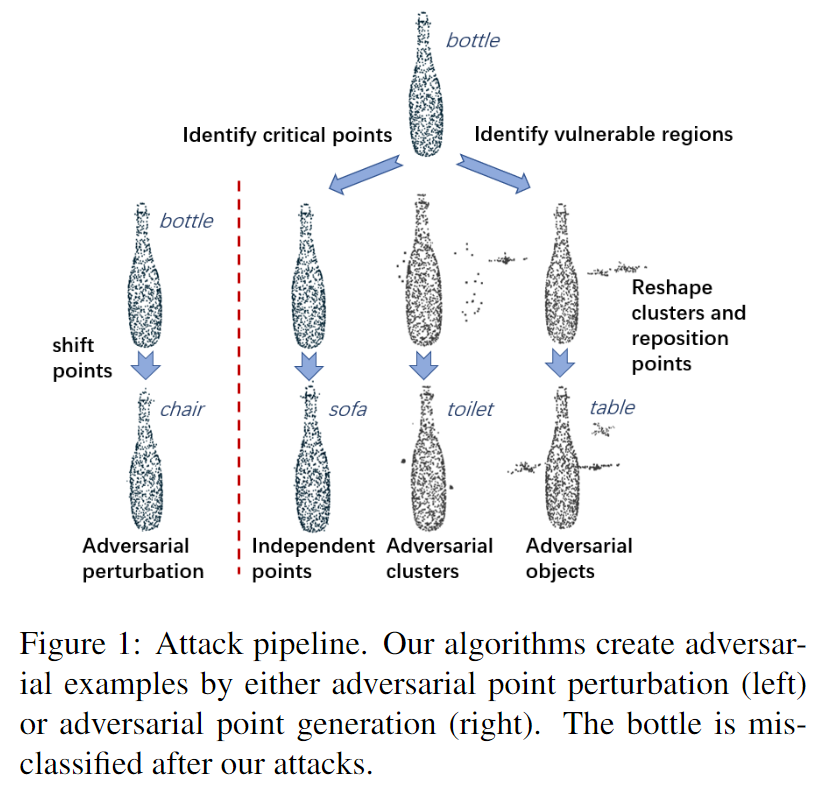
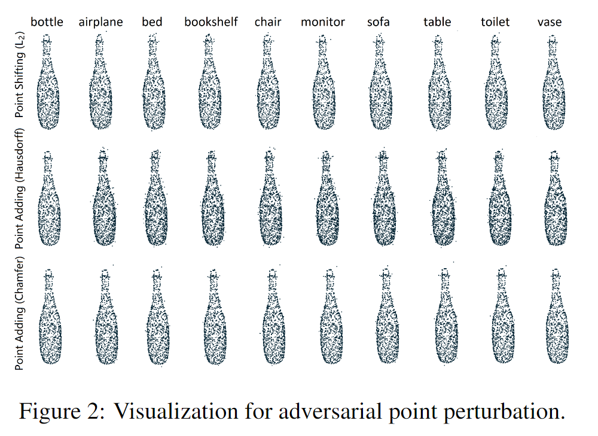

# Generating 3D Adversarial Point Clouds

元の論文の公開ページ : https://arxiv.org/abs/1809.07016

## どんなもの?
点群分類に対するAdversarial exampleを行った。著者らが知る限り、3Dへの直接的なAdversarial exampleの適応は初めてとしている。

## 先行研究と比べてどこがすごいの?
いくつかの先行研究で3D空間内のAdversarial exampleが提案されているが、いづれもデータの前処理に3Dオブジェクトを2D画像に反映している。そのため、実際の3Dモデルを脆弱性を調査した既存研究はない(と著者らは主張している)。著者らは、3D点群を直接使用するモデル(特にPointNet、理由は様々な研究でベースとして使われている上に堅牢だから)に対するAdversarial exampleの実験を行う。

## 技術や手法のキモはどこ? or 提案手法の詳細
### **提案**  
点群を使ったモデルへの攻撃問題がないので、$L_p$ノルムや集合間の比較(おなじみChamfer距離など)を用いた最適化の式を定義している。提案した攻撃方法はオリジナルのオブジェクトの点を動かす敵対点摂動型とオリジナルのオブジェクトに点を付け加える敵対点生成型の2種類あり、敵対点生成型は手法が3つに分かれる。

### **Problem Formulation**
- **Target Adversarial Attacks**  
  本稿では3D点群分類モデルに対する攻撃を説明する。分類以外のタスクにも応用できる。攻撃の目的は、3D深層モデル(例えばPointNet)の分類クラスを誤認識させることである。  具体的には、入力$x\in\mathcal{X}\subset\mathbb{R}^{n\times 3}$を対応ラベル$y\in\mathcal{Y}\subset\mathbb{Z}$に写像できるような分類モデル$\mathcal{F:X\to Y}$、敵対(ラベル)は害を与える目的のクラス$t'\in\mathcal{Y}$があるとする。摂動手法$\mathcal{D:\mathbb{R}^{n\times 3}\times \mathbb{R}^{n'\times 3} \to \mathbb{R} }$に基づき、攻撃の目標は誤認させる入力$x'\subset\mathbb{R}^{n'\times3}$を見つけることである。最適化の式は式(1)の通り

  $$
  \min D(x,x'), \qquad s.t. \ \mathcal{F}(x')=t' \tag{1}
  $$

  このとき、$n=n'$に必ずしもなるとは限らない(敵対点生成型の場合)。論文関連リンクの1でも述べているように、この問題を直接解くのは困難である。そのため、著者らは勾配最適化アルゴリズムとしてこの問題を式(2)の様に再定式する。

  $$
  \min f(x')+\lambda * \mathcal{D}(x,x') \tag{2}
  $$

  ここで、$f(x')=(\max_{i\neq t'}(\mathcal{Z}(x')_ i)-\mathcal{Z}(x')_ {t'})^+$は敵対損失関数であり、出力は攻撃が成功する見込み(当然0に近づくほど見込みが高い)である。$\mathcal{Z}(x)_i$はlogit(ソフマックス層の入力)のi番目の要素であり、$(r)^+$は$\max(r,0)$を表す。$\lambda$は摂動の制約を調節できる。　式2を最適化することによって、著者らは最小の3D摂動を用いてadversarial exampleを探すことを目的とする。

- **Attacking Types**  
  著者らは点群による攻撃を以下2種類考えた。どちらも固定されたサイズを持つ画像の場合とは異なる(特に生成型)。
  - **Adversarial Point Perturbation(敵対点摂動)**  
    敵対ジッタリングを用いたXYZ座標のシフティングによって既にある点を修正する。具体的には、点群中の点$x_i \in \mathbb{R}^3$が修正した点$x'_i=x_i+\delta_i \ (i=1, \ldots, n)$となるような摂動$\delta\in\mathbb{R}^3$を使って修正するということである。
  - **Adversarial point generatio(敵対点生成)**  
    オリジナルの点に追加する敵対点の集合を生成し、オリジナルの点群に加える。具体的には、敵対点$z_i\in\mathbb{R}^3$を生成する。敵対点$z_i = \{z_i|i=1,\ldots,k\}$もしくは$z_i\in\mathbb{R}^3$となるような配列表現をもつ。敵対点はオリジナルの点群と合体し、点群$x'=x\cup z$もしくは配列連結($n'=n+k$)による配列表現$x'\in\mathbb{R}^{(n+k)\times 3}$となる。
  
  各攻撃手法のパイプラインにより生成された敵対点群は図1の様になる。敵対点生成型は3種類ある。

  

### **Adversarial Point Perturbation**
摂動を加えることでオリジナルの点を動かしモデルを誤認識させる。最終的な点群は図1の左である。オリジナルの点と摂動の点には対応関係があり、それを計測するために$L_p$ノルムを使う。$L_p$ノルムは固定形状のデータの敵対摂動のための計測手法として一般的に使われる。具体的には、オリジナルの点集合$\mathcal{S}$とそれに対応する敵対集合$\mathcal{S'}$に対して、摂動の$L_p$ノルムは式(3)のようになる。

$$
\mathcal{D}_{L_p}(\mathcal{S,S'})=(\sum_i(s_i-s'_i)^p)^\frac{1}{p} \tag{3}
$$

ここで、$s_ i$は集合$\mathcal{S}$内の$i$番目の点座標であり、$s'_ i$は$s_i$に対応する集合$\mathcal{S'}$の点である。  
敵対摂動$\{\delta\}_ {i=1}^n$を生成するために式(2)を直接使用することができ、摂動を制限するための$L_2$ノルム距離を用いて最適化する。

### **Adversarial Point Generation**
敵対点群を生成し、それをオリジナルの点群と合わせることでモデルを誤認識させる。敵対点生成手法には3つの手法がある。
- **Generating Adversarial Independent Points**  
  ここでは目立たない独立した点群を生成する攻撃について説明する。最終的な点群は図1の左から2番目である。注意として、この生成手法ではオリジナルの点群に新しい点群を追加するにあたって、データの次元数の変化に対処する必要がある。  
  最初に敵対点のオリジナルの点に対する偏差の測定手法を導入し、攻撃アルゴリズムについて説明する。

  - **Perturbation Metrics**  
    - **Hausdorff Distance**  
      Hausdorff距離は、距離空間の2つのサブセットが互いにどれだけ離れているかを測定するためによく使用される。具体的には、オリジナルの点集合$\mathcal{S}$とそれに対応する敵対点集合$\mathcal{S'}$があるとするとHaudorff距離は式(4)の様に示される。

      $$
      \mathcal{D}_H(\mathcal{S,S'})=\max _{y\in \mathcal{S'} }\min _{x\in \mathcal{S} }||x-y||_2^2 \tag{4}
      $$

      この式(4)は、敵対点について最も近いオリジナルの点を見つけ、そのようなすべての最も近い点のペアで最大二乗距離を出力する。
      Hausdorff距離をそのまま使うのであれば$\max _{x\in \mathcal{S} }\min _{y\in \mathcal{S'} }||x-y||_2^2$が存在するが、ここではオリジナルの点群を修正することはないので省いている。

    - **Chamfer Measurement**  
      Chamfer計量はHausdorff距離とよく似ており、最大値ではなく平均をとる摂動計測手法である。式(5)で表される。

      $$
      \mathcal{D}_C(\mathcal{S,S'})=\frac{1}{||S'||_0}\sum _{y\in \mathcal{S'} }\min _{x\in\mathcal{S} } ||x-y||_2^2 \tag{5}
      $$

    - **Number of Points Added**  
      攻撃で追加された点群の数を数えるため、オブジェクトの表面からの距離が指定した閾値を超える点を数える(理由は式(6)の下)。具体的には、閾値$\mathcal{T_{thre} }$であるとすると式(6)の様に定義される。

      $$
      Count(\mathcal{S,S'})=\sum_ {y\in\mathcal{S'} } \mathbb{1}[\min_{x\in\mathcal{S} }||x-y||_2>T _{thre}] \tag{6}
      $$

      ここで、$\mathcal{1}[・]$は$[・]$が真の場合1、それ以外は0になる関数である。追加された点の数は勾配ベースの最適化アルゴリズムに適合しないため式(2)の摂動測量$\mathcal{D}$として最適化されないが、追加のパフォーマンス測定として報告される(?)。

  - **Attacking Algotithm**  
    直接点を適切な場所に置くのは不可能なので、追加された各点の適切な位置を見つけるためのinitialize-and-shift手法を提案する。

    1. 初期化した点としてオリジナルの点と同じ座標にいくつかの点をinitialize(初期化する)。
    2. 式(2)を最適化して初期点をshift(シフト、移動する)し、それらの最終位置を出力する。

    最適化中にいくつかの点は初期位置からシフトし、シフトした点を敵対点としてオリジナルの点群に追加する。その他のほとんど動いていない点はいらないため破棄する。  
    これらの最適化を効率的にするために、Critical pointsと呼ばれる位置で点を初期化する。これはいわば3D点群のキーポイントや際立った3D点群のことを指す。PointNetでいえば、Max poolingの後もactiveなままにである点を取ることで計算できる(?)。つまり、オブジェクトカテゴリを決める重要な位置にあることを意味する(?)。  
    著者らはHausdorffとChamfer計量を攻撃の摂動指標$D$として利用する。異なる次元の敵対点群がどれほど気づかれないのかを測れるためである(?)。

- **Generating Adversarial Clusters**  
  ここでは、まるでオリジナルのオブジェクトにつけられたボールの様に見える塊(Clusters)を用意し、この塊を疑われない位に最小化する。また、塊自体がオリジナルの点群の表面上に位置するように調節する。これらの条件を満たすために次のような摂動測定方法をを導入する。

  - **Perturbation Metrics**  
    - **Farthest Distance**  
      点群集合内の最も遠い点のペアごとの距離が閾値によって制限されている場合、この集合内の点は形づけられた塊を作ることができる。具体的には、点集合$\mathcal{S}$の最も遠い距離を式(7)の様に表す。

      $$
      \mathcal{D}_{far}(\mathcal{S}) = \max _{x,y\in\mathcal{S} }||x-y||_2 \tag{7}
      $$

    - **Chamfer Measurement**  
      Generating Adversarial Independent PointsのChamfer Measurementで話した通りの内容。使うのは塊をオリジナルの点群に近づけるため。

    - **Number of Clusters Added**  
      Generating Adversarial Independent PointsのNumber of Points Addedと同様に追加された塊の数をパフォーマンス計測のために数える。実験では1~3個に固定されている。

  - **Attacking Algotithm**  
    アルゴリズムの詳細に入る前に、式(2)を再定式化する。

    $$
    \min f(x')+\lambda\sum_i\mathcal{D}_{far}(\mathcal{S} _i)+\mu・\mathcal{D} _C(\mathcal{S_0,S}_i) \tag{8}
    $$

    ここで、$i\in\{1,2,\ldots,m\}$、$\mathcal{S}_0$はオリジナルオブジェクト、$\mathcal{S}_i$は$i$番目の敵対点の塊、$m$は敵対の塊の数、$\mu$はFarthest距離損失とChamfer計量損失間の重要性のバランスをとるために使われる重みである。ここで、$\mathbb{R}^{n\times 3}\times\mathbb{R}^{n'\times 3}\to\mathbb{R}$と$\mathbb{R}^{n\times 3}\to\mathbb{R}$の両方の写像を示すために$\mathcal{D}$を使った表記法を少し乱用する(?)。  
    この手法にもinitialize-and-shift手法を使う。ただし、追加された点を小さくまとめなければならず、極小値も偏在するしており(?)、初期値付近で動かなくなる可能性があるため、効率的な初期化方法が必要となる。  
    (ここら辺から若干あいまい)初期化のためにvulnerable regions(脆弱な領域)というアイデアを利用する。画像ではL1の制約を使ったりするが、点群ではL1の制約が定義されていないため適応できない。代わりに、Generating Adversarial Independent PointsのAttacking Algotithmでも用いたcritical pointsを利用して脆弱な領域を見つける。

    オリジナルのオブジェクトと誤認識させるための目標クラス$t'$があるとき、攻撃アルゴリズムは以下のようになる。

    1. $t'$でのオブジェクトのcritical pointsを得る。
    1. 選択したcritical pointsをクラスタリングするために、クラスタリングアルゴリズムのDBSCAN※(論文関連リンクの2)を使う。
    1. 初期点としてk個の最も大きい塊内の点を選ぶ。$k$はself-chosenパラメータであり、攻撃のパフォーマンス評価のための評価方法でもある。
    1. 式(8)を最適化して塊の位置と形状を見つける。

    ※DBSCANは密集している点をグループ化する(多分PCLのクラスタリングみたいなもの)。  
    目標オブジェクトを多数用意することもできる。目標オブジェクトが一つだけである場合、critical pointsの空間分布が制限されるが、目標オブジェクトが多すぎるとcritical pointsが散在してしまうためよろしくない。これはcritical pointsも同様である。そこで適度な数が必要になるが、だからといってパラメーターの細かい修正は必要ない(式(8)の最適化によって何とかなるらしい)。

- **Generating Adversarial Objects**  
  オリジナルのオブジェクトの近くに小さい別の意味のあるオブジェクト(飛行機など)を置く。人から見ればその小さいものが直接オリジナルのオブジェクトに関係しないように考えるため疑わないだろう。図1では一番右にあたる。

  - **Perturbation Metrics**  
    - **$L_p$Norm**  
      意味のあるオブジェクトを少しだけ修正し、生成された形状を実在する意味のあるもの(飛行機など)と同様にするため$L_p$ノルムの一種である$L_2$ノルムを利用する。

    - **Chamfer Measurement**  
      Generating Adversarial Clustersの時同様、生成した形状をオリジナルのオブジェクトに近づけるため使用する。(後ほど出る数式はHausdorffになっている。)
    
    - **Number of Clusters Added**  
      Generating Adversarial Clustersと同様。1~3個に制限したり評価したりする。

  - **Attacking Algorithm**  
    この生成方法に合わせた目的関数を用意するため式(2)を式(9)の様に書き直す。

    $$
    \min f(x')+\lambda・\sum_ i \mathcal{D}_ {L_ 2}(\mathcal{S} _{i0},\mathcal{S}_i)+\mu ・ \mathcal{D} _H(\mathcal{S} _{i0},\mathcal{S}_i) \tag{9}
    $$

    ここで$i\in\{1,2,\ldots,m\}$、$\mathcal{S}_0$はオリジナルオブジェクト、$\mathcal{S}_i$は$i$番目の敵対点の塊、$\mathcal{S}_{i0}$は$i$番目の実在の塊(おそらく飛行機など、敵対点の塊が目指すべき形状)、$m$は敵対の塊の数、$\mu$は$L_2$損失とHausdorff距離損失間の重要度のバランスをとる。  
    最適化するには、Generating Adversarial Clustersの時と同じように、まず脆弱な領域を見つけ、次に追加された実世界の点群の塊を摂動させ初期化する必要がある。アルゴリズムは以下のとおりである。

    1. 目標クラスでのcritical pointsをとる。
    1. DBSCANを使って、選ばれたcritical pointsをクラスタリングする。
    1. $k$個の最も大きな塊を特定し、塊の中心座標を計算する。$k$はself-chosenパラメーターであり、攻撃性の評価のための指標でもある。
    1. 意味のあるオブジェクト(複数形)を選び、それらの中心が前のステップで計算された座標と重なるように初期化する。
    1. 式(9)を最適化し、最適な塊の位置と形状を見つける。

  なお、塊の向きはどこを向いていても問題ない。

## どうやって有効だと検証した?
### **Dataset and 3D Models**
ModelNet40を使用する。点群数は1024でPointNetと同様に単位球に再スケーリングされる。PointNetの構造を使用して訓練データを訓練する。10個の最大クラスからそれぞれ25個のテストの例をランダムに選ぶ。テスト時は、正解のクラス(1個)と目標クラス(9個)のペアとなったデータが2250個用意される。なお、$\lambdaや\mu$の話も出るがここでは省く。

### **Adversarial Point Perturbation Evaluatio**
結果は以下は表1の通り。図2の最初の行がその結果を視覚化したものである。

### **Adversarial Point Generation Evaluation**
- **Adversarial Independent Points**  
  $T_{thre}$は0.01として、この閾値を超えたものを移動した点と数える。HausdorffとChamferを使った実験結果は表1の通り。結果の視覚化は図2の2と3行目にある。

- **Adversarial Clusters**  
  初期の塊を取得するため、目標クラスのテストセットから8つの異なるオブジェクトを選び、PointNetのglobal feature channelsの数に基づいて選択したオブジェクトのための32個の最も重要なcritical pointsを取得する。その後DBSCANによって$32\times 8$のcritical pointsをクラスタリングする。その後、k個の最も大きな塊を維持し、残りはすべて破棄する。各塊について、subsamplingとpaddingを行い、32個の初期点を得る(?)。$k$は1~3であり、補足にそのことについて載せられる(ここでは省く)。結果は表2の通り。視覚化は図3の通り。

  

  

- **Adversarial Objects**  
  実在の塊には飛行機を使い、これを3/10に縮小したものを使い、その中の64個の点が一様にサンプリングされた。表2に結果、図3に視覚化が乗っている。

### **More Analysis on 3D Model Robustness**
- **Transferablity of Adversarial Point Clouds**  
  作成した敵対点群を表3のモデルに乗っているモデルに適応した。

  

- **Training with Data Augmentation**  
  PointNetの訓練で使われる点群に回転やジッターを施したものを使い、訓練させた結果が表3に載っていいる。

- **Defense on MNIST with PointNet**  
  MNISTデータセットの防御のためにPointNetの構造を使う。グレースケール画像を二値化し各MNIST digitから256個の点をサンプリングする。FGSMを用いてLeNetを攻撃することでadversarial exampleを作成した。二値化された画像のテスト精度(LeNet)と異なる攻撃パラメータ$\epsilon$でサンプリングされた点群(PointNet)のテスト精度を表4に示す。ここで言いたいのは、PointNetが従来のCNNより堅牢であること、堅牢さがMax poolingによっておこること、従来のニューラルネットワークでもこの機構を使えば防御しやすくなる(堅牢性が上がる)かもしれないということである。

  

## 議論はある?
MNISTのところにあり

## 次に読むべき論文は?
- (読むべきかなぁ...)[Jiancheng Yang, Qiang Zhang, Rongyao Fang, Bingbing Ni, Jinxian Liu and Qi Tian. Adversarial Attack and Defense on Point Sets. 2019.](https://arxiv.org/abs/1902.10899)

### 論文関連リンク
1. [N. Carlini and D. Wagner. Towards evaluating the robustness of neural networks. InSecurity and Privacy (SP), 2017 IEEE Symposium on, pages 39–57. IEEE, 2017.](https://arxiv.org/abs/1608.04644)
1. [M. Ester, H.-P. Kriegel, J. Sander, X. Xu, et al. A density-based algorithm for discovering clusters in large spatial databases with noise. InProceedings of the SecondInterna-tional Conference on Knowledge Discovery and Data Min-ing, KDD’96, pages 226–231, 1996.](https://www.aaai.org/Papers/KDD/1996/KDD96-037.pdf)

### 会議
未確認

### 著者
Chong Xiang, Charles R. Qi, Bo Li

### 投稿日付(yyyy/MM/dd)
2018/09/19

## コメント
アイデアはわかるが細かいところの使用が理解できなかった(特にcritical pointsの判明方法)。PointNetの人が共著している初めての点群に対するAdeversarial exampleの論文。

## key-words
Point_Cloud, Adversarial