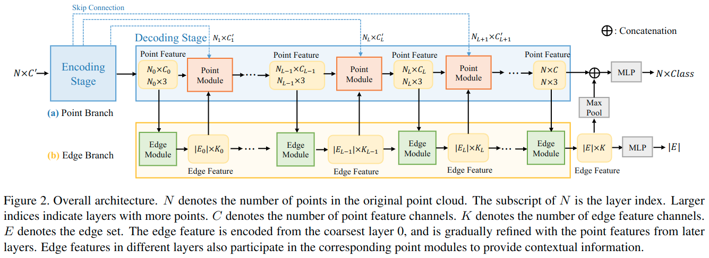

# Hierarchical Point-Edge Interaction Network for Point Cloud Semantic Segmentation

元の論文の公開ページ : [openaccess.thecvf.com](http://openaccess.thecvf.com/content_ICCV_2019/papers/Jiang_Hierarchical_Point-Edge_Interaction_Network_for_Point_Cloud_Semantic_Segmentation_ICCV_2019_paper.pdf)  
提案モデルの実装 : [2020/1/5:なし]()  
Github Issues :   

Note: 記事の見方や注意点については、[こちら](/)をご覧ください。

## どんなもの?
##### 局所領域内の点間の意味関係を利用するために、点とcontextual neighborsの間にエッジを明示的に構築するモデルを提案した。
- 図2は提案手法の概要図。本提案はPointNet++のようなencoder-decoder構造モデルを持つPoint Branch(図2の水色部分)と、Edge Branch(図2の黄色部分)からなる。
  - Edge Brachは違う層から点特徴(Point feature)を受け取って階層的にエッジ特徴(edge feature)を生成していく。
  - その後、局所グラフの情報を統合するために、Point branchへエッジ特徴を供給する。
- 各点に対して、対応するエッジ特徴が局所的な幾何学及び意味的な情報を提供して、点の表現を強化する。

##### S3DISとScanNetを用いてベンチマークを行った。
- 特になし。

## 先行研究と比べてどこがすごいの? or 関連事項
##### 省略

## 技術や手法のキモはどこ? or 提案手法の詳細
##### 省略

## どうやって有効だと検証した?
##### 省略

## 議論はある?
##### 遠距離および近距離のコンテキスト情報を集計したマルチレンジ対応のものを開発するだろう。

## 次に読むべき論文は?
##### なし

## 論文関連リンク
##### なし
1. [なし]()[1]

## 会議, 論文誌, etc.
##### ICCV 2019

## 著者
##### Li Jiang, Hengshuang Zhao, Shu Liu, Xiaoyong Shen, Chi-Wing Fu, Jiaya Jia

## 投稿日付(yyyy/MM/dd)
##### 2019/09/23

## コメント
##### あり
- AとC、Iのcontributeをざっと確認

## key-words
##### Paper, CV, Point_Cloud, Semantic_Segmentation, 導入, Graph

## status
##### 導入

## read
##### A, C

## Citation
##### 未記入
