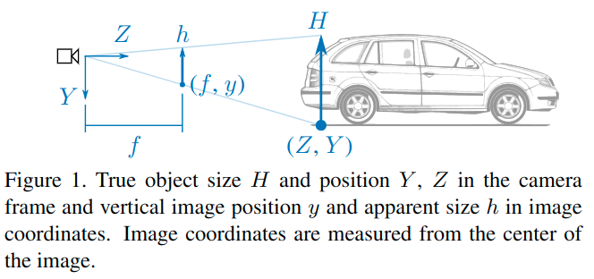

# How Do Neural Networks See Depth in Single Images?

元の論文の公開ページ : [openaccess.thecvf.com](http://openaccess.thecvf.com/content_ICCV_2019/papers/van_Dijk_How_Do_Neural_Networks_See_Depth_in_Single_Images_ICCV_2019_paper.pdf)  
提案モデルの実装 : [2019/12/13 なし]()  
Github Issues :   

## どんなもの?
##### 単体画像の深度を予測するニューラルネットワークの学習について分析を行った。
- 深度推定ネットワークに対する分析を行う初めての論文としている。
- 既存の4つのネットワークを取り上げ、これらのネットワークがどんな奥行きに関する手がかりを使っているのか調査する。

##### これらのネットワークが既知の障害物(obstacles)の見た目のサイズを無視して、画像中の垂直位置に注目していることを著者らは発見した。
- [画像中の垂直位置とは、図1にある$y$のことっぽい。読んだのはAbst.まで。]
- 垂直位置を利用するにはカメラの姿勢を知っている必要がある。
- **しかしながら、ネットワークがカメラのピッチとロール角度の変化をある程度に認識しているだけであった。**
    - カメラのピッチに小さな変化をつけた場合、障害物の深度推定が阻害される。
- 垂直の画像位置を利用すると、ネットワークは任意の障害物(訓練セットに示されていないものも含む)の深度も推定できる。
    - しかしながら、普遍的には存在しない特徴に依存することもある。

## 先行研究と比べてどこがすごいの? or 関連事項

## 技術や手法のキモはどこ? or 提案手法の詳細

## どうやって有効だと検証した?

## 議論はある?

## 次に読むべき論文は?
- なし

## 論文関連リンク
1. [なし]()[1]

## 会議, 論文誌, etc.
ICCV 2019

## 著者
Tom van Dijk, Guido C.H.E. de Croon

## 投稿日付(yyyy/MM/dd)
2019/05/16

## コメント
なし

## key-words
Analytics, CV, Paper, Depth_Image, Depth_Estimation, 修正

## status
修正

## read
A

## Citation
