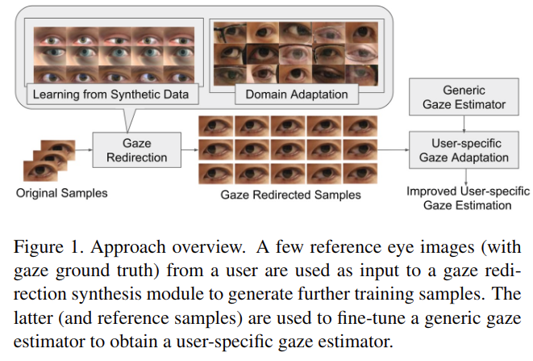
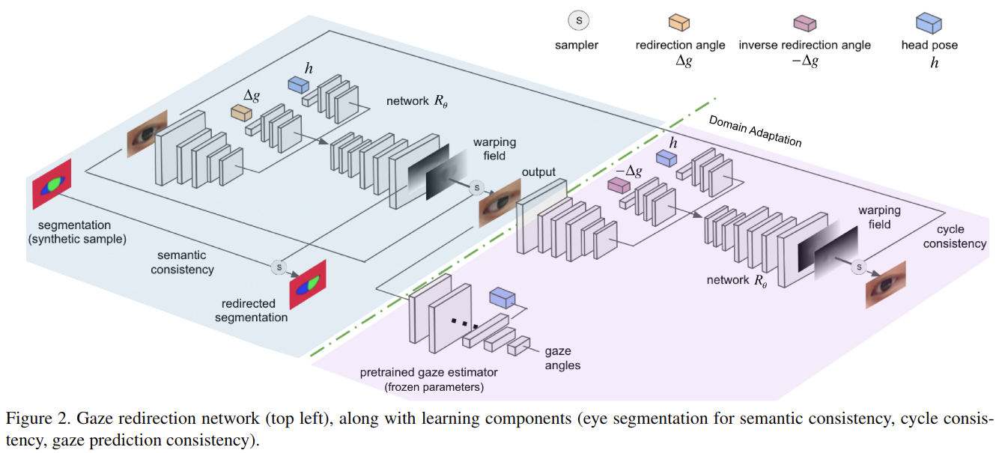

# Improving Few-Shot User-Specific Gaze Adaptation via Gaze Redirection Synthesis

元の論文の公開ページ : [arxiv](https://arxiv.org/abs/1904.10638)
Github Issues : [#55](https://github.com/Obarads/obarads.github.io/issues/55)

## どんなもの?
少ない訓練サンプルから個性(人ごとに異なっている視線バイアスのこと)を踏まえた視線推定モデルの適応問題についての研究。既存のサンプルから合成画像を介して追加の訓練データを生成することで視線適応の改善を行う。また、視線の変更も可能にしている。

## 先行研究と比べてどこがすごいの?

## 技術や手法のキモはどこ? or 提案手法の詳細
提案手法のフレームワークの概要は図1の通り。提案では、10個未満のサンプルを使用するだけでなく視線の方向変更をした追加のサンプルも生成できるようにしている。

### Gaze Redirection Overview
視線の方向変更のためのフレームワーク図2の通り。図2の左がredirection networkであり、図2の右がdomain adaptation moduleとなっている。redirection networkの出力は視線の方向変更されたサンプルである。domain adaptation moduleではself-supervisedな手法を実行している。

## どうやって有効だと検証した?

## 議論はある?

## 次に読むべき論文は?
- なし

## 論文関連リンク
1. なし

## 会議
CVPR 2019

## 著者
Yu Yu, Gang Liu, Jean-Marc Odobez.

## 投稿日付(yyyy/MM/dd)
2019/04/24

## コメント
なし

## key-words
Few-Shot_Learning, Self-Supervised_Learning, Domain_Adaptation, Gaze_Estimation, Synthetic, CV

## status
導入