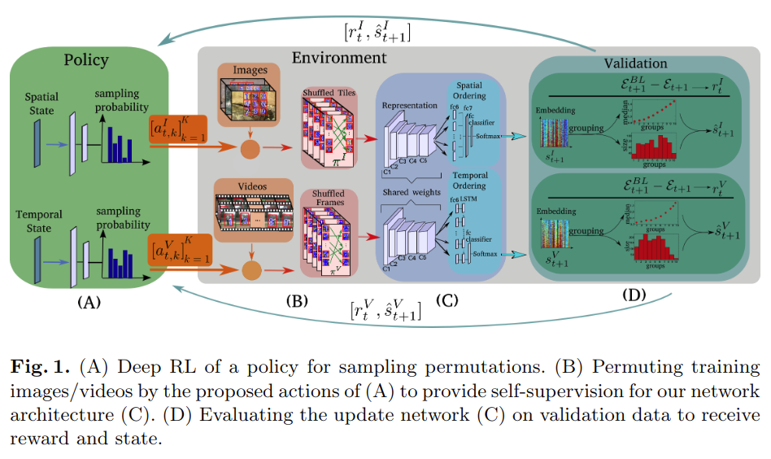

# Improving Spatiotemporal Self-Supervision by Deep Reinforcement Learning

元の論文の公開ページ : [arxiv](https://arxiv.org/abs/1807.11293)  
Github Issues : [#56](https://github.com/Obarads/obarads.github.io/issues/56)

## どんなもの?
疑似タスクとして、時間的領域と空間的領域における視覚データの順序付けに同時に取り組む。[1]のようなビデオによる時間順序付けと[2]のような入力画像内の空間的順序付けは順序付けの次元が違うため同時にそれらのタスクを行うことができる。  
また空間的順序付けを選ぶ手法、例えば、[2]では疑似ダスクでCNNの訓練に使用される順列を無作為に選択しているが、より効率的に学習が可能な順列を見つけるために、CNNの訓練で使われる順列を提案する強化学習アルゴリズムを導入する。強化学習の報酬はCNNの経時的改善を利用してself-supervisedネットワークとpolicyを訓練していく。

## 先行研究と比べてどこがすごいの?

## 技術や手法のキモはどこ? or 提案手法の詳細
フレームワークは図1の通り。

## どうやって有効だと検証した?

## 議論はある?

## 次に読むべき論文は?
- なし

## 論文関連リンク
1. [Lee, H.Y., Huang, J.B., Singh, M.K., Yang, M.H.: Unsupervised representation learning by sorting sequences. In: IEEE International Conference on Computer Vision (ICCV) (2017)](https://arxiv.org/abs/1708.01246)
2. [Noroozi, M., Favaro, P.: Unsupervised learning of visual representations by solving jigsaw puzzles. In: IEEE European Conference on Computer Vision (ECCV) (2016)](https://arxiv.org/abs/1603.09246)

## 会議
ECCV 2018

## 著者
Uta Büchler, Biagio Brattoli, Björn Ommer.

## 投稿日付(yyyy/MM/dd)
2018/07/30

## コメント
なし

## key-words
Reinforcement_Learning, Self-Supervised_Learning

## status
省略