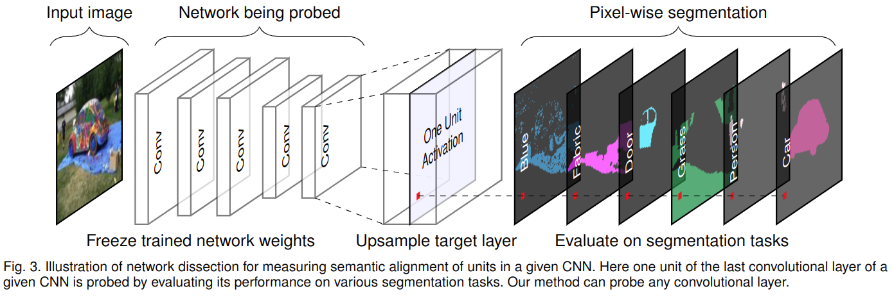
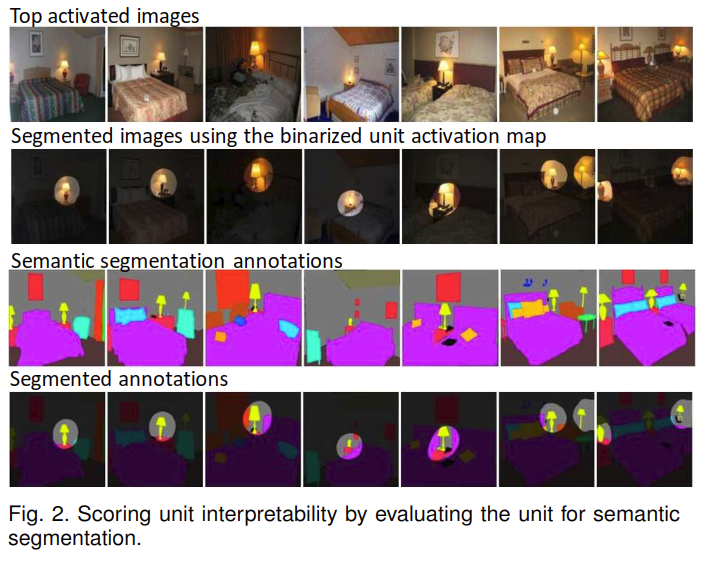
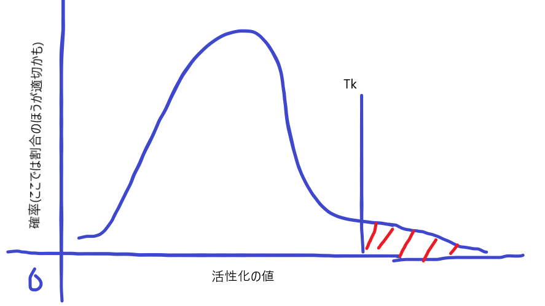

# Interpreting Deep Visual Representations via Network Dissection

元の論文の公開ページ : [arxiv](https://arxiv.org/abs/1711.05611)  
Github Issues : [#81](https://github.com/Obarads/obarads.github.io/issues/81)

## どんなもの?
概念のラベル(車、人等)を個々のユニット(畳み込みユニット)に提供し、個々のユニットが何に注目するか調べることによってネットワークを解釈する方法、Network Dissectionを提案した。
自己教師あり学習もしくは教師あり学習を行ったいくつかのネットワークアーキテクチャが持つ潜在的な表現を解釈、比較するため提案手法を適応する。次に訓練の反復  訓練の反復回数、正則化、初期化パラメータ、ネットワークの深さと幅等、ネットワークの解釈可能性に影響を与える原因を探る。最後に、解釈されたユニットは画像に対するCNN予測の明確な解釈を提供するために使われる。

## 先行研究と比べてどこがすごいの?

## 技術や手法のキモはどこ? or 提案手法の詳細
著者らの解釈可能性の定量的評価は3ステップで構成される。

1. 人がラベルづけした視覚概念のセットを識別する。
2. 既知の概念に対する潜在変数の反応を集める。
3. alignment of hidden variable - concept pairs(潜在変数と概念のペアのアライメント?)を定量化する(ここのアライメントの意味はおそらく「対応関係」?)。

尚、表現の識別力=解釈可能性ではないことに注意すること。

### Broden: Broadly and Densely Labeled Dataset
オブジェクト等の高レベルの概念と色などの低レベルの概念の両方をもつアライメントを解明するため、既存のデータセットに含まれるデータを用いて構成されたデータセット、Brodenを構築して評価に使用する。データセットには広範囲の色、素材、テクスチャ、部品、オブジェクト、シーンのデータが入っており、ピクセルに対するアノテーションもある。

### Scoring Unit Interpretability
提案手法では、各視覚概念(車、人など)に対する2値化セグメンテーションを解いてもらい、個々の畳み込みユニットを全て評価する(図3または[2]の5ページ目)。ある画像を与え、ユニットの活性化値がかなり高い部分を割り出し、その部分と概念(車、人など)のIoU値を計算してユニットがどの部分を見ているのか割り出す(図2)。

具体的な手順は以下の通り。

1. 訓練され後に重みを固定したCNNに対して全てのBrodenの画像$x$を入力し、全ての畳み込みユニット$k$の活性化マップ$A_ k(x)$が収集される。
2. 個々のユニットの活性化の分布$a_ k$が計算される。
3. 各ユニット$k$に対し、$P(a_ k>T_ k)=0.005$となるような上位の変位値レベル(top quantile level)$T_ k$(閾値)を決める。(多分、活性化マップ上で最も活性化している部分のみを探すということ。下図のグラフ(自作)のように活性化の分布を作り、赤色斜線の面積が0.005になるような$T_ k$を求めることだと思われる。)
4. 概念$c$に関するアノテーションマスク$L_ c$とユニットの活性化マップを比べるため、バイリニア補間を使って活性化マップの解像度をマスクの解像度に引き上げる。(活性化マップは畳み込みによりコンパクトになっているため、低解像度になっている)
5. 解像度を引き上げた活性化マップ$S_ k(x)$を2値セグメンテーション$M_ {k}(\mathbf{x}) \equiv S_ {k}(\mathbf{x}) \geq T_ {k}$にする。つまり、閾値$T_ k$を超える活性化の領域を選択する。
6. 概念$c$に対するセグメンテーションとして、各ユニット$k$のスコアは式(1)のようなIoU値を使って求められる。式(1)の|・|は集合の濃度である。  
この$IoU_ {k,c}$の値は、概念$c$の検出におけるユニット$k$の精度である。著者らは、0.04の閾値を$IoU_ {k,c}$が超える時、ユニット$k$を概念$c$の検出器としてみなすことができると考えている。1つのユニットが複数の概念を検知する可能性もあるが、ここでは最も活性化している概念を選び、概念に対応するユニークな検出器(unique detector)とする。

$$
I o U_{k, c}=\frac{\sum\left|M_{k}(\mathbf{x}) \cap L_{c}(\mathbf{x})\right|}{\sum\left|M_{k}(\mathbf{x}) \cup L_{c}(\mathbf{x})\right|} \tag{1}
$$

## どうやって有効だと検証した?

## 議論はある?

## 次に読むべき論文は?
- なし

## 論文関連リンク
1. [David Bau, Bolei Zhou, Aditya Khosla, Aude Oliva, Antonio Torralba. Network Dissection. (アクセス:2019/05/25)](http://netdissect.csail.mit.edu/)
2. [Yosuke Ueno, [DLHacks 実装]Network Dissection: Quantifying Interpretability of Deep Visual Representations, (アクセス:2019/05/25)](https://www.slideshare.net/DeepLearningJP2016/dlhacks-network-dissection-quantifying-interpretability-of-deep-visual-representations-81369206)
3. [David Bau, Bolei Zhou, Aditya Khosla, Aude Oliva, Antonio Torralba. Network Dissection:
Quantifying Interpretability of Deep Visual Representations. CVPR 2017.](http://netdissect.csail.mit.edu/final-network-dissection.pdf)

## 会議
PAMI

## 著者
Bolei Zhou, David Bau, Aude Oliva, Antonio Torralba.

## 投稿日付(yyyy/MM/dd)
2017/11/15

## コメント
内容は[3]とかぶっているっぽい

## key-words
RGB_Image, Analytics, Interpretability

## status
省略

## read
A, M

## BibTex
