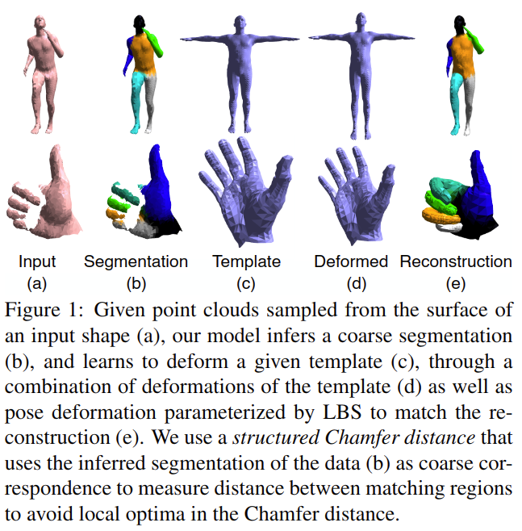

# LBS Autoencoder: Self-supervised Fitting of Articulated Meshes to Point Clouds

元の論文の公開ページ : https://arxiv.org/abs/1904.10037

## どんなもの?
LBS-AEと呼ばれる、関節付きのメッシュモデルを点群へフィッティングするためのself-supervisedなオートエンコーディングアルゴリズムを提案した。図1に示すように、(a)点群を受け取り、(b)粗いセグメンテーションや(c)(d)テンプレートに従った変形、(e)再構築などを行う。  
このモデルは、FoldingNet等の事前情報を利用せずただ2D表面をターゲットオブジェクトに変形させるモデルとDyna[1]などの手や体などの特定のオブジェクト専用の変形モデルの中間に位置する。 このモデルは、オブジェクトクラスの関節テンプレートモデルが利用可能であるが、データセット中ではstatistics of its articulation(関節の情報とか?)やオブジェクトインスタンスの特定の形状(オブジェクトのカテゴリを1つに絞ること)を取り扱わない。また、Chamfer distanceの代わりにStructured Chamfer Distance(SCD)を導入する。  
他には、初期状態からセグメンテーションを改良するためにSelf-supervision(データのようなもの?)を生成して訓練する。

## 先行研究と比べてどこがすごいの?

## 技術や手法のキモはどこ? or 提案手法の詳細

## どうやって有効だと検証した?

## 議論はある?

## 次に読むべき論文は?
- なし

## 論文関連リンク
1. [G. Pons-Moll, J. Romero, N. Mahmood, and M. J. Black. Dyna: A model of dynamic human shape in motion. TOG, 2015.](https://dl.acm.org/citation.cfm?id=2766993)

## 会議
CVPR 2019

## 著者
Chun-Liang Li, Tomas Simon, Jason Saragih, Barnabás Póczos, Yaser Sheikh.

## 投稿日付(yyyy/MM/dd)
2019/04/22

## コメント
なし

## key-words
Point_Cloud, Self-Supervised_Learning, AutoEncoder, Mesh

## status
省略