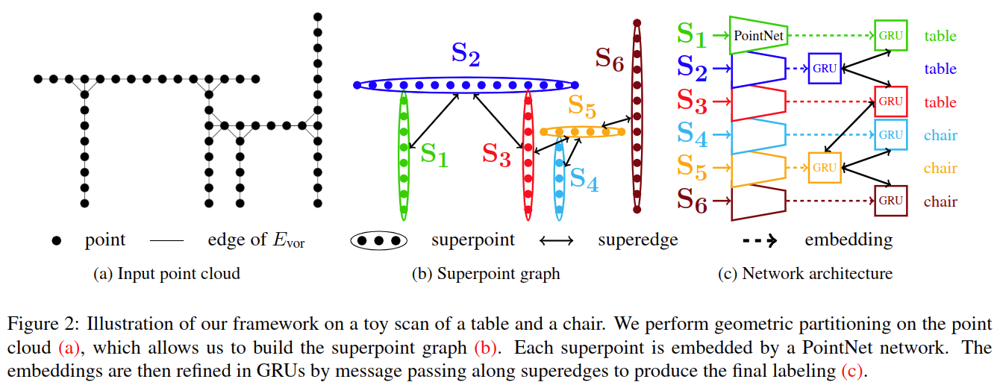
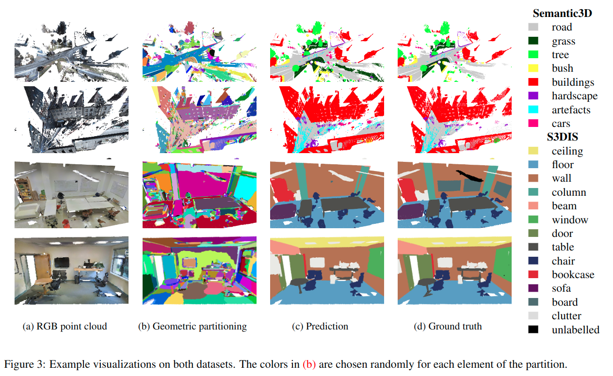
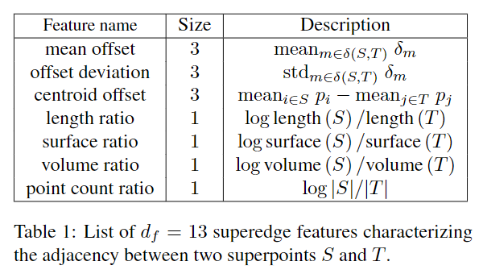

# Large-scale Point Cloud Semantic Segmentation with Superpoint Graphs

元の論文の公開ページ : [arxiv](https://arxiv.org/abs/1711.09869)  
Github Issues : [#129](https://github.com/Obarads/obarads.github.io/issues/129)

## どんなもの?
画像セグメンテーションにおけるスーパポイント手法[1]と同様の意図を持って、著者らはスーパーポイントで作られた、相互のつながりを持つシンプルな形状の一群として大規模3D点群の表現することを提案する。図1に示すように、super-point graph(SPG)と呼ばれる属性付き有向グラフによって構造を取得することができる。ノードはシンプルな形状を示し、一方でエッジは隣接関係を示す。

このSPGによる表現は以下のアドバンテージを生む。

- 個々の点もしくはボクセルを分類する代わりに、全てのオブジェクトパーツを一体として考える(※)。これは識別を容易にする。
- 隣接オブジェクト間の関係を詳細に示す。これは文脈的な分類に欠かせない要素である。
- SPGのサイズは点の合計数ではなくシンプルな構造の数によって定義される。これは通常、数桁分小さくなる。

要約すると、通常は厄介な長距離の相互作用をモデル化することができる。

著者らの貢献は以下の通り。

- 3D点群内のオブジェクトパーツ間の文脈的関係性を符号化したエッジ特徴による表現を使った新規スーパーポイントのグラフ手法を導入した。
- 上記の表現によって、細かい表現を大きく損なわずに大規模点群を深層学習に適応できる。
- Semantic3DとS3DISでSOTAを達成。

[※ アドバンテージの※部分がわかりづらいから修正すること。あと桁が小さくなるのは計算量のことでいいのか?]

## 先行研究と比べてどこがすごいの?
細かい情報を保持でき、なおかつ大規模な点群を処理できる手法がいままでなかった。本提案では、提案の中に含まれているパイプラインが幾何学的な複雑さに従って適応的に点群を分割するため、それらを両立した処理が行える。

## 技術や手法のキモはどこ? or 提案手法の詳細
本フレームワークはLiDARでスキャニングしたデータのサイズ(数百万個の点)にも耐えうることも目標としている。著者らは、SPG表現でセマンティックセグメンテーション問題を3つの尺度や性質が異なる問題に分割し、それらを段階ごとに解決することを提案している。その解決方法は図2と以下の通り。

1. **幾何学的に同質な分割**: 最初のステップでは、点群をスーパーポイントと呼ばれる幾何学的にシンプルでありながら意味的な形状へ分割することである。この教師なしのステップでは、点群全体を入力として受け取るため、計算的に非常に効率的な方法を取らなければいけない。SPGはこの分割から簡単に計算される。
2. **Superpointによる埋め込み**: SPGのノードは幾何学的にシンプルなprimitive(先程の形状を指す?)に対応する点群の小規模な一部分に相当するものである。この時、ノードは意味的に同質だと仮定する。これらのprimitiveは小規模の点群を最大100個(実装は個数違う?)の点にダウンサンプリングすることによって確実に表すことができる。小さくなったことでPointNetによる点群の埋め込みを可能にする。
3. **文脈的な分割**: スーパーポイントのグラフは元の点群上のあらゆるグラフよりも桁違いに小さくなる。このグラフを使って、深層学習モデルはノードを分類していくこととなる。

SPG表現を作成するにおいて、最後の２つのステップはEnd-to-Endな学習となる。

### Geometric Partition with a Global Energy
ここでは、図3のようにオブジェクトごとではなくオブジェクトよりさらに分解された形へ分解することを目標とする。このクラスタは単純ではあるが、幾何学に沿った分割を行うため、意味的に分割されたもの(セマンティック、インスタンス的な分割)に近いクラスタを得ることが期待できる。なお、ここではクラスラベルを使用しない。

各点について、局所近傍の形状の特性を示す$d_ g$個の幾何学特徴$f_ i\in \mathbb{R}^{d_ g}$の集合を計算する。そのため、ここでは[2]で提案された3次元値(planarity and scattering, as well as the verticality feature introduced by [3])を使用する。また、点群全体で正規化された点$p_ i$の$z$座標として定義される各点の高さも計算する。

[13]によって提案されたglobal energyは点群の10最近傍グラフ$G_ {nn}=(C,E_ {mn})$に関連して定義される(これはSGPではない)[?]。**幾何学的に均一な分割は次の最適化問題のthe constant connected components of the solutionとして定義される。**

$$
\underset{g \in \mathbb{R}^{d g}}{\arg \min } \sum_{i \in C}\left\|g_{i}-f_{i}\right\|^{2}+\mu \sum_{(i, j) \in E_{\mathrm{nn}}} w_{i, j}\left[g_{i}-g_{j} \neq 0\right] \tag{1}
$$

ここで$[\cdot]$はアイバーソンの記法を示す。edge weight $w\in \mathbb{R}^{|E|}_ {+}$はedge lengthの長さに対して線形的に減少するようになっている。係数$\mu$はthe regularization strengthであり、分割の粗さを決定する。

The problem defined in eq.1はgeneralized minimal partition problemとして知られ, a continuous-space version of the Potts energy model, もしくはan ℓ0 variant of the graph total variationとみなすことができる. ただし、[24]によって定義された$\ell_ 0$-cut pursuit algorithmはa few graph-cut iterationsで近似解をすぐに導出できる。また、$\alpha$-expansion[5]のような他の最適化手法とは対象的に、$\ell_ 0$-sut pursuit algorithmはパーティションのサイズを事前に選択する必要がない。**eq.1の解であるthe constant connected components $\mathcal{S}=\\{S_ 1,\cdots,S_ k\\}$は幾何学的な要素を定義し、これをsuperpoints (i.e. set of points)として扱う。**

### Superpoint Graph Construction
ここでは、SGPの計算方法とその機能について説明する。SPGは点群を構造化した表現でありoriented attributed graph $\mathcal{G}=(\mathcal{S}, \mathcal{E}, F)$として定義される。このグラフのノードはsuperpoints $\mathcal{S}$、エッジ $\mathcal{E}$はsuperpoints間の隣接(superedgesとみなす)を示す。このsuperedgesは$d_ f$個の特徴の集合によって注釈付けられる: $F \in \mathbb{R}^{\mathcal{E} \times d_ {f}}$はsuperpoint間の隣接関係を特徴づける[?]。

$G_ {\mathrm{vor}}=\left(C, E_ {\mathrm{vor}}\right)$を[6]によって定義されたthe symmetric Voronoi adjacency graph of the complete input point cloudとして定義する。

もし、少なくとも$E_ {vor}$中に最低一つのエッジがあり、一端が$S$、もう一端が$T$である場合、superpointsである$S$と$T$は隣接する:

$$
\mathcal{E}=\left\{(S, T) \in \mathcal{S}^{2} | \exists(i, j) \in E_{\mathrm{vor}} \cap(S \times T)\right\} \tag{2}
$$

Important spatial features associated with a superedge $(S,T)$は２つのsuperpointsに繋がっている$E_ {vor}$中のエッジに対するthe set of offsets $δ(S, T)$から得られる[相対値?]:

$$
\delta(S, T)=\left\{\left(p_{i}-p_{j}\right) |(i, j) \in E_{\mathrm{vor}} \cap(S \times T)\right\} \tag{3}
$$

superedge特徴は隣接superpointsのサイズと形状を比較することで算出できる。これらの算出するために、sueperpoint $S$中の点の数$|S|$, shape features length $(S)=\lambda_ 1$, surface $(S)=\lambda_ 1\lambda_ 2$, volume $(S)=\lambda_ 1 \lambda_ 2 \lambda_ 3$を計算する。これらは、値の減少順にならべた各superpointに含まれる点の位置の共分散の固有値$\lambda_ 1, \lambda_ 2, \lambda_ 3$からなる[?]。表1では、この論文で扱われているsuperedge特徴の違いをリストにしている。なお、edgeの特徴の対称性がなくなった場合、SPGは有向グラフになる。

[handcrafted特徴を使用]

### Superpoint Embeding
ここでは全てのsuperpoint $S_ i$に対応する記述子を計算する。この記述子は、[superpointから]固定次元長$d_ z$のベクトル$z_ i$への埋め込みである。なお、この埋め込みはsuperpointごとに分離されている。信頼できる分類を行うためのcontextual informationはグラフ畳み込みによって次の段階でのみ提供される。

最近の深層学習手法はこの目的[(埋め込み抽出)]のためにいくつかの提案がなされている。PointNetは点群におけるその代表である。著者らの場合、入力形状は幾何学的に単純なオブジェクトであり、少量の点(サブサンプリングなど)とコンパクトなPointNetで確実に表現、埋め込みできる(GPUなどの計算資源を節約できる)。ただし、点が少量($n_ {minp}=40$未満)のsuperpointがある場合は全体の性能が落ちるため、そのスーパーポイントの埋め込みは0にしてコンテキスト情報のみで分類を行う。

[in order for ~は仕様について書いてある]

### Contextual Segmentation
ここでは最後の仕上げを行う。このpipelineは埋め込み$z_ i$とSPGによる局所領域に従って各superpoint $S_ i$を分類する。ここのアーキテクチャはGated Graph Neural Networks[7]やECC[8]からのアイデアに基づいており、superpointはsuperedgesの情報に従って埋め込みを洗練させていく。

具体的には、
- Gated Recurrent Unit(GRU)[9]内のhidden state$\mathbf{h}_ {i}^{(t)}$(tはイテレーション数, $t=1\ldots T$, Tはseveral)をrefineしていく。  
    
- $\mathbf{h_ i^1}$は$i$番目のsuperpoint $S_ i$の埋め込み$z_ i$によって初期化される。
- $\mathbf{h_ i^{(t+1)}}$(新たなhidden state)はincoming message $\mathbf{m}_ i^{(t)}$と$\mathbf{h}_ i^{(t)}$をGRUに入力することで得られる。
- incoming message $\mathbf{m}_ i^{(t)}$ to superpoint $i$は隣接するsuperpoint $j$の$h_ j^{(t)}$の加重和として計算されている。
- actual weighting for a superedge $(j,i)$は、表1に挙げられるようにits attrubutes $F_ {ji}$に依存する。
- 

## どうやって有効だと検証した?

## 議論はある?

## 次に読むべき論文は?
- なし

## 論文関連リンク
1. [R. Achanta, A. Shaji, K. Smith, A. Lucchi, P. Fua, and S. S ̈ usstrunk. SLIC superpixels compared to state-of-the-art superpixel methods. IEEE Transactions on Pattern Analysis and Machine Intelligence, 34(11):2274–2282, 2012.](https://ieeexplore.ieee.org/document/6205760)[1]
2. [J. Demantk, C. Mallet, N. David, and B. Vallet. Dimension-ality based scale selection in 3D lidar point clouds. Inter-national Archives of the Photogrammetry, Remote Sensing and Spatial Information Sciences, XXXVIII-5/W12:97–102, 2011.](http://recherche.ign.fr/labos/matis/pdf/articles_conf/2011/laserscanning2011_demantke_final.pdf)[9]
3. [S. Guinard and L. Landrieu.Weakly supervised segmentation-aided classification of urban scenes from 3d LiDAR point clouds. InISPRS 2017, 2017.](https://www.int-arch-photogramm-remote-sens-spatial-inf-sci.net/XLII-1-W1/151/2017/isprs-archives-XLII-1-W1-151-2017.pdf)[13]
4. [L. Landrieu and G. Obozinski. Cut pursuit: Fast algorithms to learn piecewise constant functions on general weighted graphs. SIAM Journal on Imaging Sciences, 10(4):1724– 1766, 2017.](https://hal.archives-ouvertes.fr/hal-01306779v4/document)[24]
5. [Y. Boykov, O. Veksler, and R. Zabih. Fast approximate en-ergy minimization via graph cuts.IEEE Transactions on Pat-tern Analysis and Machine Intelligence, 23(11):1222–1239, 2001.](http://www.cs.cornell.edu/~rdz/Papers/BVZ-PAMI01.pdf)[6]
6. [J. W. Jaromczyk and G. T. Toussaint. Relative neighbor-hood graphs and their relatives. Proceedings of the IEEE, 80(9):1502–1517, 1992.](https://pdfs.semanticscholar.org/778e/013907b0edc3e2e6bb40446af3837307f72b.pdf)[19]
7. [Y. Li, D. Tarlow, M. Brockschmidt, and R. S. Zemel. Gated graph sequence neural networks. InICLR, 2016.](https://arxiv.org/abs/1511.05493)[28]
8. [M. Simonovsky and N. Komodakis. Dynamic edge-conditioned filters in convolutional neural networks on graphs. InCVPR, 2017.](https://arxiv.org/abs/1704.02901)[43]
9. [K. Cho, B. van Merri ̈ enboer, C  ̧ . G ̈ ulc  ̧ehre, D. Bahdanau, F. Bougares, H. Schwenk, and Y. Bengio. Learning phrase representations using RNN encoder–decoder for statistical machine translation. InEMNLP, 2014.](https://arxiv.org/abs/1406.1078)[9]

## 会議
CVPR 2018

## 著者
Loic Landrieu, Martin Simonovsky

## 投稿日付(yyyy/MM/dd)
2017/11/27

## コメント
なし

## key-words
Point_Cloud, Graph, Semantic_Segmentation, Oversegmentation, CV

## status
導入

## read
A, I, R

## Citation
