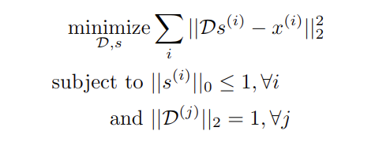

# Learning Feature Representations with K-means

元の論文の公開ページ : [www-cs.stanford.edu](https://www-cs.stanford.edu/~acoates/papers/coatesng_nntot2012.pdf)  
Github Issues : [#83](https://github.com/Obarads/obarads.github.io/issues/83)

## どんなもの?

## 先行研究と比べてどこがすごいの?

## 技術や手法のキモはどこ? or 提案手法の詳細
典型的なK-meansクラスタリングはデータ点と最も近い重心間の距離を最小化するクラスタの重心を見つける。またvector quantizationとも呼ばれ、K-meansは、データベクトル $x^{(i)} \in \mathcal{R}^{n}, i=1, \ldots, m$を再構築損失を最小化するコードベクトルに写像できるようにするための$k$ベクトルの辞書 $\mathcal{D} \in \mathcal{R}^{n \times k}$を構築する手法として見ることができる。ここで、以下のような式を定義する。

このとき、$s_ (i)$はコードベクトルであり入力$x^{(i)}$に関連し、$\mathcal{D}^{(j)}$は$\mathcal{D}$の$j$番目の列である。このゴールはいくつかの基準を満たすような各example$x^{(i)}$の新規表現$s^{(i)}$と辞書$\mathcal{D}$を見つけることである。

はじめに、$s^{(i)}$と$\mathcal{D}$が与えられ、元の$x^{(i)}$をうまく再構築できるように成るべきである。具体的には、$x^{(i)}$とそれに対応する再構築$\mathcal{D}s^{(i)}$間の二乗差異を最小化することである。この際2つの制約の下、最適化する。

- $\|s^{(i)}\|_{0} \leq 1$ : $s^{(i)}$が非ゼロの要素を持つようにする。
- $\|\mathcal{D}^{(j)}\|_{2}=1, \forall j$ : 各辞書列が単位長を持ち、それらが任意に大きくなるもしくは小さくなることを防ぐようにする。また、任意に

## どうやって有効だと検証した?

## 議論はある?

## 次に読むべき論文は?
- なし

## 論文関連リンク
1. なし

## 会議
Springer

## 著者
Adam Coates and Andrew Y. Ng.

## 投稿日付(yyyy/MM/dd)
2012/??/??

## コメント
なし

## key-words
RGB_Image, CV

## status
未完