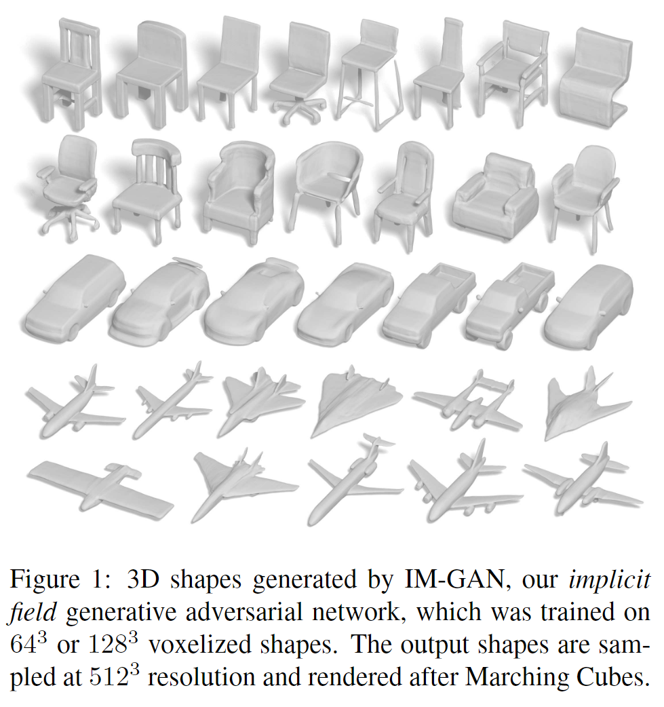

# Learning Implicit Fields for Generative Shape Modeling  

元の論文の公開ページ : [arxiv](https://arxiv.org/abs/1812.02822)  
Github Issues : 

## どんなもの?
暗黙的な領域(implicit field)を使った形状生成モデルもしくはデコーダーである、IM-NETを提案した。暗黙的な領域は3D空間上に散りばめられた点(x,y,z値を持つ)に値を割り振ることができ、値の割り振りをもとに形状の表面を表現できる。割り振りは2値分類器を学習することで行えるようになる。表現力は図1の通りである。

[※ occupancy networksやDeepSDFと同じ系列の研究]

## 先行研究と比べてどこがすごいの?

## 技術や手法のキモはどこ? or 提案手法の詳細

## どうやって有効だと検証した?

## 議論はある?

## 次に読むべき論文は?
- なし

## 論文関連リンク
1. なし

## 会議
CVPR 2019

## 著者
Zhiqin Chen, Hao Zhang

## 投稿日付(yyyy/MM/dd)
2018/12/06

## コメント
なし

## key-words
Reconstruction, CV, Paper, 修正

## status
修正

## read
A

## Citation
