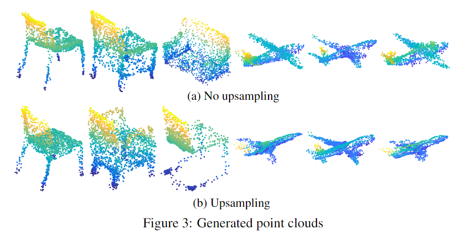
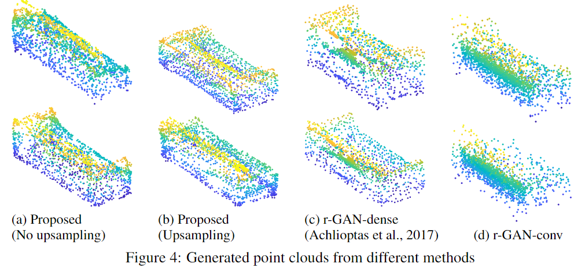
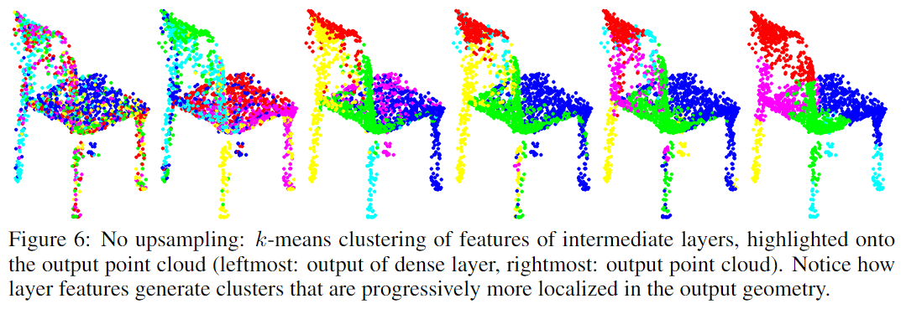
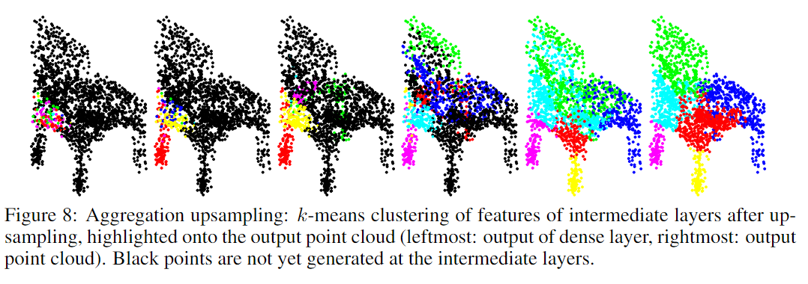

# Learning Localized Generative Models for 3D Point Clouds via Graph Convolution

元の論文の公開ページ : https://openreview.net/forum?id=SJeXSo09FQ

## どんなもの?
グラフ畳み込みタイプの局所演算を使った生成器を含むGANの提案をした。

## 先行研究と比べてどこがすごいの?
従来にはない点群用アップアンプリングの演算子(従来はFC層もしくは畳み込みベースのデコーダー)の提案を行った。

## 技術や手法のキモはどこ? or 提案手法の詳細
提案手法ではGraph convolutionブロック(GCONV)とUpsamplingブロック(UPSAMP)を組み合わせた生成器を提案した。生成器内にはGraphブロック(GRAPH)があり、2つの特徴ベクトル間の距離を使ったk-nnグラフの隣接行列を計算する。

### Graph convolutionブロック (GCONV)
定義は式2の通り。著者らはEdge-Conditioned Convolution[1]を使用する。$N^l$個の$d^l$次元の特徴ベクトル$h_ j^l\in \mathbb{R}^{d^l}$を持つ層$l$が与えられたとき、畳み込みは次の層の特徴ベクトル$h_ j^{l+1}\in\mathbb{R}^{d^{l+1} }$を生成する。畳み込みでは、特徴ベクトルの重みづけされた局所集約を取り扱っている。局所集約の対象となるノードは各ノード$i$に隣接するノード$j\in\mathcal{N}_ i^l$(この$\mathcal{N}_ i^l$は$i$の隣接ノードの集合)である。局所集約の重みは全結合ネットワーク$F^l:\mathbb{R^{d^l} }\to\mathbb{R}^{d^l \times d^{l+1} }$によって定義される。この$F^l$は二つの異なるノードの特徴間の際を入力として受け取り、対応する重み行列$\Theta^{l,ji}=F_ {w^l}^l(h_ j^l-h_ i^l)\in\mathbb{R}^{d^l\times d^{d+1} }$を出力する。

この時、$w^l$は重みパラメータ化ネットワーク$F^l$(重み$w^l$を含むネットワーク?)、$W^l\in\mathbb{R}^{d^l\times d^{l+1} }$はノード自身の線形変換、$b^l$はバイアス、$\sigma$は非線形性である。  
図1はこのGCONVを使った生成器の概要図。表1に示すように、初めに潜在変数$z$を受け取ったDENSEから点の数$\times$多次元特徴を含むデータを生成し、そこから徐々に特徴の次元のみサイズを減少させる。

### Upsamplingブロック (UPSAMP)
定義は下の式の通り(なぜか(3)を割り振っていない)。UPSAMPブロックは、$N^l$個の特徴ベクトルを入力としたとき、$N^l\times2$個の特徴ベクトルを出力する。この入力と出力の特徴の次元数は変化しない(表1の通り)。特徴ベクトル$h_ i^l\in\mathbb{R}^{d^l}$が与えられたとき、新しい特徴ベクトルは$\tilde{h}_ i^l\in\mathbb{R}^{d^l}$は下の式のようになる。

ここで、$U^l:\mathbb{R}^{d^l}\to\mathbb{R}^{d^l}$は全結合ネットワークである。全結合ネットワークには$h_ i^l$と$h_ j^l$の差異が入力され、重さベクトル$\gamma^{l,ij}\in \mathbb{R}^{d^l}$を出力する。$\gamma^{l,ij}$は対角行列$\Gamma^{l,ji}=\rm{diag}(\gamma^{l,ji})$を作るために使われる。$\tilde{w}^l$と$b^l$はトレーニング中のみでアップとされるモデルパラメータである。対角行列であるため、局所集約は各特徴を個別に扱い、パラメータ数を減少させる。

図2はGCONVとUPSAMPを交互に組み込んだ生成モデルの概要図である。これの出力次元数は表1で確認できる。

## どうやって有効だと検証した?
ShaapeNetから用意した3つのカテゴリを使い提案モデルのテストを行う。クラス固定で行う。2つの提案した生成器の視覚的結果は図3の通り。r-GANと比較した視覚的結果は図4の通り。r-GANとして、もともとのモデルであるr-GAN-denseと著者らが追加で検討したr-GAN-convの二つのモデルが使われる。定量的評価は表2の通り。

図6は中間層の特徴にk-meansクラスタリングをかけて色分けしたものである。層が出力になるにつれてきれいにまとまっていく。図7に示すようにアップサンプリングのモデルでもクラスタリングを行っている。

### 他の実験
他にもエッジ予測の精度や各層の近傍距離などを調べている。

## 議論はある?
もっとシンプルなグラフ構築演算を作ろう。

## 次に読むべき論文は?
- [Martin Simonovsky and Nikos Komodakis. Dynamic edge-conditioned filters in convolutional neu-ral networks on graphs. In Proc. CVPR, 2017.](https://arxiv.org/abs/1704.02901)

## 論文関連リンク
1. [Martin Simonovsky and Nikos Komodakis. Dynamic edge-conditioned filters in convolutional neu-ral networks on graphs. In Proc. CVPR, 2017.](https://arxiv.org/abs/1704.02901)

## 会議
ICLR 2019

## 著者
Diego Valsesia, Giulia Fracastoro, Enrico Magli.

## 投稿日付(yyyy/MM/dd)
2018/09/28

## コメント
難しいというかわかりづらい。事前に点群が知らされていないのくだりや高次元さがgriddingアプローチを実行不可にするという部分が理解できなかったためその部分は省略した。元の論文の公開ページでそのことに関して言及しているっぽいので気が向いたら確認&修正する。でもなんで評価でl-GANとかを使ってないんだ?

後ほど使うかもしれないので以下の文を残しておく。  
グラフ畳み込みを用いた生成器には、教師あり学習やAutoencoderを含む教師なし学習で使う点群は事前にわかっているが、GANの生成器の中間層は生成演算の結果のようなそれ(点群?)を事前に知ることができない問題がある。それ故、前もって知らされていないグラフの近傍へ局所化される演算を定義する手法が明らかではない。これを解決するために、前の層のノードの特徴間の相対距離を使ったk近傍グラフを作成する。図1では、各グラフ畳み込みブロックが自身のブロックの入力特徴から構築したグラフ(=k近傍グラフ(多分))を使うグラフベースの生成器のブロック図を示している。

## key-words
Point_Cloud, GAN

## status
更新済