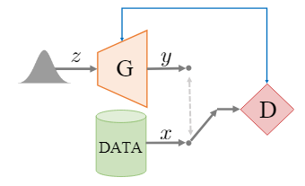
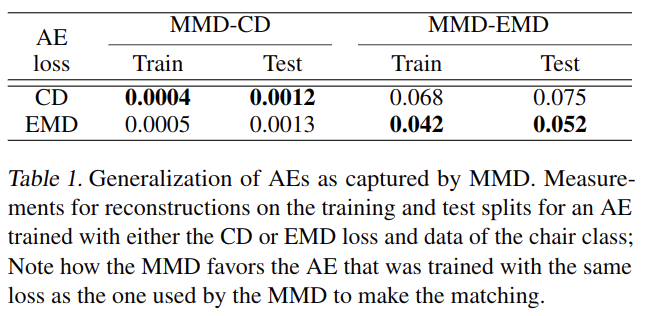
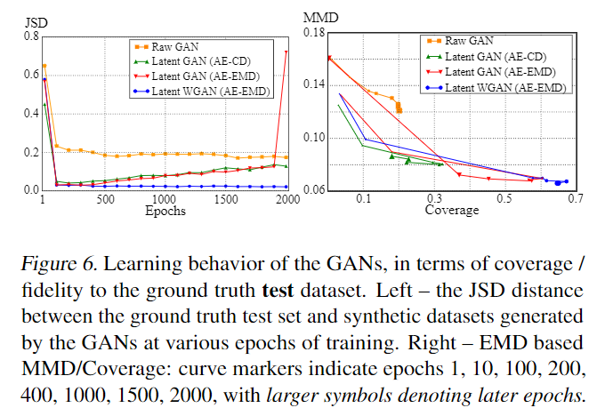

# Learning Representations and Generative Models for 3D Point Clouds

## どんなもの?
生の点群で動作するGAN、潜在表現を学習したAutoEncoderを用いたGAN、Gaussian Mixture Models(GMMs)を中心に研究した点群の生成モデルに関する論文。また、点群のAutoEncoderで重要な類似度測定手法、GANの評価基準にも注目している。

## 先行研究と比べてどこがすごいの?
生の点群のための深い生成モデルを紹介する初めての論文だと位置付けている。

## 技術や手法のキモはどこ?
この論文は紹介の意味合いが強いのでキモというか論文内容の紹介として以下に記す。

### **類似度測定手法の種類**  
- **Earth Mover's Distance(EMD)**  
    ある集合から別の集合へそれらを移動させる問題を解決する手法である。下の式のФは全単射である。

    

- **Chamfer distance(CD)**  
    ある集合の点に最も近い別の集合の点の平方距離を使う手法である。EMDよりも効率的な計算が可能である。

    
    
    点群の類似度測定手法によく使われるChamfer distanceは特定の異常なケース(identify certain pathological case)で識別できないことを発見している。

### **生成モデルの種類**
- **AutoEnocder(AE)**  
    深層学習ではおなじみの生成モデル。入力xをエンコーダーE(またはボトルネック層)によって低次元表現z(またはcode)に変換する。そしてzはデコーダーを介して出力x^へと再構築される。

    

- **Generative Adversarial Network(GAN)**  
    GANは最新の生成モデルである。生成器Gと弁別器Dによる敵対的なゲームによって構成されている。Gは実際のデータx\~p_dataと見分けがつかないようなz~p_zを使ったサンプルyを生成することを目標とする。弁別器はyとxの正しい判別を行うことを目標とする。

    

- **Gaussian Mixture Model(GMM)**  
    GMMは複数の部分母集合を含み、各部分母集合がGaussian分布に従うような分布がmultimodal Gaussianであると仮定される母集団を表現するための確率モデルである。部分母集合の数がわかっているとすると、GMMのパラメーター(Gaussiansの分散と平均)はExpectation-Maximization(EM)アルゴリズムを使いランダムサンプルから学習できる。フィットさせれば、GMMは新規の合成サンプルを得ることができる。

### **生成モデルの評価基準の種類**
- **Jensen-Shannon Divergence(JSD)**  
    軸方向に整列された点群とボクセルグリッドが並んでいることを仮定した場合に、AのデータとBのデータが同様の位置を占める傾向の度合いを計測できる。それを目的としているため、Aの全ての点に渡って並んでいる各ボクセルにある各点の個数と対応するBの点の数を数え、得られた経験分布間(P_A,P_B)のJSDを記録する。下の式ではM=(1/2)(P_A+P_B)でD(・||・)は2つの分布のKLダイバージェンスを示す。

    

- **Coverage**  
    Aの各点群に近いBの近傍を見つける。CoverageはAの点群に一致するBの点群の割合として測定する。割合の測定方法は類似度測定手法の種類の節で紹介したEMDもしくはCDであるため、COV-EMDとCOV-CDの2つの手法が得られる。Coverageのscoreが高い場合、Bの大部分はA内で表されているということである。

- **Minimum Matching Distance(MMD)**  
    Coverageはどれ程良くカバーされた例(点群)が集合Aで表されているかを正確に表すものではない。つまり、マッチされる例に近い必要がないということである。よって、Bに関してAの忠実性を測る方法が必要となる。その目的のために、Bの全ての点群をAの点群と最小距離(MMD)でマッチングさせ、そのマッチングの平均距離を記録する。点間の距離をMMD-CDとMMD-EMDで得ることができる。MMDはマッチングの距離に直接依存するため、AのBに対する忠実度を確認できる。

### **紹介する点群用生成モデルの紹介**
- **3D点群の表現学習**  
    2048\*3のサイズの点群を入力する。エンコーダーにはPointNet(論文関連リンク2)を利用する。デコーダーには3つのFCN(最初の2つのみReLU)を使って2048\*3の出力を行う。これらの損失関数としてCD又はEMDを使うため、AE-EMDとAE-CDという2つのモデルができる。また、ボトルネックの次元数や点群のランダム回転に対する調査を行う。なお、AEのボトルネック層の次元数は明記しない限り128次元とする。

- **点群用の生成モデルの紹介**  
    - **Raw point cloud GAN(r-GAN)**  
        2048\*3のサイズの点群を入力する。弁別器の構造はAEと同じ、batch-normなしで、ReLUsの代わりにleaky ReLUsを使用する。最後には、FCNの出力はシグモイドニューロンに渡される。生成器は入力としてGaussian noiseベクトルを受け取り、5つのFC-ReLUを介して2048\*3のサイズの点群を出力する。
    
    - **Latent-space GAN(l-GAN)**  
        l-GANはr-GANと違い生の点群の代わりに事前訓練されたAutoEncoderを介して出力したデータを扱う。生成器と弁別器もAEのボトルネック変数に影響する。GANのトレーニング終了後、生成器で学習されたcodeにAEのデコーダーを使って点群に変換する。具体的には単体隠れ層のMLP生成器と2つの隠れ層のMLP弁別器は結合しており、良い結果を出している。

    - **Gaussian mixture model**  
        l-GANに追加で、AEsによって学習された潜在空間にGMMsを当てはめる。そして、様々な数のGaussian componentsとdiagonalまたはfull covariance行列を試す。GMMsは調節された分布からのサンプリングとAEのデコーダーを用いてl-GAN同様、生成器に変えられる。

## どうやって有効だと検証した?
基本的にこれらの実験には更に調査した付録があることに注意すること。本文と同じ分のページがある。

### **AEの表現力**
- **一般化能力**
    AEによって再構築された点群は図1に示す通り。しっかりと再構築がなされている。
    
    

    各類似度測定手法による訓練と測定結果は表1に示す通り。一般化のギャップは小さい。
    
    

- **潜在空間と線形性**  
    図2で潜在空間の線形補間を示す。補間は図2の左の幾何学形状と右の幾何学形状の間で行われている。

    
    
    図３ではこれらの潜在表現を用いて、特定の個性(コンパーチブルの車や取っ手なしコップ)を持つ幾何学形状の平均ベクトルを加えることで入力の形状を変更している。以上より、学習された空間の滑らかさを証明し、尚且つ点群の滑らかな変形性を持ち合わせる内包的能力を強調した。

    

- **形状の完成**  
    形状の修正。入力に欠陥がある場合、それを補うというもの。詳細は付録にあり。

- **分類**  
    55のカテゴリからなる57000のデータに含まれる様々な異なる形状をAEに学習させる。この実験では、512次元のボトルネックを使い、重力軸に沿ってランダムに点群を回転させる。これらを分別するため、線形SVMに学習させたAEから出力されるボトルネックのベクトルを入力する。これらのベクトルはModelNetの3D分類ベンチマークで学習された線形SVMによって分類される。結果を表2に示す(対象は全部AEかな?)。

    

### **生成モデルの評価**
- **考案した生成モデルの比較**
    椅子カテゴリの点群を扱うこととする。はじめにAE-CDとAE-EMDを訓練させ、その後それぞれの潜在空間のl-GANをGoodfellowらの非飽和損失(論文関連リンクの3)で訓練する。AE-EMDによる空間の学習において、二つのモデルを追加する: l-GANの構造はそのままでWasserstein objectiveの勾配ペナルティを使うものと、平均の数と共分散の構造が違うGMMの一種。r-GANについては直接点群を入力する。結果は図6の通り。

    

- ****

## 議論はある?

## 次に読むべき論文は?
-

### 論文関連リンク
1. [Panos Achlioptas, Olga Diamanti, Ioannis Mitliagkas, and Leonidas Guibas. Learning Representations and Generative Models for 3D Point Clouds. 2017.](https://arxiv.org/abs/1707.02392)
2. [Charles R. Qi, Hao Su, Kaichun Mo, and Leonidas J. Guibas. PointNet: Deep Learning on Point Sets for 3D Classification and Segmentation. 2016.](https://arxiv.org/abs/1612.00593)
3. [Goodfellow, I., Pouget-Abadie, J., Mirza, M., Xu, B., Warde-Farley,D.,Ozair,S.,Courville,A.,andBengio,Y.Generative adversarial nets. InNIPS, 2014.](https://papers.nips.cc/paper/5423-generative-adversarial-nets)

### 会議
ICML 2018

### 著者
Panos Achlioptas, Olga Diamanti, Ioannis Mitliagkas, and Leonidas Guibas.

### 投稿日付(yyyy/MM/dd)
2017/07/08

## コメント
JSDは別の資料を見たほうがいいと思う。