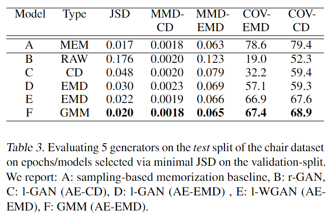
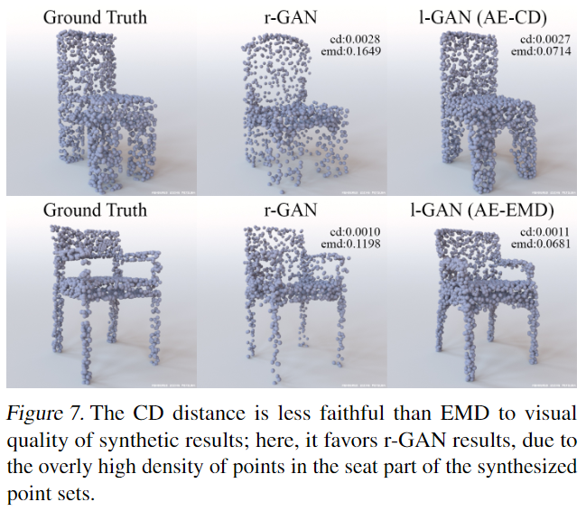
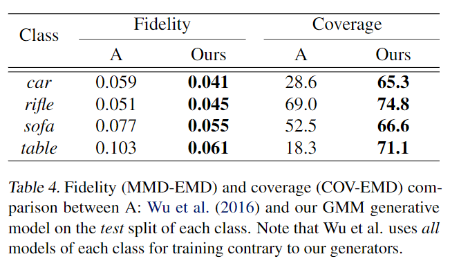
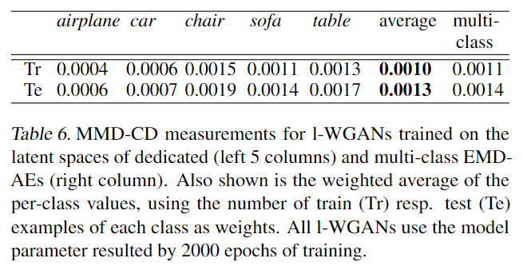

# Learning Representations and Generative Models for 3D Point Clouds

元の論文の公開ページ : [arxiv](https://arxiv.org/abs/1707.02392)
Github Issues : [#14](https://github.com/Obarads/obarads.github.io/issues/14)

## どんなもの?
生の点群で動作するGAN、潜在表現を学習したAutoEncoderを用いたGAN、Gaussian Mixture Models(GMMs)を中心に研究した点群の生成モデルに関する論文。また、点群のAutoEncoderで重要な類似度測定手法、GANの評価基準にも注目している。

## 先行研究と比べてどこがすごいの?
生の点群のための深い生成モデルを紹介する初めての論文だと位置付けている。

## 技術や手法のキモはどこ? or 提案手法の詳細
この論文は紹介の意味合いが強いのでキモというか論文内容を記す。

### Point clouds
#### Definition
xyz座標値と$N$個の点を含む$N \times 3$行列を点群として扱う。点群には順序不変性(permutation invariant、点の順番を変えても点群の表現は変化しない)と規則的でないデータ構造(ユークリッド空間上にまばらに点が存在するため)を持つ。

  これらの特徴があるが故に、画像の場合と違う点群比較用の測定基準を用意しなければならない。これらの測定基準はAEなどの再構成損失で使われる。

#### Metrics
##### Earth Mover's Distance(EMD)
  ある集合から別の集合へそれらを移動させる問題を解決する手法であり、微分可能である。下の式の$\phi$は全単射、二つのサブセット(二つの点群とも)は$S_1\subseteq R^3$と$S_1\subseteq R^3$である。

$$
d_{EMD}(S_1,S_2)=\min_{\phi:S_1 \to S_2}\sum_{x\in S_1}||x-\phi(x)||_2
$$

##### Chamfer distance(CD)
ある集合の点に最も近い別の集合の点の平方距離を使う手法である。微分可能であり、EMDよりも効率的な計算が可能である。

$$
d_{CH}(S_1,S_2)=\sum_{x\in S_1}\min_{y\in S_2}||x-y||_2^2+\sum _{y\in S_2}\min_{x\in S_1}||x-y||_2^2
$$

点群の類似度測定手法によく使われるChamfer distanceは特定の異常なケース(identify certain pathological case)で識別できないことを発見している。

### Fundamental building blocks
#### AutoEnocder(AE)
著者らはこの研究で入力と同じものを出力するAutoEncoder(AE)をメインコンポーネントとして扱う。AEは入力と出力の間にボトルネック層を含む。この層は入力を低次元表現(code)に落とし込むことができる。図に沿って具体的にいえば、Encoder(E、ボトルネック層)は入力$x$を潜在表現$z$(code)に圧縮する方法を学習し、Decoder(D)は$z$から出力$\hat{x}$を$x$と似せるように再構築することを学ぶ。

#### Generative Adversarial Network(GAN)
GANは最新の生成モデルである。生成器($G$)と弁別器($D$)による敵対的なゲームによって構成されている。$G$は実際のデータ$x\sim p_{data}$と見分けがつかないような、分布$z\sim p_{z}$を使った合成サンプル$y$を生成することを目標とする。弁別器は$y$と$x$の正しい判別を行うことを目標とする。

#### Gaussian Mixture Model(GMM)
GMMはmultimodal Gaussian、つまり複数のガウス分布に従う部分母集合を仮定した分布を表すための確率モデルである。部分母集合の数が分かっていると仮定すると、GMMパラメーター(ガウス分布の平均と分散を指す)はExpectation-Maximization(EM)アルゴリズムを使って、ランダムサンプルから学習することができる。一度フィットさせたら、GMMは新規合成サンプルのサンプリングに使うことができる。

### Evaluation Metrics for Generative Models
2組の点群の集合AとBの間の評価を可能にするための尺度が必要である。これらの尺度はテストセットと再構築もしくは合成された点群らが同じ分布を示しているか評価できる。

#### Jensen-Shannon Divergence(JSD)
軸方向に整列された点群とボクセルグリッドが並んでいることを仮定した場合に、Aの点群とBの点群が同様の位置を占める傾向の度合いを計測できる。そのためには、Aの全ての点群に渡って並んでいる各ボクセル内の点の個数と対応するBの点の数を数え、得られた経験分布間$(P_A,P_B)$のJSDを記録する。下の式では$M=\frac{1}{2}(P_A+P_B)$で$D(・||・)$は2つの分布のKLダイバージェンスを示す。

$$
JSD(P_A||P_B)=\frac{1}{2}D(P_A||M)+\frac{1}{2}D(P_B||M)
$$

#### Coverage
Aの各点群について、Bでの近傍を見つける。CoverageはAの点群に一致するBの点群の割合として測定する。CoverageはAの点群らと一致するようなBの点群の割合として計測することができる。近傍はPoint cloudsのMetricsの項で述べたCDもしくはEMDを使って測る。そのため、COV-CDとCOV-EMDの2つの評価基準を設ける。Coverageスコアが高いほど、Bの大半がA内であらわされているということである。

#### Minimum Matching Distance(MMD)
Coverageはカバーされている例(点群)が集合Aでどれ程よく表現されているか正確に表すものではない。つまり、マッチした例に近い必要がないということである。よって、Bに関してAの忠実性を測る方法が必要となる。そのために、Bの全ての点群をAの点群と最小距離(MMD)でマッチングさせ、そのマッチングの平均距離を記録する。点間の距離をMMD-CDとMMD-EMDで得ることができる。MMDはマッチングの距離に直接依存するため、AのBに対する忠実度を確認できる。

### Models for Representation and Generation
本研究で利用するAEの詳細について説明し、その次に著者らが提案するGAN、最後にGMMの生成モデルの説明をする。なお、潜在空間を利用するl-GANははじめにAEを訓練させ、次にAEの潜在空間で最小限のGANの訓練を行う。

#### Learning representations of 3D point clouds
$2048\times 3$のサイズの3Dオブジェクトの点群を入力する。AEのEncoderとしてPointNet[2]を利用する。PointNetで出力されるglobal featureを$k$次元ベクトルの低次元表現として扱う。この低次元表現は潜在空間の基礎となる。Decoderには3つのFCN(最初の2つのみReLU)を使って$2048\times 3$サイズの出力を行う。これらの損失関数としてCD又はEMDを使うため、AE-EMDとAE-CDという2つのモデルができる。また、ボトルネックの次元数や点群のランダム回転に対する調査を行う。なお、AEのボトルネック層の次元数は明記しない限り128次元(おそらく$k=128$)とする。

#### 点群用の生成モデルの紹介
##### Raw point cloud GAN(r-GAN)
  $2048\times 3$のサイズの点群を入力する。弁別器のアーキテクチャはAE(modulo the filter-sizes and number of neurons)と同じ(?)、batch-normなしで、ReLUsの代わりにleaky ReLUsを使用する。最後には、FCNの出力はシグモイドニューロンに渡される。生成器は入力としてGaussian noiseベクトルを受け取り、5つのFC-ReLUを介して$2048\times 3$のサイズの点群を出力する。

##### Latent-space GAN(l-GAN)
l-GANはr-GANと違い生の点群の代わりに事前訓練されたAutoEncoderを介して出力したデータを扱う。l-GANの生成器と弁別器もAEのボトルネック変数(低次元表現?)に影響する。GANのトレーニング終了後、生成器ではAEのDecoderを使ってcodeを点群に変換する。具体的には単体隠れ層のMLP生成器と結合している2つの隠れ層のMLP弁別器は、良い結果を生みさしている。

##### Gaussian mixture model
l-GANに追加で、AEsによって学習された潜在空間にGMMsを当てはめる。そして、様々な数のGaussian componentsとdiagonalまたはfull covariance行列を試す。GMMsはフィットした分布からのサンプリングし、AEのDecoderを用いてl-GAN同様に点群生成器に利用できる。

## どうやって有効だと検証した?
基本的にこれらの実験には更に調査した付録があることに注意すること。本文と同じ分のページがある。

### Representational power of the AE
#### Generalization ability
AEによって再構築された点群は図1に示す通り。しっかりと再構築がなされている。
  

各類似度測定手法による訓練と測定結果は表1に示す通り。一般化のギャップは小さい。
  

#### Latent space and linearity
図2で潜在空間の線形補間を示す。補間は図2の左の幾何学形状と右の幾何学形状の間で行われている。

図３ではこれらの潜在表現を用いて、特定の個性(コンパーチブルの車や取っ手なしコップ)を持つ幾何学形状の平均ベクトルを加えることで入力の形状を変更している。以上より、学習された空間の滑らかさを証明し、尚且つ点群の滑らかな変形性を持ち合わせる内包的能力を強調した。

#### Shape completions
形状の修正。入力に欠陥がある場合、それを補うというもの。図4にそれを示す。詳細は付録にあり。

#### Classification
55のカテゴリからなる57000のデータに含まれる様々な異なる形状をAEに学習させる。この実験では、512次元のボトルネックを使い、重力軸に沿ってランダムに点群を回転させる。これらを分別するため線形SVMに、学習させたAEから出力されるボトルネックのベクトルを入力する。これらのベクトルはModelNetの3D分類ベンチマークで学習された線形SVMによって分類される。結果を表2に示す。

### Evaluating the generative models
#### Comparison of our different generative models
椅子カテゴリの点群を扱うこととする。はじめにAE-CDとAE-EMDを訓練させ、その後それぞれの潜在空間のl-GANをGoodfellowらの非飽和損失(論文関連リンクの3)で訓練する。AE-EMDによる空間の学習において、二つのモデルを追加する: l-GANの構造はそのままでWasserstein objectiveの勾配ペナルティ(論文関連リンクの4)を使うものと、平均の数と共分散の構造が違うGMMの一種。r-GANについては直接点群を入力する。結果は図6の通り。

表3に、生成されたサンプルとバリデーションセット間の差が最小になるJSDを持つエポック数(または内在するGMMパラメーター)に基づいて、全ての生成器の測定値を示す。

#### Chamfer’s blindness, r-GAN’s hedging
表3において、r-GANに関して気になる結果が得られたため追加でr-GANの調査を行った結果、Chamferで多くの場合に一部の場所に点が密集することが分かった。この問題を回避することはChamferの罰則では特に難しい。その理由は、2つの被加数のうち片方がかなり小さくなりもう片方が過疎な場所でまばらに点が配置することによって適度に値が大きくなるからである。図7ではその問題が視覚的に見て取れる。このChamferが一部分しか一致しないという盲目的なCDの問題は、CDベースのcoverageがEMDベースよりも大きいという副作用を伴っている。

#### Comparisons to voxel generators
点群が自分たちの目標様式であるなら、ボクセル生成器を使ったのちに点群に変換する必要はあるのだろうか。実験した結果はこの質問の答えに否定的であった。はじめに、私たちはAE-EMDに併せて訓練された潜在GMMを使って比較を行う。次に、私たちはボクセルを操作するAEを作り、そして対応する潜在空間内でGMMをフィットさせる。両ケースにて、32のガウシアンとフルな共分散行列をGMMのために使う。点基準の指標を使うため、論文関連リンクの5の出力と私たちのボクセルベースのGMMをメッシュに変換し、点群生成のためにサンプリングする。この変換を行うためmarching-cubes(論文関連リンクの6)アルゴリズムを使用する。使用するにあたって、前者の手法(per authors' suggestions(?))のための0.1のisovalueと0.5の私たちのvoxel-AEを設定する。また、ground-truthデータの大部分がそうであるように、各メッシュを単一の連結成分になるように制約します。表4は結果を示しており、AE-EMDとAはクラス固有(1つのクラスのみ学習させたもの)である。尚、Aのモデルはすべてのデータを使ったが、提案したモデルではテスト分割したものへのアクセスはしていない。

また、椅子クラスのものでボクセルベースのAEをトレーニングした場合のパフォーマンスを示す。それぞれの評価基準も載せる。

#### Qualitative results
l-GANと32のコンポーネントを含むGMMによる合成結果を図5に示す。詳しくは付録参照。

#### Multi-class generators
最後に、クラス固有のものとクラスによらない生成器の比較を行う。表6に結果を示す。また、マルチクラスのデータセットで作った合成点群を図8に示す。

## 議論はある?
結果的に、GMMという古典的な手法が良い結果を出すということになった。これは新規の技術ばかりに着目し、昔ながらの手法を軽視してはならないということである。これの更なる証明は付録についている。

## 次に読むべき論文は?
- [Wu, J., Zhang, C., Xue, T., Freeman, B., and Tenenbaum, J. Learning a probabilistic latent space of object shapes via 3d generative-adversarial modeling. In Lee, D. D., Sugiyama,M.,Luxburg,U.V.,Guyon,I.,andGarnett,R.(eds.),NIPS. 2016.](https://arxiv.org/abs/1610.07584)

## 論文関連リンク
1. [Panos Achlioptas, Olga Diamanti, Ioannis Mitliagkas, and Leonidas Guibas. Learning Representations and Generative Models for 3D Point Clouds. 2017.](https://arxiv.org/abs/1707.02392)
2. [Charles R. Qi, Hao Su, Kaichun Mo, and Leonidas J. Guibas. PointNet: Deep Learning on Point Sets for 3D Classification and Segmentation. 2016.](https://arxiv.org/abs/1612.00593)
3. [Goodfellow, I., Pouget-Abadie, J., Mirza, M., Xu, B., Warde-Farley,D.,Ozair,S.,Courville,A.,andBengio,Y.Generative adversarial nets. InNIPS, 2014.](https://papers.nips.cc/paper/5423-generative-adversarial-nets)
4. [Gulrajani, I., Ahmed, F., Arjovsky, M., Dumoulin, V., and Courville, A. C. Improved training of wasserstein gans. CoRR, abs/1704.00028, 2017.](https://arxiv.org/abs/1704.00028)
5. [Wu, J., Zhang, C., Xue, T., Freeman, B., and Tenenbaum, J. Learning a probabilistic latent space of object shapes via 3d generative-adversarial modeling. In Lee, D. D., Sugiyama,M.,Luxburg,U.V.,Guyon,I.,andGarnett,R.(eds.),NIPS. 2016.](https://arxiv.org/abs/1610.07584)

## 会議
ICML 2018

## 著者
Panos Achlioptas, Olga Diamanti, Ioannis Mitliagkas, and Leonidas Guibas.

## 投稿日付(yyyy/MM/dd)
2017/07/08

## コメント
JSDは別の資料を見たほうがいいと思う。あとこの論文の詳細は付録にいっぱいある(ここではそれを省く)。VAE使ったほうが楽じゃない...?あと分別器にAEを使うって?

## key-words
AutoEncoder, Classification, GAN, Point_Cloud, CV, Paper

## status
更新済
