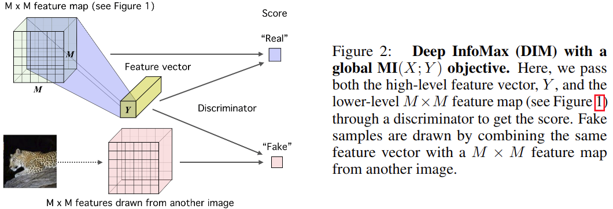

# Learning deep representations by mutual information estimation and maximization

元の論文の公開ページ : [arxiv](https://arxiv.org/abs/1808.06670)
Github Issues : [#82](https://github.com/Obarads/obarads.github.io/issues/82)

## どんなもの?
エンコーダーの入力と出力の相互情報量を最大化するような教師なし学習を提案した。

入力と出力の間の相互情報量(MI)を最大にするためのに表現学習関数(エンコーダー)を訓練する。ただし、漠然と画像全体とエンコーダの出力(表現)との間のMI(global MI)を最大化することは、下流タスクによっては有用な表現を得ることに繋がらない。  
これは構造が重要であり、入力画像の局所領域(パッチ)と表現との間の平均MIを最大化することは分類タスクのための表現の品質向上につながり、一方でgobal MIは入力全体を再構築する能力にて役割を果たす。

## 先行研究と比べてどこがすごいの?

## 技術や手法のキモはどこ? or 提案手法の詳細
まずは、入力と出力の相互情報量を最大にするためのエンコーダーの訓練設定について説明する。エンコーダーは図1の通りである。画像が入力である場合、convnet(エンコーダー)を介して$M\times M$個の画像パッチに対応する$M\times M$の特徴マップに変換され、更に特徴ベクトル$Y$を生成する。

infomax最適化の原則[2]と同様に、著者らは以下の基準に従ってエンコーダーが訓練されるべきだと主張した。

- **Mutual information maximization**: 相互情報量が最大になるような、エンコーダに含まれるパラメーターのセットを探す。この最大化は入力全体もしくは構造化されたサブセット、「ローカル」サブセットに対して行うことができる。
- **Statistical constraints**: 入力をエンコーダーに介して得られる分布を事前分布に一致させる。大雑把に言えば、エンコーダの出力が所望の特性(例:independence)を持つように促すために使われる。

これら2つの目標を持つ形式をDeep InfoMax(DIM)と呼ぶ。以下に詳細を説明する。

### MUTUAL INFORMATION ESTIMATION AND MAXIMIZATION
著者らの相互情報最大化フレームワークは図2に示す通り。

このアプローチはMutual Information Neural Estimation(MINE)[3]に従う。MINEは確率変数$X$と$Y$の周辺(分布?)の積$\mathbb{M}$と結合(分布?)$\mathbb{J}$に由来するサンプルを区別する分類器を訓練することによって相互情報量の推定を行う。MINEはKLダイバージェンスのDonsker-Varadhan表現(DV, [5])に基づくMIへの下限を使う。式(2)の様になる。

$$
\mathcal{I}(X ; Y) :=\mathcal{D}_{K L}(\mathbb{J} \| \mathbb{M}) \geq \widehat{\mathcal{I} }_{\omega}^{(D V)}(X ; Y) :=\mathbb{E}_{J}\left[T_{\omega}(x, y)\right]-\log \mathbb{E}_{\mathbb{M} }\left[e^{T_{\omega}(x, y)}\right] \tag{2}
$$

ここで、$T_ \omega:(\mathcal{X}\times\mathcal{Y})\to \mathbb{R}$はパラメータ$\omega$を持つニューラルネットワークによって構築された識別器の関数である。高レベルに関して、最大化$\mathcal{L}(X,E_ \psi(X))$と推定を同時に行うことで$E_ \psi$(パラメータ$\psi$をもつエンコーダ)を最適化する。これは式(3)の様になる。

$$
(\hat{\omega}, \hat{\psi})_{G}=\underset{\omega, \psi}{\arg \max } \widehat{\mathcal{I} }_ {\omega}\left(X ; E_{\psi}(X)\right) \tag{3}
$$

このとき、下付き文字の$G$は「global」を指す(詳細は後述)。しかし、この研究はMINEとは違う部分が2つある。

- エンコーダーと相互情報量推定器は同じ目的を持ち合わせ、なおかつ同様の計算量を必要とする。そのため、$E_ \psi$と$T_ {\psi,\omega}$間で層を共有する。つまり、$E_ {\psi}=f_ {\psi} \circ C_ {\psi}$と$T_ {\psi, \omega}=D_ {\omega} \circ g \circ\left(C_ {\psi}, E_ {\psi}\right)$であり、$g$はエンコーダーの出力と下層を組み合わせた関数である。
- MIを最大化することに興味が有り、正確な値には関心がないので、このタスクに好ましいtrade-offを提示する非KLなダイバージェンスに頼ることができる。そのため、Jensen-Shannon MI推定器([6]に従う)を定義できる。

結果として、式(4)の様な定義が出来上がる。

$$
\widehat{\mathcal{I}}_{\omega, \psi}^{(\mathrm{JSD})}\left(X ; E_{\psi}(X)\right) :=\mathbb{E}_{\mathbb{P}}\left[-\operatorname{sp}\left(-T_{\psi, \omega}\left(x, E_{\psi}(x)\right)\right)\right]-\mathbb{E}_{\mathbb{P} \times \tilde{\mathbb{P}}}\left[\operatorname{sp}\left(T_{\psi, \omega}\left(x^{\prime}, E_{\psi}(x)\right)\right)\right] \tag{4}
$$

ここで、$x$は入力サンプル、訓練データセットの入力の経験的確率分布$\mathbb{P}$があるとき、$x'$は$\mathbb{\widetilde{\mathbb{P}}=\mathbb{P} }$からサンプリングされた入力、$\operatorname{sp}(z)=\log(1+e^z)$はsoftplus関数である。  
同様の推定器が[7]で提案されているが、これらについては補足にて記載されている。

はじめにNoise-Contrastive Estimation(NCE,[8])は[9]\(infoNCEと呼ばれる\)のMI上の限界として使われ、そしてこの損失は最大化によってDIMを用いて使われる。式(5)の様になる。

$$
\widehat{\mathcal{I}}_{\omega, \psi}^{(\mathrm{infoNCE})}\left(X ; E_{\psi}(X)\right) :=\mathbb{E}_{\mathbb{P} }\left[T_{\psi, \omega}\left(x, E_{\psi}(x)\right)-\mathbb{E}_{\tilde{\mathbb{P} } }\left[\log \sum_{x^{\prime} } e^{T_{\psi, \omega}\left(x^{\prime}, E_{\psi}(x)\right)}\right]\right]
$$

DIMに対して、DVとJSD、infoNCEとの主な違いは$\mathbb{P}/\mathbb{\widetilde P}$の期待値がlogの外側に現れるか内側に現れるかである(?)。実際、JSDベースの目的は[8]の元のNCE定式化を反映している。

### LOCAL MUTUAL INFORMATION MAXIMIZATION

## どうやって有効だと検証した?

## 議論はある?

## 次に読むべき論文は?
- なし

## 論文関連リンク
1. [鈴⽊智之. Self-supervised Learningによる特徴表現学習. (アクセス日時 2019/02/06)](http://hirokatsukataoka.net/temp/cvpaper.challenge/SSL_0929_final.pdf)
2. [Ralph Linsker. Self-organization in a perceptual network. IEEE Computer, 21(3):105–117, 1988. doi: 10.1109/2.36.](https://ieeexplore.ieee.org/document/36)
3. [Ishmael Belghazi, Aristide Baratin, Sai Rajeswar, Sherjil Ozair, Yoshua Bengio, Aaron Courville, and R Devon Hjelm. Mine: mutual information neural estimation. arXiv preprint arXiv:1801.04062, ICML’2018, 2018.](https://arxiv.org/abs/1801.04062)
4. [Entropy](/complementary/#Entropy.md)
5. M.D Donsker and S.R.S Varadhan. Asymptotic evaluation of certain markov process expectations for large time, iv. Communications on Pure and Applied Mathematics, 36(2):183–212, 1983.
6. [Sebastian Nowozin, Botond Cseke, and Ryota Tomioka. f-gan: Training generative neural samplers using variational divergence minimization. In Advances in Neural Information Processing Systems, pp. 271–279, 2016.](https://arxiv.org/abs/1606.00709)
7. [Philemon Brakel and Yoshua Bengio. Learning independent features with adversarial nets for non-linear ica. arXiv preprint arXiv:1710.05050, 2017.](https://arxiv.org/abs/1710.05050)
8. [Michael Gutmann and Aapo Hyv ̈ arinen. Noise-contrastive estimation: A new estimation principle for unnormalized statistical models. In Proceedings of the Thirteenth International Conference on Artificial Intelligence and Statistics, pp. 297–304, 2010.](http://proceedings.mlr.press/v9/gutmann10a/gutmann10a.pdf)
9. [AaronvandenOord,YazheLi,andOriolVinyals.Representation learning with contrastive predictive coding. arXiv preprint arXiv:1807.03748, 2018.](https://arxiv.org/abs/1807.03748)

## 会議
ICLR 2019

## 著者
R Devon Hjelm, Alex Fedorov, Samuel Lavoie-Marchildon, Karan Grewal, Phil Bachman, Adam Trischler, Yoshua Bengio.

## 投稿日付(yyyy/MM/dd)
2018/08/20

## コメント
なし

## key-words
RGB_Image, Self-Supervised_Learning, CV, Paper, 修正

## status
修正

