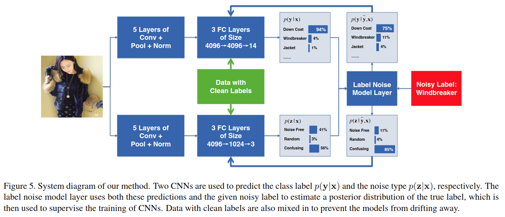

# Learning from Massive Noisy Labeled Data for Image Classification

元の論文の公開ページ : [ee.cuhk.edu.hk](http://www.ee.cuhk.edu.hk/~xgwang/papers/xiaoXYHWcvpr15.pdf)  
Github Issues : [#69](https://github.com/Obarads/obarads.github.io/issues/69)

## どんなもの?
限られた数のクリーンなラベルと100万ほどあるノイズありのラベルが含まれるデータセットでCNNを訓練するフレームワークを提案した。

## 先行研究と比べてどこがすごいの?

## 技術や手法のキモはどこ? or 提案手法の詳細
提案手法は図5の通り。クラスラベルを予測するCNNとノイズタイプを予測するCNNがあり、ここで予測した結果と与えられたノイズラベルを使って真のラベルの事後分布を予測する。予測した真のラベルはCNNの訓練に使われる。モデルが疎遠になる(?)ことを防ぐためクリアなデータも混ぜる。

ノイズタイプは以下の通り。

- **Confusing noise** : まあまあ誤解を与えるようなノイズラベル。画像内容がわかりにくいものを指す。
- **Pure random noise** : 完全に間違っているノイズラベル。ラベルの割り振りミスは画像の周りにあるテキストが影響しているとのこと。

## どうやって有効だと検証した?

## 議論はある?

## 次に読むべき論文は?
- なし

## 論文関連リンク
1. なし

## 会議
CVPR 2015

## 著者
Tong Xiao, Tian Xia, Yi Yang, Chang Huang, and Xiaogang Wang.

## 投稿日付(yyyy/MM/dd)
2015/06/07

## コメント
なし

## key-words
RGB_Image, CV, Paper, 修正

## status
修正

