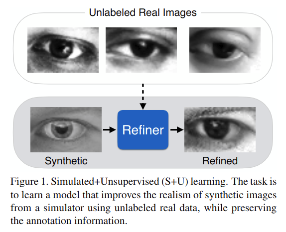

# Learning from Simulated and Unsupervised Images through Adversarial Training

元の論文の公開ページ : https://arxiv.org/abs/1612.07828

## どんなもの?
GANを使って合成画像(シミュレーター内の画像など)を現実の画像に近づけるモデルを提案した。

## 先行研究と比べてどこがすごいの?
シミュレーターによって生成された画像にはアノテーションがついてくるという利点があるが、これらの画像で訓練されたモデルを現実で使うと、合成写真と現実の写真の写り具合の差によりモデルは良い結果を残すことができない。この問題の解決策として現実の描写に近いシミュレーターを作るという提案があるが、手間がかかる上に望むほど改善しない可能性がある。そこでこの論文ではSimulated+Unsupervied(S+U) learningという、ラベル付されていない現実のデータを使ってシミュレーターの合成画像の現実感を改善する目標を持つ学習手法を提案する。図1がS+U learningを図で表したものである。

## 技術や手法のキモはどこ?

## どうやって有効だと検証した?

## 議論はある?

## 次に読むべき論文は?
-
-

### 論文関連リンク
1.
2.

### 会議

### 著者

### 投稿日付(yyyy/MM/dd)
2016/12/22

## コメント

## key-words
GAN, Simulation, 2D Image, S+U_learning