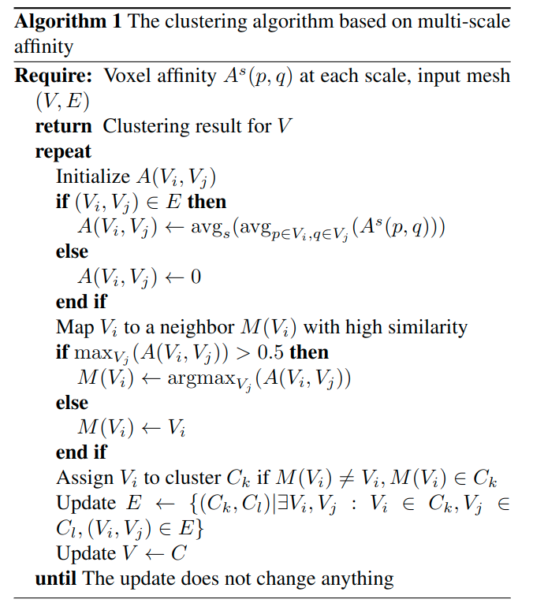

# MASC: Multi-scale Affinity with Sparse Convolution for 3D Instance Segmentation

元の論文の公開ページ : [arxiv](https://arxiv.org/abs/1902.04478)  
Github Issues :   

## どんなもの?
新規の3Dインスタンスセグメンテーションモデルを提案した。
- スパース畳み込みと、2つの点が同じインスタンスに属すかどうかの尤度を示すpoint affinityの予測に基づいたモデルである。
- 提案されたネットワークは、スパース畳み込み[1]で構成され、ボクセル化された点群を処理する。[ただし、入力自体はメッシュトポロジである。]
- ネットワークは、専有されている各ボクセルのセマンティックスコアと、異なるスケールで隣接しているボクセル間のaffinity(類似性)を予測する。[専有はおそらく点群を含むかどうかの話。]

## 先行研究と比べてどこがすごいの? or 関連事項
省略

## 技術や手法のキモはどこ? or 提案手法の詳細
[提案手法では[1]で使われているスパース畳み込みを導入したU-Netのアーキテクチャを使う。アーキテクチャにはブランチが新たに追加されている。アーキテクチャの出力は、最終的にクラスタリングアルゴリズムに入力される。全体像は図1の通り。]

はじめにU-Netアーキテクチャを元としたモデルに点群を入力する。[入力自体はメッシュでないとだめである。メッシュのグラフはモデルの出力後にある倉田スタリングで利用する。]
- すべての点は座標、色、表面法線を含む。[1]に従い、このネットワークの入力には点群を$2cm \times 2cm \times 2cm$のボクセルに変換したものを使用する。各ボクセルは最大で一つの点を含むようにする。[点はランダムで間引く?]
- semantic segmentationの出力を行うブランチ以外にmultiple affinity branchesを追加する。
    - この追加されたブランチでは、異なるスケールで類似性が取られる。active voxel[1を参照]と6つの近傍[?]間の類似性スコアを予測する。

入力メッシュをグラフ$(V,E)$として扱い、the multi-scale affinity fieldとセマンティックの予測に基づいて点をインスタンスごとに分割するクラスタリングアルゴリズムを提案した。
- このクラスタリングはグラフ上で使われる。
- まず、2つのノード間の類似性を計算するため、隣接する2つのノードを接続している近隣ボクセルのペア間の平均類似度を使用する。
    - [点をノードとして扱い、ノード間の類似度に着目する。この点の類似度は各点に対応するボクセルの類似度を参照している。この後$4^S$のくだりは省略。]
- ノードは、自身との類似度が0.5以上のノードの中から最も高いものを選びマッピングし、この条件を満たさない場合は自身をマッピングする[自身へマッピング?、要は他のノードへマッピングしないということ?クラスタリングではこういうのか?翻訳ミス?]。
- [ここでいうマッピングは、ノードと他のノードを同じグループ(インスタンス)に振り分けることを指す模様。]
- 各クラスタ[マッピング後のグループ]を新たなノードとして、[グラフの]エッジを更新する。
- 以上のクラスタリングアルゴリズムはalg.1の通り。  
    
- このアルゴリズムは[2]と違って並列処理が可能である。

## どうやって有効だと検証した?
ScanNetで実験した。
省略

## 議論はある?
省略

## 次に読むべき論文は?
- なし

## 論文関連リンク
1. [B. Graham, M. Engelcke, and L. van der Maaten. 3d seman-tic segmentation with submanifold sparse convolutional net-works. InProceedings of the IEEE Conference on Computer Vision and Pattern Recognition, pages 9224–9232, 2018.](http://openaccess.thecvf.com/content_cvpr_2018/papers/Graham_3D_Semantic_Segmentation_CVPR_2018_paper.pdf)[3]
2. [Y. Liu, S. Yang, B. Li, W. Zhou, J. Xu, H. Li, and Y. Lu. Affinity derivation and graph merge for instance segmentation. In Proceedings of the European Conference on Com-puter Vision (ECCV), pages 686–703, 2018. ](https://arxiv.org/abs/1811.10870)[11]

## 会議, 論文誌, etc.
未確認(2019/11/17現在)

## 著者
Chen Liu, Yasutaka Furukawa

## 投稿日付(yyyy/MM/dd)
2019/02/12

## コメント
なし

## key-words
Technical_Report, CV, Instance_Segmentation, Mesh

## status
省略

## read
A, M

## Citation
