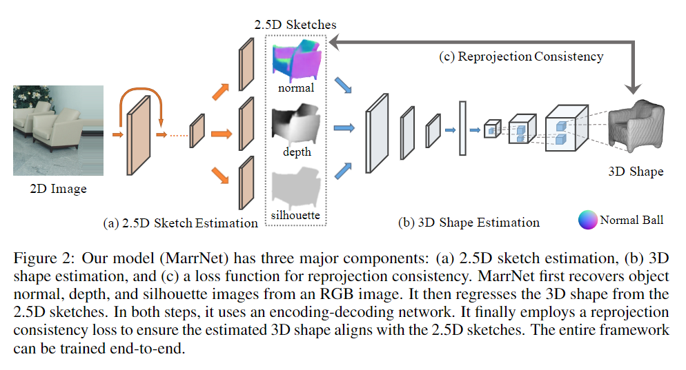
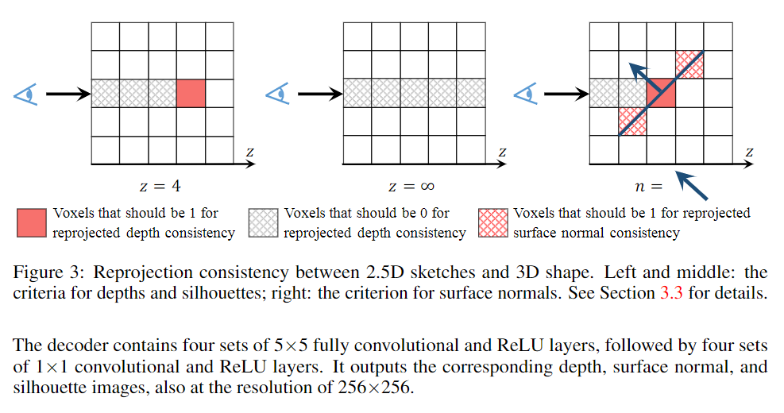
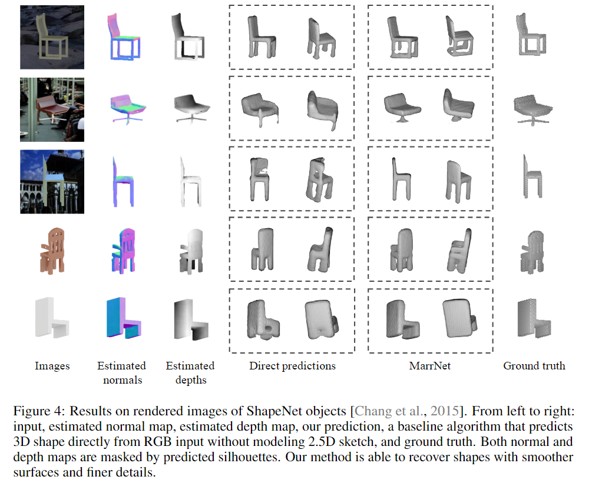
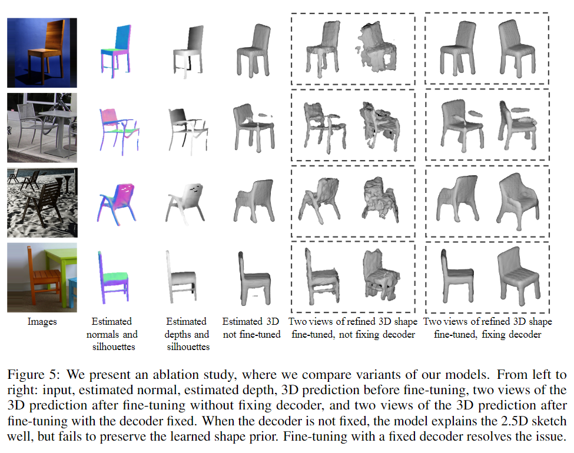
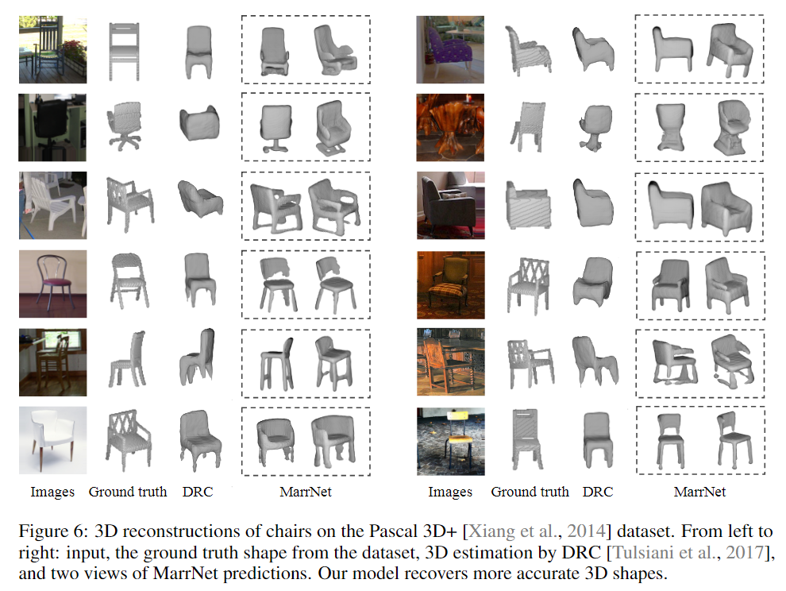
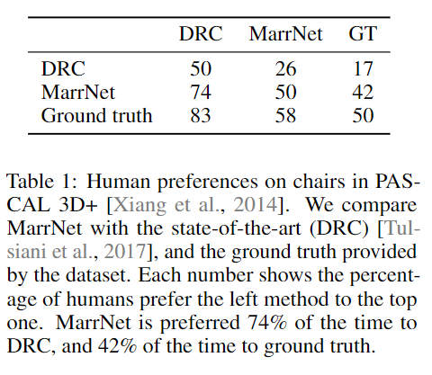
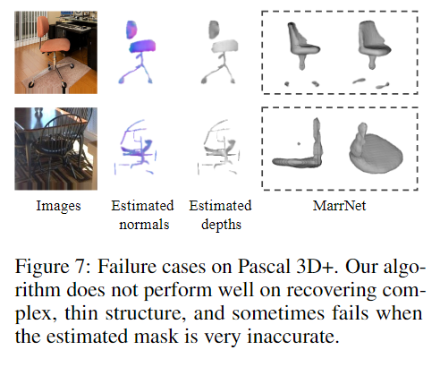

# MarrNet: 3D Shape Reconstruction via 2.5D Sketches

元の論文の公開ページ : [arxiv](https://arxiv.org/abs/1711.03129)
Github Issues : [#29](https://github.com/Obarads/obarads.github.io/issues/29)

## どんなもの?
RGB画像を2.5Dスケッチと呼ばれる立体構造を把握しやすい画像に変換させ、2.5Dスケッチから3Dボクセルオブジェクトを生成するMarrNetを提案した。

## 先行研究と比べてどこがすごいの?
RGB画像を用いた3Dオブジェクトの生成は、ドメイン適応問題によってうまく動作しない部分があったため、それを緩和するために2.5Dスケッチと呼ばれる3つの合成画像を使った。結果、SOTAを超す結果を出した。

## 技術や手法のキモはどこ? or 提案手法の詳細
### 構造
MarrNetは図2の通り。MarrNetは3つのパーツに分かれる。

- 図2(a):2.5Dスケッチの推定、具体的には表面法線、シルエット画像、オブジェクトの奥行を予測する。
- 図2(b):ボクセルによる3Dオブジェクトの形状推定
- 図2(c):reprojection consistency関数による推定した3Dオブジェクトと2.5Dスケッチの調節

### 2.5D Sketch Estimation
入力として2DのRGB画像を受け取り、これを用いて2.5Dスケッチを推定する。2.5Dスケッチ推定の目的は、オブジェクトの表面の色合いや照明などの3D推定に必要ない情報を省き、内在するデプス情報などの3D推定に必要な情報を得るためである。これらはAutoEncoderを用いて推測され、解像度$256\times 256$の画像として出てくる。

### 3D Shape Estimation
入力として2.5Dスケッチを受け取り、これを用いて3Dオブジェクトの推定を行う。RGB画像と違い、ドメイン適応の問題に悩まされずに訓練することができる。アーキテクチャは3D-VAE-GANなどから発想を得ている。

### Reprojection Consistency
ニューラルネットワークにおいて3Dオブジェクトと2D表現間で整合性を強化する試みがあり、ここでは、depth reprojection損失とsurface normal reprojection損失からなる3D形状と2.5Dスケッチ間のreprojection consistency損失を含む新たな方法を導入する。

$v_{x,y,z}$は3Dボクセル内の位置$(x,y,z)$における値を表し、これらは$v_{x,y,z}\in [0,1], \ \forall x,y,z$を仮定する。$d_{x,y}$は位置$(x,y)$の推定されたデプスを示し、$n_{x,y}=(n_a,n_b,n_c)$は推定された表面法線を示す。正投影を行うとする。

#### Depth
projection depth損失はデプス$v_{x,y,d_{x,y} }$のボクセルが1であり、それの前のボクセルが0であるようにするものである。

図3の左のようになるとき、式(1)のようになる。$v_{x,y,z}$についても微分する(式(2)省略)。

$$
L_{depth}(x,y,z)=\left\{
\begin{array}{ll}
v_{x,y,z}^2 & z < d_{x,y} \\
(1-v_{x,y,z})^2 & z = d_{x,y} \\
0 & z > d_{x,y}
\end{array}
\right. \tag{1}
$$

図3の真ん中の様に$d_{x,y}=\infty$であるなら、ボクセルがすべて0になるようにする。

#### Surface normals
ベクトル$n_x=(0,-n_c,n_b)$と$n_y=(-n_c,0,n_a)$は法線ベクトル$n_{x,y}=(n_a,n_b,n_c)$に直角であり、それらを正規化して2つのベクトルとして得ることができる。$n_x'=(0,-1,n_b/n_c)$と$n_y'=(-1,0,n_a/n_c)$は両方とも$(x,y,z)$で推定された表面平面上のものである。projected surface normal損失は、推定された表面法線と一致するために$(x,y,z)\pm n_x'$と$(x,y,z)\pm n_{+y}$のボクセルが1になるようにする。この制約は推定されたシルエットの中にあるボクセルのみに適応される。

図3の右のようになるとき、$z=d_{x,y}$として、projected surface normal損失は式(3)の様に表される。

$$
L_{normal}(x,y,z)=(1-v_{x,y-1,z+\frac{n_b}{n_c} })^2 + (1-v_{x,y+1,z-\frac{n_b}{n_c} })^2 
+ (1-v_{x-1,y,z+\frac{n_a}{n_c} })^2 + (1-v_{x+1,y,z-\frac{n_a}{n_c} })^2 \tag{3}
$$

それぞれ偏微分を行う(式(4)省略)。

### Training paradigm
著者らは2段階のトレーニングパラダイムを採用する。最初に、合成画像で2.5Dスケッチ推定と3D形状推定コンポーネントを別々にトレーニングする。その後、実際の画像に合わせてネットワークを微調節する。

事前トレーニングには、ShapeNetオブジェクトの合成画像を使用する。 2.5Dスケッチ推定は、L2損失を有するground truthの表面法線、デプス、およびシルエット画像を使用して訓練される。3Dオブジェクト推定はground truthボクセルとcross entropy損失を使って訓練される。

reprojection consistency損失は予測された2.5Dスケッチを使用して実際の画像における3D推定を微調整するために使用される。ただし、Decoder部分は固定しないと事前に学習した3D形状を保存せずに3D形状推定モジュールが画像を過剰適合するためである。

## どうやって有効だと検証した?
### 3D Reconstruction on ShapeNet
#### Data
SUNデータセットからランダムな背景の前にShapeNetの椅子を置き、対応するRGB、デプス、表面法線、シルエット画像をレンダリングする。よりリアルな画像を得るために物理ベースのレンダラー(論文関連リンクの1)を使用する。

#### Method
先ほど説明した方法を最後の微調整なしで訓練する。ベースライン手法として、2.5Dスケッチなしで直接RGB画像を使い予測するモデルを用意し比較した。図4に生成物を示す。定量的評価として、Intersection-over-Union(IoU)を計算した結果、著者らのフルモデルはベースラインの0.52よりも高い0.57を記録した。

  
### 3D Reconstruction on Pascal 3D+
#### Data
生活内の画像とオブジェクトモデルを含むPASCAL 3D+データセットを使う。論文関連リンクの2と同じPASCAL 3D+のテストセットを使う。

#### Method
訓練方法は同じで、初めにそれぞれのモジュールでShapeNetのデータセットを使い訓練したのち、PASCAL 3D+データセットで微調整する。ただし、MarrNetは微調整中にシルエットを必要とせず、代わりに合同でシルエットを推定する(?)。切除実験として、微調整なしでShapeNetデータのみの訓練した提案モデル、微調整中にdecoderを固定しなかった提案モデル、微調整中にdecoderを固定した提案モデルを用意し、SOTAな結果を出しているDRC(論文関連リンクの2)と比較した。結果は図5,6の通り。IoUによる定量的な結果は、MarrNetがDRCの0.34よりも高い0.39を記録した(ただし、IoUには評価基準としての欠点があることを指摘している、理由はここでは省略)。また、表1に人による見た目の評価を行わせている。失敗した例は図7にある。

### その他
IKEAのデータセットを使ったりしている。

## 議論はある?

## 次に読むべき論文は?
- [Jiajun Wu, Chengkai Zhang, Xiuming Zhang, Zhoutong Zhang, William T. Freeman and Joshua B. Tenenbaum. Learning Shape Priors for Single-View 3D Completion and Reconstruction. ECCV 2018.](https://arxiv.org/abs/1809.05068)

## 論文関連リンク
1. [Wenzel Jakob. Mitsuba renderer, 2010.](http://www.mitsuba-renderer.org)
2. [Shubham Tulsiani, Tinghui Zhou, Alexei A Efros, and Jitendra Malik. Multi-view supervision for single-view reconstruction via differentiable ray consistency. In CVPR, 2017.](https://arxiv.org/abs/1704.06254)

## 会議
NIPS 2017

## 著者
Jiajun Wu, Yifan Wang, Tianfan Xue, Xingyuan Sun, William T Freeman and Joshua B Tenenbaum.

## 投稿日付(yyyy/MM/dd)
2017/11/08

## コメント
なし

## key-words
RGB_Image, Voxel, 3D_Estimation, Depth_Image, CV

## status
更新済