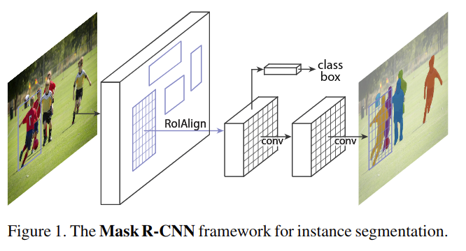

# Mask R-CNN

元の論文の公開ページ : [arxiv](https://arxiv.org/abs/1703.06870)  
Github Issues : 

## どんなもの?

## 先行研究と比べてどこがすごいの?

## 技術や手法のキモはどこ? or 提案手法の詳細
Mask R-CNNは最初の段階にRPN(RoIを出力)を使用し、次の段階でバウンディングボックスとクラスを予測すると同時に各RoIに対するバイナリマスクを出力する。Mask R-CNNの概要図は図1の通り。  

マスクブランチ(処理の分岐、他にはクラスとボックスブランチがある)は各RoIに対して$K \ m^2$次元の出力を行う。この時、Kはクラス数、$m\times m$は解像度を指す。  
本提案の損失は以下のようになる。

$$
L=L_{c l s}+L_{b o x}+L_{m a s k}
$$

$L_ {cls}$と$L_ {box}$は[1]に従う。$L_ {mask}$はピクセル単位の損失を必要とするため、平均バイナリクロスエントロピー損失として扱う。なお、ground-truthが$k$番目のクラスに関連するRoIである場合、$L_ {mask}$は$k$番目のマスクのみを扱う(他のマスクは損失に関与しない)。通常、セマンティックセグメンテーションではピクセル単位でソフトマックスと多項式クロスエントロピー損失を扱う。その場合、他のクラスとマスクが競合するが、本提案ではピクセル単位でシグモイドと2値損失を使うため、競合しない。これがインスタンスセグメンテーションに良好な結果をもたらす。(なんで?)

## どうやって有効だと検証した?

## 議論はある?

## 次に読むべき論文は?
- なし

## 論文関連リンク
1. [R. Girshick. Fast R-CNN. InICCV, 2015.](https://arxiv.org/abs/1504.08083?context=cs.CV)

## 会議
ICCV 2017

## 著者
Kaiming He, Georgia Gkioxari, Piotr Dollar, Ross Girshick.

## 投稿日付(yyyy/MM/dd)
2017/03/20

## コメント
これを読む前にR-CNN、Fast R-CNN、Faster R-CNNを読むこと。

## key-words
2D_Image, Detection, Semantic_Segmentation, Instance_Segmentation

## status
未完

## read

## Citation
