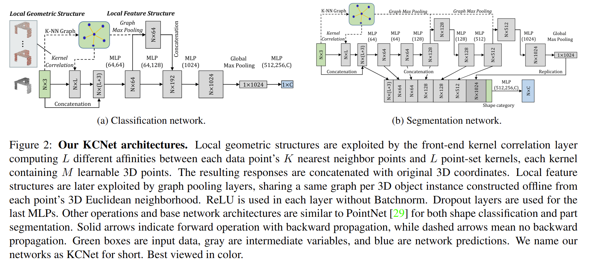

# Mining Point Cloud Local Structures by Kernel Correlation and Graph Pooling

元の論文の公開ページ : https://www.merl.com/publications/docs/TR2018-041.pdf

## どんなもの?
局所特徴の活用によってPointNetを改善したモデルであるKernel Correlation Net(KCNet)を提案した。

## 先行研究と比べてどこがすごいの?
点群には凹凸やコーナー等の判別しやすい表現(ローカル特徴)が含まれており、それらを学習できる拡張をPointNetにシンプルさを維持したまま適応する。

## 技術や手法のキモはどこ? or 提案手法の詳細
### **構造**
提案したアーキテクチャは図2の通り。点集合の形状の類似性を測定するkernel correlation(カーネル相関、元ネタはpoint cloud registrationから)と近傍点間のローカル特徴を伝播するK-Nearest Neighbor Graph(KNNG、K最近傍グラフ)を使ったアーキテクチャである。

### **Learning on Loacal Geometric Structure**  
畳み込みカーネルを用いて画像とカーネルの類似性を定量化するように、点群では2つの点集合間(入力とkernel point)の類似性をkernel correlation(論文関連リンクの1と2)で測定する。kernel correlationの計算はback propagationを介して修正される。具体的には論文関連リンクの2のLeave-one-out Kernek Correlation(LOO-KC)とmultiply-linked registration cost function(論文関連リンクの2)で点群の局所形状構造を得る。

M個の学習可能な点群を持つpoint-set kernel ${\kappa}$と、$N$個の点を持つ点群内にある現在のanchor point ${\rm x}_i$間のkernel correlation(KC)を式(1)の様に定義する。

$$
{\rm KC}( \kappa_i, {\rm x_i} )=\frac{1}{|\mathcal{N}(i)|} \sum_{m=1}^ {M} \sum_ {n \in \mathcal{N}(i)} {\rm K_ \sigma}(\kappa_m,{\rm x}_n-{\rm x}_i) \tag{1}
$$

この時、  
1. $\kappa_m$はカーネル内のm番目の学習できる点を表す。
2. $\mathcal{N}(i)$はanchor point ${\rm x}_iの$近傍インデックスのセットである。
3. ${\rm x}_n$は${\rm x}_i$の近傍点の一つを指す。
4. ${\rm K_\sigma}(・,・):\mathfrak{R}^D\times\mathfrak{R}^D→\mathfrak{R}$は任意の有効なカーネル関数である($D$=2(2D点群)もしくは3(3D点群)である)(式がよくわからんかった)。

論文関連リンクの2に従って、カーネルには式(2)の様にガウスカーネルを適応する。

$$
{\rm K}_\sigma({\bf k, \delta})=\exp(-\frac{-||{\rm k - \delta}||^2}{2\sigma^2}) \tag{2}
$$

ここで、
1. ||・||は2点間のユークリッド距離を表す。
2. $\sigma$はカーネル幅であり、2点間の距離の影響をコントロールする(このパラメーターは全ての訓練点群にわたる近傍グラフの平均近傍距離を入力すれば問題ない)。

$\mathcal{L}$が損失関数であり、top layerから各点$x_i$のKC応答$d_i=\frac{\partial \mathcal{L}}{\partial {\rm KC(\kappa,{\bf x}_i ) } }$逆伝播である(?)。この時、それぞれのkernel point $\kappa_m$のための逆伝播は式(3)の様になる。

$$
\frac{\partial\mathcal{L} }{\partial\kappa_m}=\sum_{i=1}^N \alpha_i d_i [ \sum_{n \in \mathcal{N}(i) } {\bf v}_ {m,i,n} \exp(-\frac{||{\bf v}_ {m,i,n}||^2}{2\sigma^2}) ] \tag{3}
$$

この時、
1. 点$x_i$の正規化定数$\alpha_i=\frac{-1}{|\mathcal{N}(i)|\sigma^2}$
2. 局所差分ベクトル${\bf v}_{m,i,n}=\kappa_m+{\bf x}_i-{\bf x}_n$

LOO-KCに由来するが、著者らのKCの動作は異なる。
1. 著者らのKCは学習可能な点のカーネルとデータ点の近傍の間の類似性を計算する。
2. 著者らのKCはカーネル中の全ての点が自由に動き、順応することを可能にし(つまり、$\kappa$に対して重みの減少がない)、テンプレートと変換パラメータをpoint-set kernelとして置き換える。

KCが局所の幾何学的構造をどのように捉えているか

## どうやって有効だと検証した?

## 議論はある?

## 次に読むべき論文は?
- [Yaoqing Yang, Chen Feng, Yiru Shen and Dong Tian. FoldingNet: Point Cloud Auto-encoder via Deep Grid Deformation. CVPR 2018.](https://arxiv.org/abs/1712.07262)

### 論文関連リンク
1. [B. Jian and B. C. Vemuri. Robust point set registration us-ing gaussian mixture models. IEEE Transactions on Pattern Analysis and Machine Intelligence, 33(8):1633–1645, 2011.](https://www.researchgate.net/publication/224207506_Robust_Point_Set_Registration_Using_Gaussian_Mixture_Models)
2. [Y. Tsin and T. Kanade. A correlation-based approach to robust point set registration. In European conference on com-puter vision (ECCV), pages 558–569, 2004.](http://citeseerx.ist.psu.edu/viewdoc/download?doi=10.1.1.88.8155&rep=rep1&type=pdf)

### 会議
CVPR 2018

### 著者
Y. Shen, C. Feng, Y. Yang, and D. Tian.

### 投稿日付(yyyy/MM/dd)
2018/07/08

## コメント
なんか難しくない...?

## key-words
PointCloud,Classification,Segmentaion