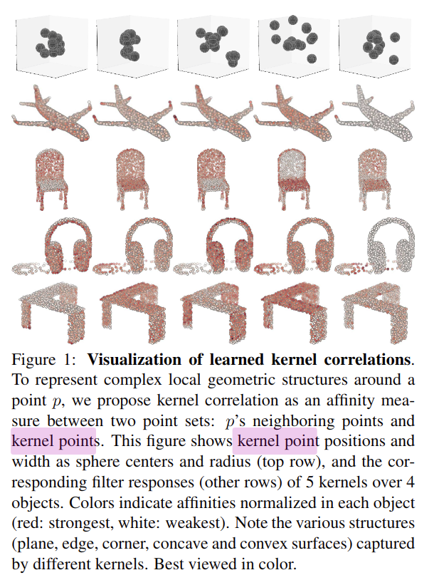
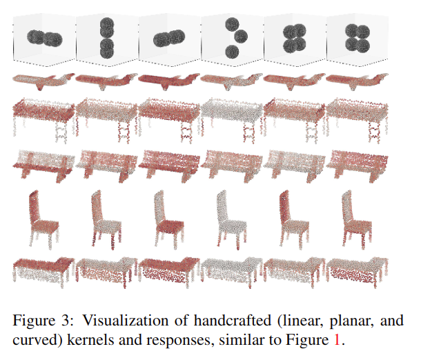
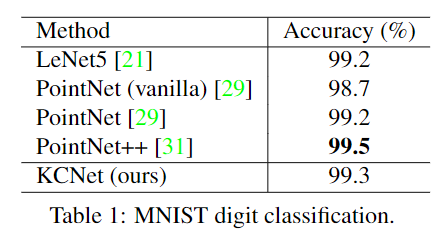
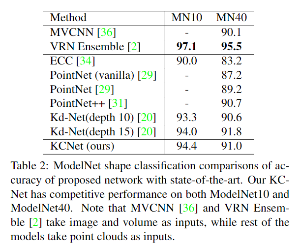

# Mining Point Cloud Local Structures by Kernel Correlation and Graph Pooling

元の論文の公開ページ : [www.merl.com](https://www.merl.com/publications/docs/TR2018-041.pdf)
Github Issues : [#21](https://github.com/Obarads/obarads.github.io/issues/21)

## どんなもの?
局所特徴の活用によってPointNetを改善したモデルであるKernel Correlation Net(KCNet)を提案した。

## 先行研究と比べてどこがすごいの?
点群には凹凸やコーナー等の判別しやすい表現(ローカル特徴)が含まれており、それらを学習できる拡張をPointNetにシンプルさを維持したまま適応する。

## 技術や手法のキモはどこ? or 提案手法の詳細
### 構造
提案したアーキテクチャは図2の通り。点集合の形状の類似性を測定するkernel correlation(カーネル相関、元ネタはpoint cloud registrationから)と近傍点間のローカル特徴を伝播するK-Nearest Neighbor Graph(KNNG、K最近傍グラフ)を使ったアーキテクチャである。尚、図2にある$L$はカーネル数を表し、これは$L$がconvolutional netsの出力チャンネルの数に相当する(この記述はLearning on Local Geometric Structureの最後にあり)。

### Learning on Local Geometric Structure
畳み込みカーネルを用いて画像とカーネルの類似性を定量化するように、点群では2つの点集合間(入力とkernel point)の類似性をkernel correlation(論文関連リンクの1と2)で測定する。kernel correlationの計算はback propagationを介して修正される。具体的には論文関連リンクの2のLeave-one-out Kernel Correlation(LOO-KC)とmultiply-linked registration cost functionで点群の局所形状構造を得る。

M個の学習可能な点群を持つpoint-set kernel ${\kappa}$(畳み込み層のフィルタに相当するもの？)と、$N$個の点を持つ点群内にある現在のanchor point ${\rm x}_i$間のkernel correlation(KC)を式(1)の様に定義する。

$$
{\rm KC}( \kappa_i, {\rm x_i} )=\frac{1}{|\mathcal{N}(i)|} \sum_{m=1}^ {M} \sum_ {n \in \mathcal{N}(i)} {\rm K_ \sigma}(\kappa_m,{\rm x}_n-{\rm x}_i) \tag{1}
$$

この時、  
- $\kappa_m$はカーネル内のm番目の学習できる点(畳み込み層のフィルタのピクセルに相当するもの？)を表す。
- $\mathcal{N}(i)$はanchor point ${\rm x}_iの$近傍インデックスのセットである。
- ${\rm x}_n$は${\rm x}_i$の近傍点の一つを指す。
- ${\rm K_\sigma}(・,・):\mathfrak{R}^D\times\mathfrak{R}^D→\mathfrak{R}$は任意の有効なカーネル関数である($D$=2(2D点群)もしくは3(3D点群)である)。

論文関連リンクの2に従って、カーネルには式(2)の様にガウスカーネルを適応する。

$$
{\rm K}_\sigma({\bf k, \delta})=\exp(-\frac{-||{\rm k - \delta}||^2}{2\sigma^2}) \tag{2}
$$

ここで、
- ||・||は2点間のユークリッド距離を表す。
- $\sigma$はカーネル幅であり、2点間の距離の影響をコントロールする(このパラメーターは全ての訓練点群にわたる近傍グラフの平均近傍距離を入力すれば問題ない)。

$\mathcal{L}$が損失関数であり、top layerから各点$x_i$のKC応答$d_i=\frac{\partial \mathcal{L}}{\partial {\rm KC(\kappa,{\bf x}_i ) } }$逆伝播である(?)。この時、それぞれのkernel point $\kappa_m$のための逆伝播は式(3)の様になる。

$$
\frac{\partial\mathcal{L} }{\partial\kappa_m}=\sum_{i=1}^N \alpha_i d_i [ \sum_{n \in \mathcal{N}(i) } {\bf v}_ {m,i,n} \exp(-\frac{||{\bf v}_ {m,i,n}||^2}{2\sigma^2}) ] \tag{3}
$$

この時、
- 点$x_i$の正規化定数$\alpha_i=\frac{-1}{|\mathcal{N}(i)|\sigma^2}$
- 局所差分ベクトル${\bf v}_{m,i,n}=\kappa_m+{\bf x}_i-{\bf x}_n$

LOO-KCに由来するが、著者らのKCの動作は異なる。
- 著者らのKCは学習可能な点のカーネルとデータ点の近傍の間の類似性を計算する。
- 著者らのKCはカーネル中の全ての点が自由に動き、順応することを可能にし(つまり、$\kappa$に対して重みの減少がない)、テンプレートと変換パラメータをpoint-set kernelとして置き換える。

KCが局所の幾何学的構造をどのように捉えているか理解するため、図1にセマンティックセグメンテーションを使って学習したカーネル、図3に手作りのカーネルとそれに対応する異なるオブジェクトのKC responseを視覚化した。

### Learning on Local Feature Structure
KCを計算するため、点の局所的な近傍を効率的に格納できる、点を頂点とするK Nearest neighbor graph(KNNG)を構築する。その後、入力の局所的な構造を利用するために、KNNGのedgeに沿った集約と再帰的な特徴伝播を行う(画像でいう畳み込みと似ている)。

具体的には、

- $X\in \mathfrak{R}^{N \times K}$はgraph pooling layer(図2)への入力である

としたとき、式(4)のgraph pooling operationにより近傍内の各点の特徴を集約する。

$$
{\bf Y=PX} \tag{4}
$$

これはaverageもしくはmax poolingとして実装できる。
#### Graph average pooling
graph average poolingの場合、正規化された(標準化?)隣接行列として式(4)のPを使うことで、近傍の点の特徴を平均化する。この${\bf P}$は式(5)で定義される。

$$
{\bf P=D^{-1}W \tag{5} }
$$

この時、
- KNNGは隣接行列${\bf W\in\mathfrak{R}^{N\times N} }$を持つ。
- ${\bf W}(i,j)=1$は、頂点iとjの間にedgeがある場合。
- ${\bf W}(i,j)=0$は、上記条件以外の場合。
- $D\in \mathfrak{R}^{N\times N}$は$(i,j)$番目のentry(要素?)$d_{i,j}$による次数行列である(?)。
- $deg(i)$は頂点$i$とつながっている頂点の数を数えた頂点$i$の次数である。

以上の定義があるとき、$d_{i,j}$は式(6)のように定義される。

$$
d_{i,j} = \left\{\begin{array}{ll}deg(i), & if \qquad i=j \\0, & otherwise\end{array}\right. \tag{6}
$$

#### Graph max pooling(GM)
graph max pooling(GM)の場合、それぞれの近傍上の最大特徴をとる。これは式(4)の行列乗算の「+」演算子を「max」演算子に置き換えることで簡単に計算できるようになる。これにより出力のY$(i,k)$番目のentryは式(7)のようになる。

$$
{\bf Y}(i,k) = \max_{n\in\mathcal{N}(i)} {\bf X}(n,k) \tag{7}
$$

ここで、
- $\mathcal{N}(i)$は${\bf W}$から計算された点${\bf X}_i$の近隣のインデックスの集合を示す。

poolingが行われた特徴量は図2の様に結合される。

## どうやって有効だと検証した?
### Shape Classification
MNISTを2D点群に変換した分類(表1)とModelNetを使った分類(表2)で評価を行った。あとMのサイズによる比較も行っている。

### Part Segmentation
ShapeNetのpart datasetで評価を行った(表4)。

### Ablation Study
以下の項にまとめられている。ここでは省く。
- Effectiveness of Kernel Correlation(KCの効率性)
- Symmetric Functions(対称関数)
- Effectiveness of Local Structures(局所構造の有効性)
- Choosing Hyper-parameters(ハイパーパラメータの選択)
- Robustness Test(堅牢性のテスト)

## 議論はある?
将来的には学習可能なカーネル幅を使用して、KCをより高次元に一般化させる。

## 次に読むべき論文は?
- [Yaoqing Yang, Chen Feng, Yiru Shen and Dong Tian. FoldingNet: Point Cloud Auto-encoder via Deep Grid Deformation. CVPR 2018.](https://arxiv.org/abs/1712.07262)

## 論文関連リンク
1. [B. Jian and B. C. Vemuri. Robust point set registration us-ing gaussian mixture models. IEEE Transactions on Pattern Analysis and Machine Intelligence, 33(8):1633–1645, 2011.](https://www.researchgate.net/publication/224207506_Robust_Point_Set_Registration_Using_Gaussian_Mixture_Models)
2. [Y. Tsin and T. Kanade. A correlation-based approach to robust point set registration. In European conference on com-puter vision (ECCV), pages 558–569, 2004.](http://citeseerx.ist.psu.edu/viewdoc/download?doi=10.1.1.88.8155&rep=rep1&type=pdf)

## 会議
CVPR 2018

## 著者
Y. Shen, C. Feng, Y. Yang, and D. Tian.

## 投稿日付(yyyy/MM/dd)
2018/07/08

## コメント
なんか難しくない...?

## key-words
Point_Cloud,Classification,Semantic_Segmentation, CV, Paper, 修正

## status
修正

