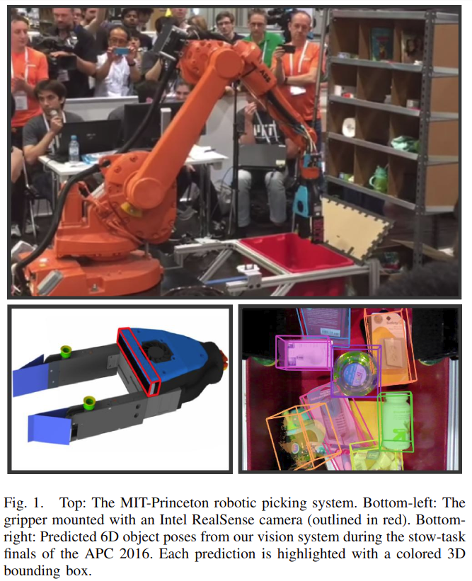

# Multi-view Self-supervised Deep Learning for 6D Pose Estimation in the Amazon Picking Challenge

元の論文の公開ページ : [arxiv](https://arxiv.org/abs/1609.09475)  
Github Issues : [#120](https://github.com/Obarads/obarads.github.io/issues/120)

## どんなもの?
Amazon Picking Challenge(APC)などで使われる倉庫内向け自動ピックアンドプレースシステムでは残雑とした環境とself-occlusions、センサーノイズ、多種多様なオブジェクトの中で堅牢な認識システムが必要となる。著者らはそれらの課題に対してマルチビューRGB-Dデータと自己教師あり、データ駆動型学習を利用したアプローチを提案した。このアプローチはAPCのタスクで使用するために産業用マニュピレータに導入され、また視覚情報を得るためのカメラはマニュピレータの手の部分に装備されている。マニュピレータの形状については後に掲載する図1を参照。

この認識アルゴリズムの手順は以下の方法に基づいている。後に掲載する図2はアルゴリズムの概要を示している。

1. マルチビュー画像を深層ニューラルネットワークに与えて、シーンからオブジェクトを分割する。
2. 3Dモデルを分割された点群モデルに適合させた後、オブジェクトの6D姿勢を復元する。

深層学習モデルによるセグメンテーション(分割)には、大量のラベル付き訓練データセットが必要となる。APCでこの問題に対処するため、著者らはピクセル単位の39種類のカテゴリラベルを持つ130000個の画像を自動的に生成し、それで訓練(自己教師あり学習)を行った。

また、評価のために手作業でラベル付けした7000個の画像テストデータセットを構築した。

貢献は以下の通り。

- **6D推定システム** : オブジェクトの6D姿勢を推定するための堅牢なマルチビュー視覚システムを提案した。
- **自己教師あり学習による訓練** : 訓練データにピクセル単位のラベルを自動的に割り振る自己教師あり学習を提案した。
- **データセット作成** : オブジェクト姿勢を推定するためのベンチマークデータセットを作成した。

## 先行研究と比べてどこがすごいの?

## 技術や手法のキモはどこ? or 提案手法の詳細
本提案は以下の環境下でオブジェクトの6D姿勢を推定する。本アプローチの稼働環境であるAPC 2016の詳細は省略する(詳しくは論文の3章を参照)。

- **Cluttered environments** : 棚や荷物には複数のオブジェクトがあり、それらは視覚アルゴリズムを欺くように配置されているかもしれない。
- **Self-occlusion** : カメラの位置には制限があるため、オブジェクトは部分的にしか見ることができない。
- **Missing data** : 産業用深度センサーは反射、透明、網目状の表面を持つオブジェクトを捉えられない。
- **Small or deformable** : 小さいオブジェクトは少量のデータ点(点群の点?)しか提供せず、一方で変形可能オブジェクトは事前モデルと照合するのが難しい。
- **Speed** : 視覚情報の取得と処理に費やす合計時間は20秒以下とする。

使用するマニュピレータは図1の通り。マニュピレーターは6DOF産業マニュピレーターABB IRB 1600id、RGB-DカメラはRealSense F200を使用する。図1に示すとおり、カメラとマニュピレータは密接にくっついているため、マニュピレータの指が完全に開いた状態でもカメラの一部の視界を手と指が占めてしまう。著者らは、マニュピレータを用いて複数の視点を得ることでこの問題を克服する。

### 6D OBJECT POSE ESTIMATION
ここでは6D姿勢の推定を行うアルゴリズムについて説明する。アルゴリズムの概要は図2の通り。

アプローチの基礎的な手順は以下の通り。

1. DCNNを用いてマルチビューから得られたRGB-D点群を複数のオブジェクトに分割する。
2. 事前にスキャンした3Dモデルを分割された点群に適合させ、各オブジェクトの6D姿勢を推定する。

この方法は典型的な手法に基づいている。しかし、この手法をそのまま本タスクに導入しても十分な結果を出すことができない。著者らはより堅牢な視覚システムを構築するためのいくつかの工夫を紹介する。

#### Object Segmentation with Fully Convolutional Networks
(ここから未確認)

## どうやって有効だと検証した?

## 議論はある?

## 次に読むべき論文は?
- なし

## 論文関連リンク
1. なし

## 会議
ICRA 2017

## 著者
Andy Zeng, Kuan-Ting Yu, Shuran Song, Daniel Suo, Ed Walker Jr., Alberto Rodriguez, and Jianxiong Xiao

## 投稿日付(yyyy/MM/dd)
2016/09/29

## コメント
このアプローチはAPC 2016の収納作業とピッキング作業でそれぞれ三位と四位を獲得している。

## key-words
Self-Supervised_Learning, Detection, RGB_Image, Depth_Image, Point_Cloud, Robot, CV, Paper, Multi-View, 修正

## status
修正

## read
A, I

## Citation
