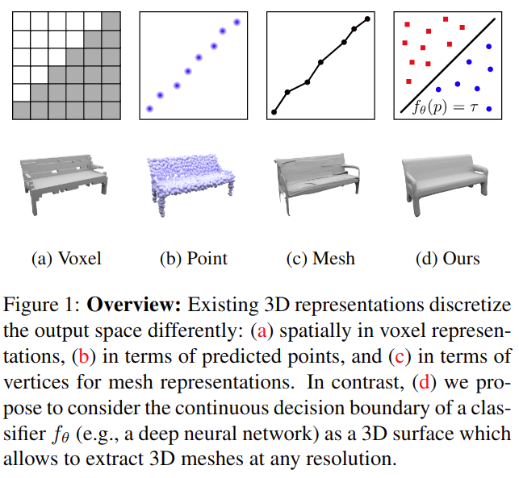
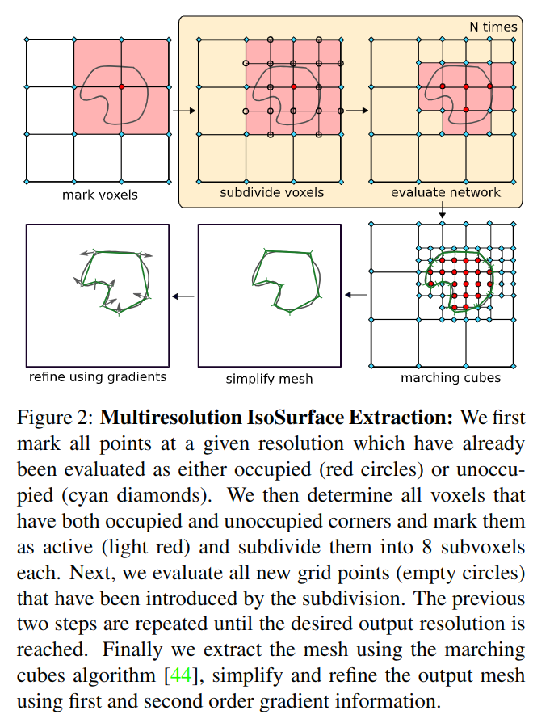
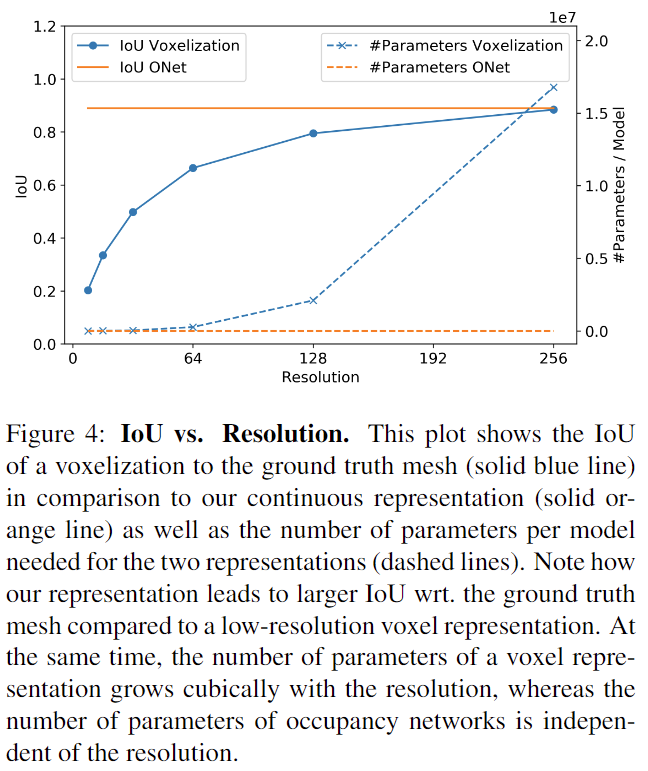
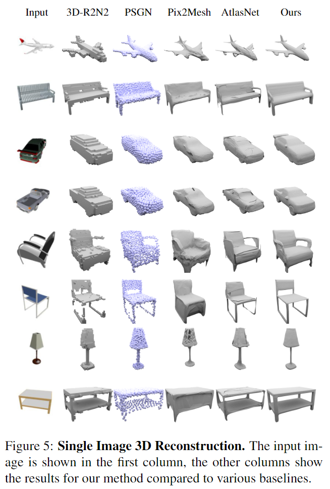
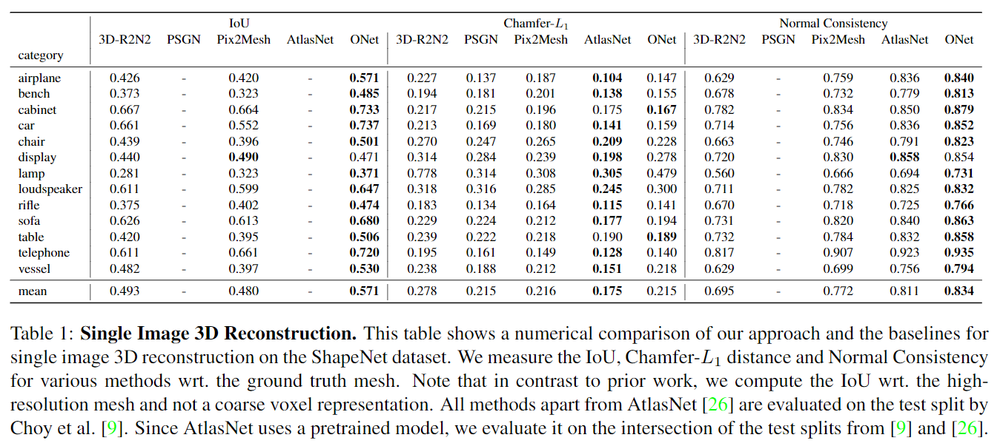

# Occupancy Networks: Learning 3D Reconstruction in Function Space

元の論文の公開ページ : https://arxiv.org/abs/1812.03828  
Github Issues : [#67](https://github.com/Obarads/obarads.github.io/issues/67)

## どんなもの?
点群、ボクセル、メッシュに変わる、占有率関数を使った3D表現を提案した。

## 先行研究と比べてどこがすごいの?
3Dの表現としてはボクセル、点群、メッシュが挙げられる。

- **ボクセル** : ピクセルを3Dに一般化したもの(図1(a))。シンプルな表現であるが、解像度が高くなるに連れてボクセルの処理に要するメモリの量が非常に多くなるため、そのままだと$32^3,64^3$ほどの解像度しか持たない。octreeを用いることで$256^3$まで上げることができるが、解像度としては依然として小さい上にoctreeによって複雑な実装をしなければならなくなる。

- **点群** : 3次元座標を含む点を使った3D表現(図1(b))。ボクセルよりも低メモリで処理を行うことが可能であるが、点同士でつながりを持つような情報を持ち合わせていないため、モデルから幾何学的情報(表面表現など)を抽出する必要がある。

- **メッシュ** : メッシュ(図1(c))。通常、既存のメッシュ表現はテンプレートメッシュの変形に基づいているため、任意のトポロジーを使えない。

今回提案する3D表現は任意の解像度設定が可能であり、幾何学情報も持ち合わせている。

## 技術や手法のキモはどこ? or 提案手法の詳細
### Occupancy Networks
ボクセルや点群における表現の占有率を推論できる式(1)の関数を求める。式(1)を3Dオブジェクトの占有関数とする。

$$
o : \mathbb{R}^{3} \rightarrow\{0,1\} \tag{1}
$$

この占有率関数は3D次元空間上のあらゆる位置$p\in \mathcal{R}^3$に占有確率を0と1の間で振り分ける。

上記の占有率関数にニューラルネットワークを導入する。具体的には、観測$x\in\mathcal{X}$(点群、画像など)がある時、ペア$(p,x)\in\mathbb{R}^3\times \mathcal{X}$を入力として受け取り、占有確率を表す実数を出力するニューラルネットワーク$f_ \theta$は式(2)の様に示すことができる。

$$
f_{\theta} : \mathbb{R}^{3} \times \mathcal{X} \rightarrow[0,1]\tag{2}
$$

これをOccupancy Networkと呼ぶ。  
尚、オブジェクトの表面を暗黙的に表現する決定境界を求めること以外はバイナリ分類ニューラルネットワークに相当する。

### Training
パラメータ$\theta$を持つニューラルネットワーク$f_ \theta(p,x)$を訓練する。トレーニングバッチ中の$i$番目のサンプルから取った$K$個の点$p_ {i j} \in \mathbb{R}^{3}, j=1, \ldots, K$(座標点?)がある時、ミニバッチ損失$\mathcal{L}_ {\mathcal{B}}$は式(3)になる。

$$
\mathcal{L}_{\mathcal{B}}(\theta)=\frac{1}{|\mathcal{B}|} \sum_{i=1}^{|\mathcal{B}|} \sum_{j=1}^{K} \mathcal{L}\left(f_{\theta}\left(p_{i j}, x_{i}\right), o_{i j}\right) \tag{3}
$$

ここで、$x_ i$はバッチ$\mathcal{B}$の$i$番目の観測、$o_ {i j} \equiv o\left(p_ {i j}\right)$は点$p_ {ij}$の真の占有率、$\mathcal{L}(\cdot,\cdot)$はクロスエントロピー分類損失を示す。このネットワークの性能は位置$p_ {ij}$に依存し、その点に関しては実験を行う。

また、著者らの3D表現は確率潜在変数モデルを学習することも可能である。入力に$p_ {ij}$と$o_ {ij}$を取り、潜在$z\in\mathbb{R}^L$のガウス分布$q_ {\psi}(z |\left(p_ {i j}, o_ {i j})_ {j=1 : K}\right)$からなる平均 $\mu_ {\psi}$と標準偏差$\sigma_ \psi$を予測するようなエンコーダーネットワーク$g_ \psi(\cdot)$を導入することを目的とする。
著者らは、生成モデル$p\left(\left(o_ {i j}\right)_ {j=1 : K} |\left(p_ {i j}\right)_ {j=1 : K}\right)$の負の対数尤度に下界を最適化する。

$$
\begin{aligned} \mathcal{L}_{\mathcal{B}}^{\mathrm{gen}}(\theta, \psi)=& \frac{1}{|\mathcal{B}|} \sum_{i=1}^{|\mathcal{B}|} [ \sum_{j=1}^{K} \mathcal{L}(f_{\theta}(p_{i j}, z_{i}), o_{i j})\\ &+\mathrm{KL}(q_{\psi}(z |(p_{i j}, o_{i j})_{j=1 : K}) \| p_{0}(z)) ] \end{aligned} \tag{4}
$$

$p_ 0(z)$は潜在変数$z_ i$の事前分布、$z_ i$は$q_ {\psi}\left(z_{i} |\left(p_ {i j}, o_ {i j}\right)_ {j}=1 : K\right)$からサンプリングされる。

### Inference
訓練されたoccupancy networkを与えられた新しい観測($x$?)があり、それに対応する等値面を抽出するため、著者らはMultiresolution IsoSurface Extraction (MISE)という階層等値面抽出アルゴリズムを導入する(図2)。octreeを段階的に構築することで、最初からきめ細かいボクセルを使って等値面を抽出するより効率的な処理を行える。手順は以下の通り。

#### 1. mark voxels & subdivide voxels & evaluate network
1. 最初の解像度(mark voxels)で体積空間を離散化する。
2. occupancy network $f_ \theta(p,x)$で全ての$p$(グリッド点)を評価する(占有率を求める?)(この$p$は、図2で言えば赤またはシアンで表されている点である)。
3. $p$の占有率が閾値$\tau$以上であるもののみマークする(図2で言えば、赤点としてマークする)。
4. 次に、最低２つの隣接するグリッド点が互いに異なる占有率の値をもつボクセルをアクティブとする(図2で言えば、薄い赤色のボクセル)。
5. アクティブなボクセルを8つのサブボクセルに分割する。
6. 2~5を望む解像度になるまで繰り返す。

#### 2. marching cubes
望む解像度になったら、Marching Cubesアルゴリズム[1]で近似する等値面(式(5))を抽出する。

$$
\left\{p \in \mathbb{R}^{3} | f_{\theta}(p, x)=\tau\right\} \tag{5}
$$

もし、初期解像度での占有率グリッドが内部と外部メッシュの両方の連結成分からなる場合、著者らのアルゴリズムは正確なメッシュに収束する(?)。殆どの場合これを満たす初期値は$32^3$であった。

#### 3. simplify mesh
(ここからの作業は離散化表現を除去するため、ボクセル表現では行う必要がない)  
作成された等値面、つまりメッシュをさらに洗練する。Fast-Quadric-Mesh-Simplification algorithm[2]を使ってメッシュの洗練を行う。

#### 4. refine using gradients
さらにメッシュを洗練するため、一次と二次情報(つまり勾配)を使う。メッシュの各面からランダムな点$p_ k$をサンプリングし、式(6)を最小化する。

$$
\sum_{k=1}^{K}\left(f_{\theta}\left(p_{k}, x\right)-\tau\right)^{2}+\lambda\left\|\frac{\nabla_{p} f_{\theta}\left(p_{k}, x\right)}{\left\|\nabla_{p} f_{\theta}\left(p_{k}, x\right)\right\|}-n\left(p_{k}\right)\right\|^{2} \tag{6}
$$

ここで、$n(p_ k)$は$p_ k$におけるメッシュの法線ベクトルである。式(6)の二項の最小化は二次勾配情報をつかい、効率的にDouble-Backpropagation[3]を実行する。なお、メッシュの全頂点の法線はoccupancy networkを介して逆伝播で求められる。この推定アルゴリズムはメッシュごとに3秒かかる。

## どうやって有効だと検証した?
### Representation Power
ShapeNetの椅子クラスを使って、どれ程の表現力(細かいところまで表現できるか)があるか評価する。この評価では、ground truthメッシュにボクセル化を施してボクセル表現にしたものと、ground truthメッシュを使ってOccupancy Network(ONet)を学習したものを比較する。

結果は図4の通り。ground truthメッシュに対する体積IoUを測定している(?)。提案手法は常に0.89という高い平均IoU値を保っているが、低解像度においてボクセル表現はメッシュを的確に示すことができていない。また、提案手法は6M個のパラメーターで4746個のトレーニングサンプルをエンコードできる。図3に作成したオブジェクトを示す。

### Single Image 3D Reconstruction
画像から3Dオブジェクトを再構築する。質的な結果は図5の通り。最も自然な再構築オブジェクトは著者らの3D表現である。定量的な結果は表1に示されている。

### その他
あり、多分書く

## 議論はある?
無し

## 次に読むべき論文は?
- なし

## 論文関連リンク
1. [W. E. Lorensen and H. E. Cline. Marching cubes: A high resolution 3D surface construction algorithm. InACM Trans. on Graphics (SIGGRAPH), 1987.](http://academy.cba.mit.edu/classes/scanning_printing/MarchingCubes.pdf)
2. [M. Garland and P. S. Heckbert. Simplifying surfaces with color and texture using quadric error metrics. In Visualization’98. Proceedings, pages 263–269. IEEE, 1998.](https://www.cs.cmu.edu/~./garland/Papers/quadric2.pdf)
3. [H. Drucker and Y. Le Cun. Improving generalization perfor-mance using double backpropagation. IEEE Trans. on Neu-ral Networks, 3(6):991–997, 1992.](https://ieeexplore.ieee.org/abstract/document/165600/similar#similar)

## 会議
CVPR 2019

## 著者
Lars Mescheder, Michael Oechsle, Michael Niemeyer, Sebastian Nowozin, Andreas Geiger.

## 投稿日付(yyyy/MM/dd)
2018/12/10

## コメント
なし

## key-words
2D_Image, Voxel, Point_Cloud, Mesh, 3D_Estimation

## status
更新済