# OctNet: Learning Deep 3D Representations at High Resolutions

元の論文の公開ページ : [arxiv](https://arxiv.org/abs/1611.05009)  
Github Issues : [#46](https://github.com/Obarads/obarads.github.io/issues/46)

## どんなもの?
入力(ボクセル)のスパース性を利用して、各リーフノードがプールされた特徴表現を保存している不均一なoctreeのセットを使い、空間を階層的に分割するモデルを提案した。

## 先行研究と比べてどこがすごいの?
ボクセルなどを扱う3Dネットワークアーキテクチャは、その密な3Dデータ表現によって計算に多くのメモリを要する。メモリの消費量は解像度依存であり、メモリ節約のために解像度を下げ、結果として低解像度なものを使った処理となる。そこで、著者らは3D表現に含まれるスパース性に着目し、解像度を上げながらもメモリ消費を抑えるOctNetを提案した。

## 技術や手法のキモはどこ? or 提案手法の詳細
OctNetにはoctreeが使われる。octreeはデータが疎な部分を要約することができ、そのまま3Dデータを扱うよりも効率的である。しかし、普通のoctreeの使用では殆どの場合、効率的なデータへのアクセスができない。理由として、octreeは典型的に各ノードがその子へのポインタを含むように実装されている。これは、octree内の任意の要素(もしくは要素からその要素の隣接要素)にアクセスするには目的の要素に到達するまでのトラバース(多分ツリーを山に見立てた横断という意味)が必要になる。畳み込みでは隣の要素に隣接することが多いため、hybrid grid-octree data structureを使用する。

### Hybrid Grid-Octree Data Structure
著者らは、Millerら[1]によって提案されたものと同様のhybrid grid-octree structureを利用する。このアイデアの根幹は、octreeの最大深度を小さい数(3くらい)に制限し、いくつかの浅いoctreeを規則的に並んでいる格子に沿って配置することである(図2)。通常のoctreeよりもメモリ効率が悪い可能性があるが、それでも圧縮率はかなり高い。  
さらに、浅いoctreeはビット列表現を使うことで構造の効率的な符号化&アクセス時間短縮を実現する(図3)。

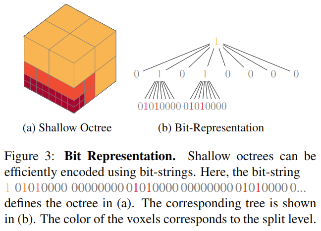

### Network Operations
また、先程のHybrid Grid-Octree Data Structureのことを踏まえた、畳み込みネットワークの一般的な演算子にも焦点を当てる。焦点を当てる演算子はconvolution、pooling、unpooling。活性化関数などの点ごとの演算子は入力依存ではないためそのままで問題ない。

#### Convolution
畳み込みは図4の通り。ここではサイズが$8^3$のoctreeセルとサイズが$3^3$の畳み込みカーネルがある場合を考える。通常は図4の(a)のような形で計算を行い、$8^3\cdot 3^3=13824$の乗算を行う。  
著者らの実装はより効率的であり、図4の(b)の様になる。具体的には、$8^3$サイズのセルの内の値はconstant(一定)であることに着目する(?)。図14の(a)の様にこのセル内で一度だけ畳み込みを評価し、セルのサイズ$8^3$を結果にかける。更に、図14の(b)~(d)の様にcorners(角)、edges(辺)、faces(面)の部分をtruncated versions of the kernel(?)で評価する。結果として、constantで27、cornersで8・19、edgesで12・6・15、facesで$6・6^2・9$の乗算を行う。合計で3203の乗算を行う。これは従来の実装の23.17%の乗算で済む。

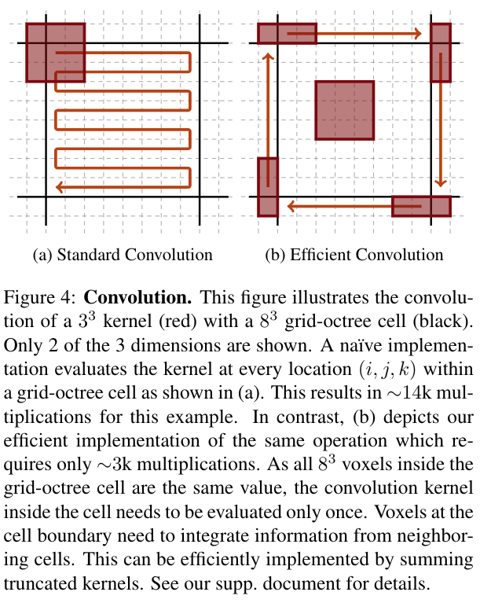

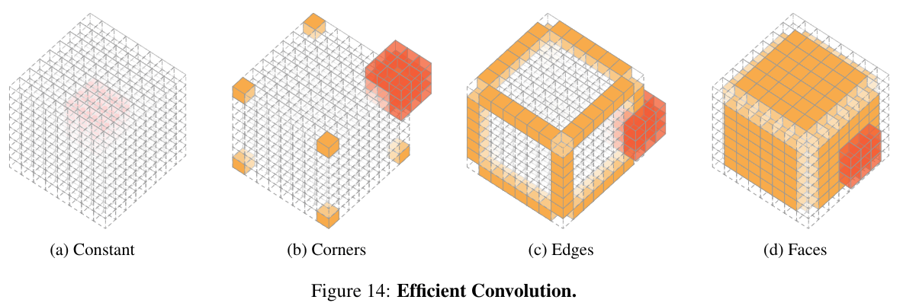

#### Pooling
図5の通り。サイズが$2D\times2H\times2W$であるoctree $O^{in}$が入力である時、出力は$D\timesH\timesW$のoctreeとなる。深度が3のボクセルはプールされる。各ボクセルの深度は1つ分深くなる。

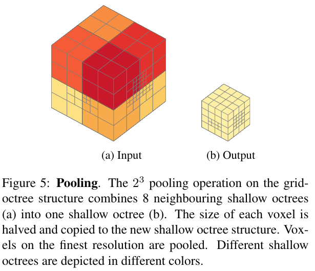

#### Unpooling
図6の通り。サイズが$D\times H\times W$であるoctree $O^{in}$が入力である時、出力は$2D\times2H\times2W$のoctreeとなる。各ボクセルの深度は1つ上がる。深度0の各ノードにはoctreeが生成される。

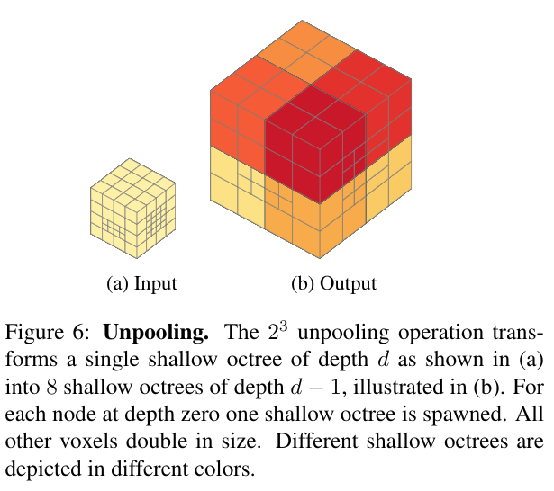

## どうやって有効だと検証した?
### 3D Classification
ModelNet10で3D形状分類問題解く。この際、精度だけでは無くメモリ使用量と動作時間も計測している。結果は図7の通り。精度の差はほとんどでなかったが、メモリの使用量と動作時間がかなり節約されている。

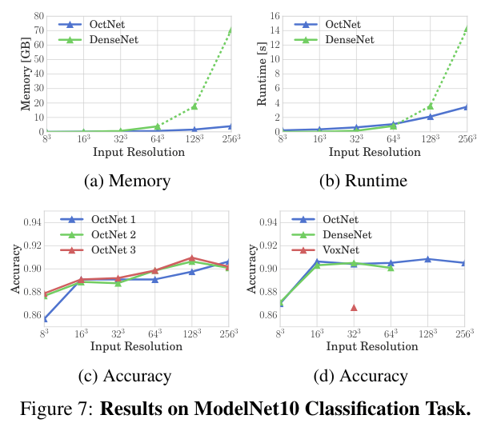

また、図9のconfusion matricesに示すとおり、高解像度化は多くのクラスの判別を助けるが、同時に他のクラス同士の曖昧さがそのままだったりする。これは表現の問題であるとしている。図8に示すように、BathtubとBedは高解像度化によって見分けがつくようになったが、DresserとN.Standは依然として区別しづらいままである。

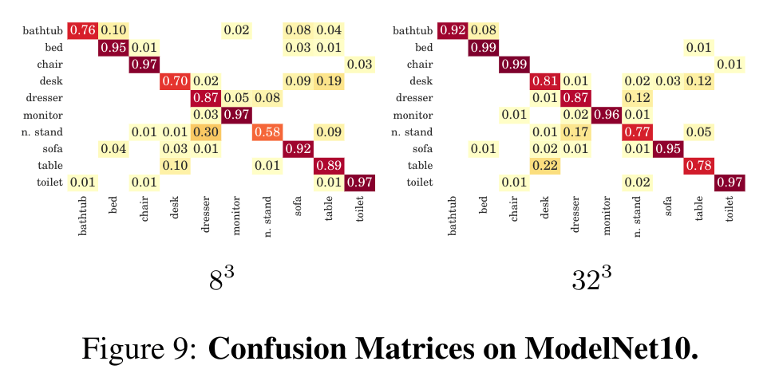

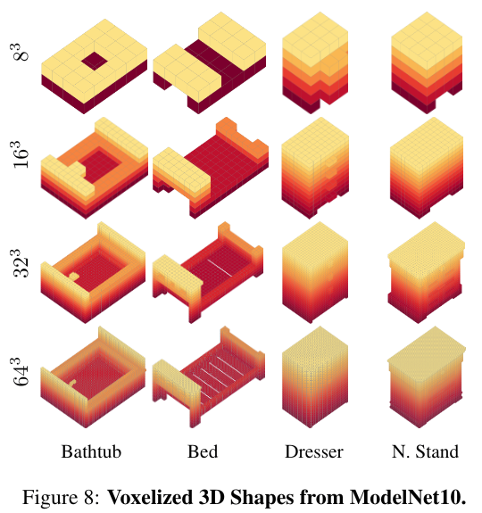

### 3D Orientation Estimation
ModelNet10の椅子オブジェクトを使い、各軸ごとにランダムに$\pm 15$度の回転を入れる。ネットワークは、それらのオブジェクトの角度を求めるタスクを行う。角度予測ためにネットワーク(の出力?)を変更しているだけで基本的なネットワークは分類と同じである。結果は図10と図11の通り。図11はオブジェクトに角度を付け加え、それを比較しているもの。

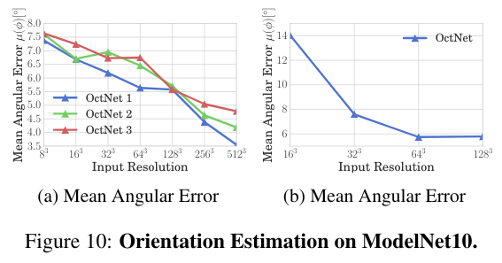

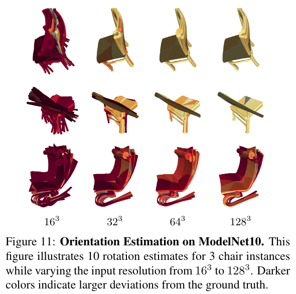

### 3D Semantic Segmentation
RunMonge2014データセットを使いセマンティックセグメンテーションを行う。入力は点群であるため、それを元にoctree構造へ変換する。結果は表1と図12の通り。

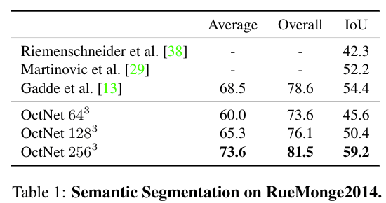

## 議論はある?
OcyNetは高解像度ボクセルデータセットが出るようになると更に重要性が増すだろう。高解像度ボクセル形状を処理する能力が非常に重要な多視点3D再構築のための表現学習が将来有望な研究手法の1つである(?)。

## 次に読むべき論文は?
- なし

## 論文関連リンク
1. [A. Miller, V. Jain, and J. L. Mundy. Real-time rendering and dynamic updating of 3-d volumetric data. In Proc. of the Workshop on General Purpose Processing on Graphics Processing Units (GPGPU), page 8, 2011.](https://dl.acm.org/citation.cfm?id=1964190)

## 会議
CVPR 2017.

## 著者
Gernot Riegler, Ali Osman Ulusoy, Andreas Geiger.

## 投稿日付(yyyy/MM/dd)
2016/11/15

## コメント
なし

## key-words
Voxel, Point_Cloud, Classification, Semantic_Segmentation

## status
更新済