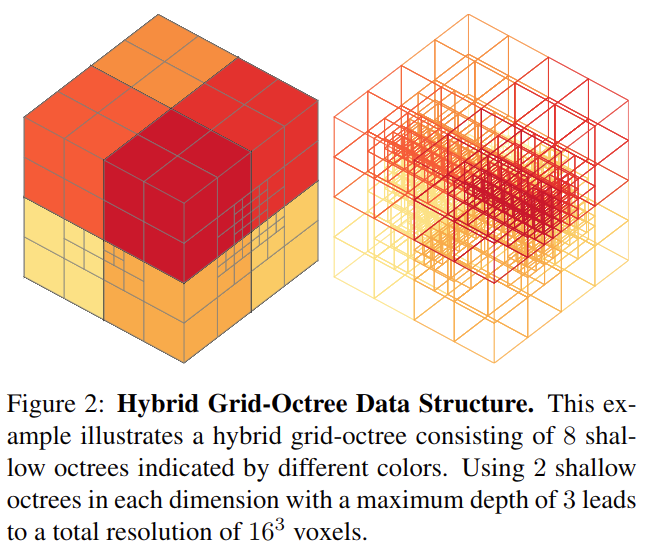

# OctNet: Learning Deep 3D Representations at High Resolutions

元の論文の公開ページ : https://arxiv.org/abs/1611.05009

## どんなもの?
入力(ボクセル)のスパース性を利用して、各リーフノードがプールされた特徴表現を保存している不均一なoctreeのセットを使い、空間を階層的に分割するモデルを提案した。

## 先行研究と比べてどこがすごいの?
ボクセルなどを扱う3Dネットワークアーキテクチャは、その密な3Dデータ表現によって計算に多くのメモリを要する。メモリの消費量は解像度依存であり、メモリ節約のために解像度を下げ、結果として低解像度なものを使った処理となる。そこで、著者らは3D表現に含まれるスパース性に着目し、解像度を上げながらもメモリ消費を抑えるOctNetを提案した。

## 技術や手法のキモはどこ? or 提案手法の詳細
OctNetにはoctreeが使われる。octreeはデータが疎な部分を要約することができ、そのまま3Dデータを扱うよりも効率的である。しかし、普通のoctreeの使用では殆どの場合、効率的なデータへのアクセスができない。理由として、octreeは典型的に各ノードがその子へのポインタを含むように実装されている。これは、octree内の任意の要素(もしくは要素からその要素の隣接要素)にアクセスするには目的の要素に到達するまでのトラバース(多分ツリーを山に見立てた横断という意味)が必要になる。畳み込みでは隣の要素に隣接することが多いため、hybrid grid-octree data structureを使用する。

### Hybrid Grid-Octree Data Structure
著者らは、Millerら[1]によって提案されたものと同様のhybrid grid-octree structureを利用する。このアイデアの根幹は、octreeの最大深度を小さい数(3くらい)に制限し、いくつかの浅いoctreeを規則的に並んでいる格子に沿って配置することである(図2)。通常のoctreeよりもメモリ効率が悪い可能性があるが、それでも圧縮率はかなり高い。  
さらに、浅いoctreeはビット列表現を使うことで構造の効率的な符号化&アクセス時間短縮を実現する(図3)。

### Network Operations
また、先程のHybrid Grid-Octree Data Structureのことを踏まえた、畳み込みネットワークの一般的な演算子にも焦点を当てる。ただし、活性化関数などの点ごとの演算子は入力依存ではないためそのままで問題ない。

## どうやって有効だと検証した?

## 議論はある?

## 次に読むべき論文は?
- なし

## 論文関連リンク
1. [A. Miller, V. Jain, and J. L. Mundy. Real-time rendering and dynamic updating of 3-d volumetric data. In Proc. of the Workshop on General Purpose Processing on Graphics Processing Units (GPGPU), page 8, 2011.](https://dl.acm.org/citation.cfm?id=1964190)

## 会議
CVPR 2017.

## 著者
Gernot Riegler, Ali Osman Ulusoy, Andreas Geiger.

## 投稿日付(yyyy/MM/dd)
2016/11/15

## コメント
なし

## key-words
Voxel, Point_Cloud, Classification

## status
未完