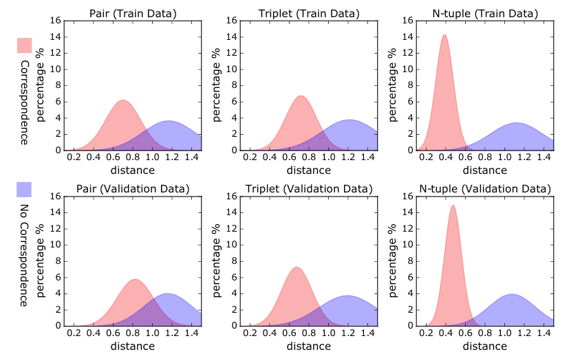
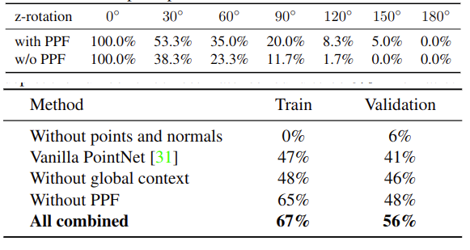

# PPFNet: Global Context Aware Local Features for Robust 3D Point Matching

元の論文の公開ページ : https://arxiv.org/abs/1802.02669

## どんなもの?
点の法線とPoint Pair Feature(以下PPF)を組み合わせたLocal Geometry Frを入力して扱い、分断されたそれぞれのシーンから一致するパッチ(局所領域)を探し出す(Point set registrationと同じ)。Frは以下の通り(ψはppf()と同じ)。

ppfの定義は以下の通り(参考リンクの1を見たほうがわかりやすい)。  

## 先行研究と比べてどこがすごいの?
PPFとPointNetを組み合わせてシーンの局所特徴を学習し、それぞれのシーンから一致する点を探し出すことができること。また、新たな損失関数を定義した。

## 技術や手法のキモはどこ? or 提案手法の詳細
PPFNetの構造は以下の様になっている。各パッチからPointNetを介してパッチのごとの特徴(local Feature)を生成し、それをMaxPoolingでまとめた後、まとめた特徴とパッチごとの特徴を連結しMLPを介して最終的な特徴を生成する。なお、PointNetのパラメータは共有する。

それぞれのフラグメント(Fragment)からパッチを取り出し、PPFNetによって各パッチの特徴を取り出す。その後、パッチ間の特徴距離行列(Feature Space Distance Matrix)を形成する。一方で、フラグメント同士が正しくつながった実際のデータ(ground-truth)から各パッチ間の距離行列(Distance Matrix)を形成する。距離行列を2値化し、それぞれのパッチが一致しているかどうか判別できるようにした対応行列(Correspondence Matrix)を作成する。この特徴距離行列と対応行列の比較を行うことで損失を計算する。下の図はPPFNetに損失関数を適応したものである。

実際の空間内でのパッチ同士の近さは特徴空間上でも保存されると考える。しかし、下の図の左と中央にあるように、既存の損失関数は最大3つのパッチの関係性を求めるだけであり、すべてのパッチの関係性を求めることはできない。
そこで、下図の右のようにパッチ間の距離関係をとらえるためにN-tuple lossを定義する。

N-tuple lossは各フラグメントにそれぞれN個のパッチがあるとき、そのN個のパッチの対比損失を計算する。実際のデータTが与えられ、N-tuple lossは対応行列M∈RN*Nがあるとき、M=(m_ij)は、

となる。この時1は指示関数である。この式は1によって二値化されている(xはパッチ、Tyは実際のデータに合わせたパッチの事?)。
また、特徴距離行列D∈RN*NであるときD=(d_ij)は

となる。この式のf(・)はPPFNetである。これらより、以下の損失関数を定義する。

この時、αは対応&非対応ペアのウェイトのバランスをとる。また、Θは非対応ペア間の予測距離の最低値である。
参考リンクの2より、
- 第一項は対応点同士の特徴空間での距離が近くなるように学習
- 第二項は非対応点同士の特徴空間での距離が遠くなるように学習する。

## どうやって有効だと検証した?
7-scenesからkitchenを、残りはSUN3Dのデータセットを使い評価した。なお、下の表にはRANSACを適応していない。

この下の表はRANSACを適応した結果である。上と下どちらでもSOTAな結果となっている。

下の図はN-tuple loss(右)の有用性についての検証である。左と中央に比べ、対応と非対応のペアを分別しやすくなっている。

また、PPFを用いることでTrainとValidation時のinlier ratioが向上し(下図の下)、回転に対するロバストも向上している(下図の上)。

## 議論はある?
将来的にはメモリのボトルネックを目標とし、そしてより一般的な剛性グラフマッチング問題を解決する。(?)  
また、N-tuple lossの有用性から、これを姿勢推定などのタスクに適応するべきだと主張している。
また、ハードウェア的にメモリの制限があるため、パッチの数を2Kに制限している。そのため、Home2などで3DMatchの結果を上回れなかったとしている。

## 次に読むべき論文は?
- Learning descriptors for object recognition and 3d pose estimation.(論文中の参考文献45より)

## 論文関連リンク
1. 本論文: https://arxiv.org/abs/1802.02669

## 参考リンク
1. PPFの説明:http://isl.sist.chukyo-u.ac.jp/Archives/ppf.html
2. https://www.slideshare.net/naoyachiba18/ss-120302579

## 会議
CVPR2018

## 著者/所属機関
Haowen Deng, Tolga Birdal, Slobodan Ilic

## 投稿日付(yyyy/MM/dd)
2018/02/07

## コメント
参考リンク2を参考にしている部分が理解できていないため、再度確認すること。

## key-words
Point_Cloud, Registration

## status
更新済