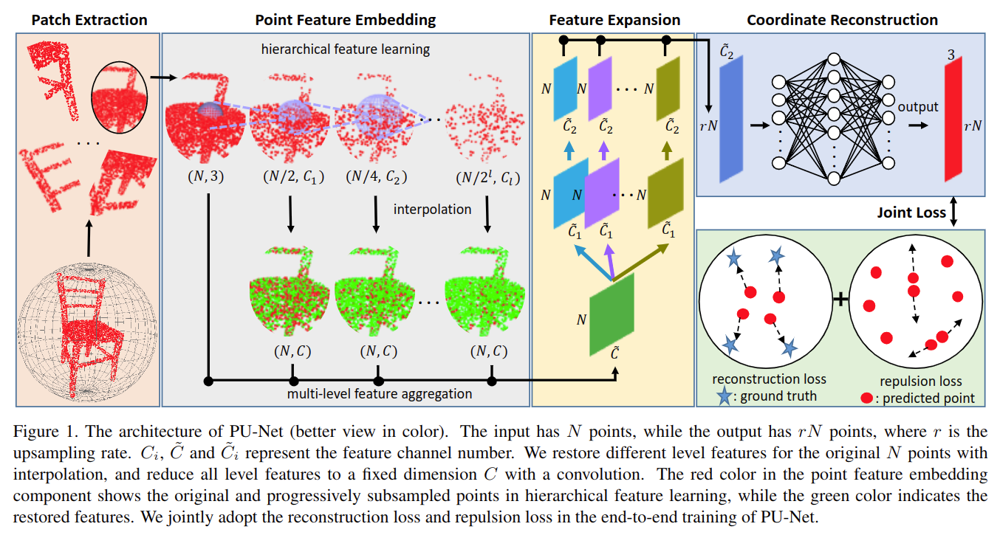

# PU-Net: Point Cloud Upsampling Network

元の論文の公開ページ : [arxiv](https://arxiv.org/abs/1801.06761)  
Github Issues : 

## どんなもの?
3Dモデルから点に基づくパッチの幾何学的意味を学習し、学習した知識を使って与えられた点群をアップサンプリングするPU-Netを提案した。

## 先行研究と比べてどこがすごいの?
初めて点群アップサンプリングに焦点を当てた研究であること。

## 技術や手法のキモはどこ? or 提案手法の詳細
### Network Architecture
このネットワークの処理過程は以下の通り。処理過程は図1の様に表される。

1. Patch Extraction: 3Dモデルから点のパッチを抽出する。
2. Point Feature Embedding: 階層特徴学習とマルチレベル特徴集約(?)によって点の3D座標値を特徴空間へマッピングする。
3. Feature Expansion : 特徴の数を増やす。
4. Coordinate Reconstruction: 全結合層を介して再構築した点群を出力する。

以下で各部品の説明を行い、その後訓練について説明する。

#### Patch Extraction
ここでは、アップサンプリングで必要となるオブジェクトの局所幾何学パターンを学習するのに必要な点群のパッチを抽出する。具体的には、ランダムに点を$M$個選択し、選択された点ごとに指定半径$d$内の点を取り、それをパッチとして扱う。ここで、Poisson disk samplingによって$\hat{N}$個の点となった各パッチをパッチのground truth point distributionとして扱う。様々なスケール(規模)と密度を会得するため、$d$の値は複数用意する。

[※ Poisson disk samplingは点が密集している部分に点を分布させるような代物? 図中で四角形状のパッチのように見えるものがあるが、無視したほうが良さそう。異なる$d$は必要?]

#### Point Feature Embedding
ここでは、局所(local)と大域(global)幾何学的文脈をパッチから学習するため、以下の2つの特徴学習戦略を用いる。

[※ ここではパッチが一つづつ入力として扱われる(図1)。ここでglobalとlocal特徴と言っているが、図を見る限り、パッチ(オブジェクトの局所(local)領域)の中のglobalとlocal特徴を得る認識で問題ない?]

- **Hierarchical feature learning** : ここでは、局所特徴と大域特徴を得るために、階層的な処理を行うことができるPointNet++アーキテクチャを使用する。通常、アップサンプリングには認識タスクよりも多くの局所文脈を必要とするため、ここでは比較的小さいグループ化半径を用いる。また、階層ごとにグループ化半径は大きくなる。
- **Multi-level feature aggregation** : ここでは、階層ごとに出た特徴を集約する。階層的な処理を行うことで、階層ごとに複数の特徴が生成される。階層が浅い場合はより小さな範囲の局所的な特徴を生成し、深い場合はより大域な特徴を持つ。これらの特徴は全てアップサンプリングに利用されるべきである。PointNet++などではスキップ構造を利用しているが、この構造は著者らの実験によって、アップサンプリングにおいて最適な特徴利用法ではないことがわかった。そのため、著者らは異なる階層(レベル)の特徴を直接組み合わせて、各階層の重要性をネットワークに学習させることを提案した[3]。

  各階層の点特徴を連結するため、PointNet++の補間法を利用してダウンサンプリングされた点から全ての点の特徴を復元する(図1、赤点から緑点の特徴を復元)。具体的には、階層$l$の補間された点$x$は式(1)のように計算される。大雑把に言えば、式(1)は補間点の近傍点を用いて復元することを示している。

  $$
  f^{(\ell)}(x)=\frac{\sum_{i=1}^{3} w_{i}(x) f^{(\ell)}\left(x_{i}\right)}{\sum_{i=1}^{3} w_{i}(x)} \tag{1}
  $$

  ここで、$w_ {i}(x)=1 / d\left(x, x_ {i}\right)$ (距離重み付けの逆数であり)となり、$x_ {i}, x_ {2}, x_ {3}$は$x$の近傍点を示す。また、各階層の特徴を$1\times 1$畳み込みで$C$次元に縮小する。最終的に各階層の特徴を連結し、埋め込み点特徴$f$とする。

#### Feature Expansion
ここでは特徴の数を増やす。点と特徴は互いに置き換え可能であるため、特徴を増やすことは点を増やすことと同意義である。具体的には入力として$N\times\tilde{C}$の$f$を使い、$rN\times\tilde{C}_ 2$の特徴$f^\prime$を出力する。ここで、$r$はアップサンプリングレートを指す。

著者らは、このFeature Expansion演算においてsub-pixel convolution層[2]に基づいた方法を提案する。詳細は省略(技術のミソっぽいので修正候補)。

#### Coordinate Reconstruction
ここでは、先程の$rN\times\tilde{C}_ 2$の拡張された特徴をから3D座標値を持つ点群を出力する。これは、全結合層を介して行われる。

### End-to-End Network Training

## どうやって有効だと検証した?

## 議論はある?

## 次に読むべき論文は?
- なし

## 論文関連リンク
1. [Naoya Chiba, 三次元点群を取り扱うニューラルネットワークのサーベイ Ver. 2 / Point Cloud Deep Learning Survey Ver. 2 - Speaker Deck, 2019(アクセス:2019/07/19).](https://speakerdeck.com/nnchiba/point-cloud-deep-learning-survey-ver-2?slide=351)
2. [W. Shi, J. Caballero, F. Husz ́ ar, J. Totz, A. P. Aitken, R. Bishop, D. Rueckert, and Z. Wang. Real-time single im-age and video super-resolution using an efficient sub-pixel convolutional neural network. In IEEE Conf. on Computer Vision and Pattern Recognition (CVPR), 2016.](https://arxiv.org/abs/1609.05158)
3. [B. Hariharan, P.Arbel ́ aez, R. Girshick, and J. Malik. Hyper-columns for object segmentation and fine-grained localiza-tion. InIEEE Conf. on Computer Vision and Pattern Recog-nition (CVPR), 2015.](https://ieeexplore.ieee.org/document/7298642)

## 会議
CVPR 2018

## 著者
Lequan Yu, Xianzhi Li, Chi-Wing Fu, Daniel Cohen-Or, Pheng-Ann Heng

## 投稿日付(yyyy/MM/dd)
2018/01/21

## コメント
なし

## key-words
Point_Cloud, Reconstruction

## status
導入

## read
A, I, R

## Citation
