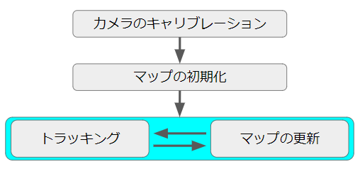

# Parallel Tracking and Mapping for Small AR Workspaces

元の論文の公開ページ : http://www.robots.ox.ac.uk/~gk/publications/KleinMurray2007ISMAR.pdf

## どんなもの?

## 先行研究と比べてどこがすごいの?
提案されるモデルは手持ちの単眼カメラからSLAMを行うため、通常のSLAMの様にオドメトリ等の他のセンサーの値を利用できない。

## 技術や手法のキモはどこ? or 提案手法の詳細
### 手法の概要
大まかなアルゴリズムは以下の図の通り、[1]を参考に作成した。トラッキングとマップの更新の処理を(CPUのスレッド単位で)別々に行う様にすることで、トラッキングの性能を向上させる。また、冗長な情報を省くためにキーフレームを採用している。そのため、リアルタイムな処理が必要な本タスクでもバンドル調節と呼ばれる重い処理を導入できるようになっている。

## どうやって有効だと検証した?

## 議論はある?

## 次に読むべき論文は?
- なし

### 論文関連リンク
1. [Masaya Kaneko. SLAM勉強会(PTAM). (アクセス:2019/04/09)](https://www.slideshare.net/MasayaKaneko/slamptam)

### 会議
????

### 著者
Georg Klein, David Murray.

### 投稿日付(yyyy/MM/dd)
2007/??/??

## コメント
なし

## key-words
SLAM, 2D_Image